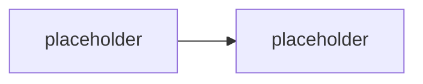

# Konvence

Závazná pravidla pro psaní materiálů GOC223. Cíl: konzistence napříč moduly a snadná údržba (malé soubory = malé diffy).

## Jazyk

- **Obsah**: čeština.
- **Cesty a názvy souborů/složek**: angličtina, `kebab-case`.

### Zkratky

**Každá zkratka se na každé stránce při prvním použití rozepíše** — buď zkratka
s plným zněním v závorce, nebo plné znění se zkratkou v závorce:

```md
ano:  SIEM (Security Information and Event Management) sbírá logy z celé organizace
ano:  Data Collection Rule (DCR) umí data transformovat už při zápisu
ne:   DCR může obsahovat KQL transformaci
```

„Na každé stránce" znamená v každém souboru zvlášť — student čte jednotlivé stránky
z odkazu, ne celý repozitář odshora. Rozepsat stačí jednou za soubor, ne u každého výskytu.

Výjimka: zkratky, které v oboru nikdo nerozepisuje a plné znění nic nevysvětlí
(`URL`, `API`, `JSON`, `XML`, `CSV`, `REST`, `IT`, `ID`). U všeho ostatního platí pravidlo.

Úplný seznam je v [`GLOSSARY.md`](GLOSSARY.md) v sekci **Rejstřík zkratek** — nové
zkratky do textu přidávat jen zároveň s řádkem v rejstříku.

### Výkladový registr

Materiál čte inženýr, který danou technologii **vidí první den**. Proto platí:

- **Každá `###` sekce začíná jednou obyčejnou větou o tom, co ta věc je a proč ho
  zajímá** — až potom smí přijít termín, který v textu ještě nebyl vysvětlený.
- Definice před zkratkou, zkratka před detailem, detail před výjimkou.
- Nepsat „trivialita", „samozřejmě", „jak víme" — čtenář to neví, jinak by kurz nečetl.

## Struktura modulu

Jeden modul = jedna složka. Slug složky, ne pořadové číslo. Volitelné moduly mají prefix `opt-`.

Typické soubory ve složce modulu:

| Soubor | Účel | Publikum |
|---|---|---|
| `README.md` | teorie / výklad modulu | student |
| `lab-*.md` | zadání labu | student |
| `instructor-notes.md` | timing, tripwires, otázky, fallbacky | jen lektor |

Podle potřeby modul přidává i další soubory (bez šablony, ale konzistentní pojmenování):

| Prefix | Účel |
|---|---|
| `explainer-<téma>.md` | samostatný deep-dive na jeden mechanismus/koncept, odkazovaný z README |
| `comparison-<téma>.md` | srovnávací tabulka + rozhodovací osa |
| `guide-<téma>.md` | krok-za-krokem návod (instruktorský demo skript nebo PowerShell referenční postup) |
| `exercise-<téma>.md` | krátké hands-on cvičení (do ~20 min, bez psaní kódu) — menší útvar než `lab-`; v `README.md` mu odpovídá sekce `## Cvičení` místo `## Lab` |
| `scenario-<téma>.md` | běžící příklad/dataset sdílený napříč sourozeneckými moduly |
| `solution/<skript>.ps1` | referenční řešení labu — plně okomentované, odpovídá `Ověření` v labu |

Pořadí modulů v běhu drží **`agenda.md`** — je to jediný zdroj pravdy o pořadí. Změna pořadí = úprava `agenda.md`, ne přejmenování složek.

## Odkazování mezi moduly

- H1 nadpis modulu je jen `# <Název>` — **žádná pořadová čísla** v nadpisech ani v textu.
  Vkládání/přesun modulu tak nikdy nevyvolá přečíslování napříč repem.
- Křížové odkazy mezi moduly vždy **slugem jako relativní odkaz na složku**. Tvar odkazu
  (z pohledu souboru uvnitř složky modulu):

  ```md
  jiný den:        [`../../day-3/migration-patterns/`](../../day-3/migration-patterns/)
  sourozenec dne:  [`../security-hardening/`](../security-hardening/)
  ```

  V instruktorských poznámkách (sekce Vazby) stačí backtick slug bez odkazu.
- Pořadí v rámci dne drží výhradně `agenda.md` (a `day-N/README.md` tabulka).

## Markdown styl

- Nadpisy `##` / `###`, žádné přeskoky úrovní.
- Krátké odstavce, odrážky pro výčty.
- Odkazy na názvosloví vždy proti [`GLOSSARY.md`](GLOSSARY.md) — nepsat názvy nástrojů/API „od oka".

## Mermaid

- Diagramy jako fenced bloky ` ```mermaid ` přímo v `.md`. GitHub je renderuje nativně, žádný build step.
- **Výchozí motiv** (bez `%%{init}%%`) — nulová údržba, konzistentní vzhled.
- Placeholder v kostře:



## Currency-markery

Fast-moving fakta (throttling limity, verze PowerShell modulů, ceny Azure služeb, preview stavy) se v tomto oboru mění rychle. Balit je do GitHub alertů, ať jsou vizuálně oddělené a grep-nutelné před každým během:

```md
> [!WARNING] Ověřit k datu běhu — stav k <RRRR-MM>.
> Throttling limit / cena / verze modulu / preview stav.
```

Lineage a breaking changes:

```md
> [!IMPORTANT] Názvosloví
> <starý název/API> → <aktuální název/API>. V dokumentaci/UI se může objevit staré jméno.
```

## Callouty — co smí být v rámečku

Callout (`> [!NOTE]`, `> [!WARNING]`, `> [!IMPORTANT]`, `> [!TIP]`) je zvýraznění.
Zvýraznění funguje jen dokud je vzácné: stránka s deseti rámečky nemá zvýrazněné nic
a student je začne přeskakovat všechny — včetně toho jednoho, který ho měl zachránit.

**Ve studentských souborech** (`README.md`, `lab-*.md`, `explainer-*`, `comparison-*`,
`guide-*`, `exercise-*`) smí být callout **jen** když projde alespoň jedním z těchto
tří testů:

| Test | Callout | Příklad |
|---|---|---|
| 1. **Currency-marker** — fakt s krátkou životností (cena, limit, verze, preview) | `[!WARNING] Ověřit k datu běhu` | retirement certifikace, ceny Azure |
| 2. **Tiché nebo lživé selhání** — špatný výsledek bez chybové hlášky, **nebo hláška, která ukazuje na jinou příčinu, než jaká nastala** | `[!WARNING]` | `Get-PnPSiteCollectionAdmin` vrátí app-only identitě prázdno místo chyby; `./` se vyhodnocuje proti aktuální složce, ale hláška tvrdí, že soubor neexistuje |
| 3. **Předpoklad, bez kterého lab nedojede** | `[!IMPORTANT]` | Azure subscription a SharePoint musí být ve stejném tenantu |

Plus `[!IMPORTANT] Názvosloví` pro přejmenování API (viz Currency-markery níž).

**Všechno ostatní jde do běžného textu, do tabulky, nebo pryč.** Konkrétně:

- **Historie změn kurzu nepatří studentům vůbec.** „Přestavba 2026-09-09", „Zkráceno
  z 90 na 45 min", „Korektura po reálném běhu" — student neví, jaká byla předchozí
  verze, a je mu to lhostejné. Tohle žije v `instructor-notes.md`.
- **Meta-komentář o materiálu** („pro koho je to napsané", „proč to vysvětlujeme
  takhle") — buď je to součást výkladu, nebo to nikdo nepotřebuje.
- **Doporučení a kontext** („hodí se vědět", „v praxi se dělá") — to je výklad. Napsat
  ho jako větu v odstavci, kde stejně patří.
- Chyba, která **zahlásí sama sebe**, callout nepotřebuje — student ji uvidí v konzoli.

Praktický strop, který z těch testů vychází: **do tří callloutů na stránku**. Víc
znamená, že se do rámečků dostal výklad.

U dlouhých dokumentů se strop počítá **na sekci `##`, ne na soubor** — u labu na šest částí
je sedm callloutů v pořádku, protože čtenář má na obrazovce vždycky jen jeden. Rozhodující
je, jestli rámeček v okolí textu vyčnívá, ne jeho absolutní počet.

V `instructor-notes.md` strop neplatí — ty čte lektor cíleně a hledá v nich právě
tripwires.

## Delta sekce

Každý modul má na konci:

```md
## Stav produktu / delta
- <co se od napsání změnilo, co ověřit>
```

## Kód v materiálech

- PowerShell skripty (`solution/*.ps1` i inline ukázky) používají PascalCase Verb-Noun cmdlet styl, `param()` blok, komentářový `.SYNOPSIS`/`.NOTES` blok u delších skriptů.
- Žádné tenant ID, ClientId, thumbprinty ani jiné identifikátory natvrdo v kódu — vždy parametry/proměnné prostředí (viz [`scripts/README.md`](scripts/README.md)).
- Ukázky Graph/REST volání ukazují i chybové/retry větve, ne jen happy path — to je nosný pedagogický bod kurzu (inženýrská robustnost, ne demo-ware).
