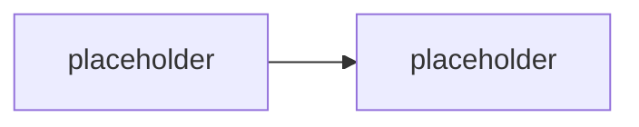

# Konvence

Závazná pravidla pro psaní materiálů GOC223. Cíl: konzistence napříč moduly a snadná údržba (malé soubory = malé diffy).

## Jazyk

- **Obsah**: čeština.
- **Cesty a názvy souborů/složek**: angličtina, `kebab-case`.

## Struktura modulu

Jeden modul = jedna složka. Slug složky, ne pořadové číslo. Volitelné moduly mají prefix `opt-`.

Typické soubory ve složce modulu:

| Soubor | Účel | Publikum |
|---|---|---|
| `README.md` | teorie / výklad modulu | student |
| `lab-*.md` | zadání labu | student |
| `instructor-notes.md` | timing, tripwires, otázky, fallbacky | jen lektor |

Podle potřeby modul přidává i další soubory (bez šablony, ale konzistentní pojmenování):

| Prefix | Účel |
|---|---|
| `explainer-<téma>.md` | samostatný deep-dive na jeden mechanismus/koncept, odkazovaný z README |
| `comparison-<téma>.md` | srovnávací tabulka + rozhodovací osa |
| `guide-<téma>.md` | krok-za-krokem návod (instruktorský demo skript nebo PowerShell referenční postup) |
| `exercise-<téma>.md` | krátké hands-on cvičení (do ~20 min, bez psaní kódu) — menší útvar než `lab-`; v `README.md` mu odpovídá sekce `## Cvičení` místo `## Lab` |
| `scenario-<téma>.md` | běžící příklad/dataset sdílený napříč sourozeneckými moduly |
| `solution/<skript>.ps1` | referenční řešení labu — plně okomentované, odpovídá `Ověření` v labu |

Pořadí modulů v běhu drží **`agenda.md`** — je to jediný zdroj pravdy o pořadí. Změna pořadí = úprava `agenda.md`, ne přejmenování složek.

## Odkazování mezi moduly

- H1 nadpis modulu je jen `# <Název>` — **žádná pořadová čísla** v nadpisech ani v textu.
  Vkládání/přesun modulu tak nikdy nevyvolá přečíslování napříč repem.
- Křížové odkazy mezi moduly vždy **slugem jako relativní odkaz na složku**. Tvar odkazu
  (z pohledu souboru uvnitř složky modulu):

  ```md
  jiný den:        [`../../day-3/migration-patterns/`](../../day-3/migration-patterns/)
  sourozenec dne:  [`../security-hardening/`](../security-hardening/)
  ```

  V instruktorských poznámkách (sekce Vazby) stačí backtick slug bez odkazu.
- Pořadí v rámci dne drží výhradně `agenda.md` (a `day-N/README.md` tabulka).

## Markdown styl

- Nadpisy `##` / `###`, žádné přeskoky úrovní.
- Krátké odstavce, odrážky pro výčty.
- Odkazy na názvosloví vždy proti [`GLOSSARY.md`](GLOSSARY.md) — nepsat názvy nástrojů/API „od oka".

## Mermaid

- Diagramy jako fenced bloky ` ```mermaid ` přímo v `.md`. GitHub je renderuje nativně, žádný build step.
- **Výchozí motiv** (bez `%%{init}%%`) — nulová údržba, konzistentní vzhled.
- Placeholder v kostře:



## Currency-markery

Fast-moving fakta (throttling limity, verze PowerShell modulů, ceny Azure služeb, preview stavy) se v tomto oboru mění rychle. Balit je do GitHub alertů, ať jsou vizuálně oddělené a grep-nutelné před každým během:

```md
> [!WARNING] Ověřit k datu běhu — stav k <RRRR-MM>.
> Throttling limit / cena / verze modulu / preview stav.
```

Lineage a breaking changes:

```md
> [!IMPORTANT] Názvosloví
> <starý název/API> → <aktuální název/API>. V dokumentaci/UI se může objevit staré jméno.
```

## Delta sekce

Každý modul má na konci:

```md
## Stav produktu / delta
- <co se od napsání změnilo, co ověřit>
```

## Kód v materiálech

- PowerShell skripty (`solution/*.ps1` i inline ukázky) používají PascalCase Verb-Noun cmdlet styl, `param()` blok, komentářový `.SYNOPSIS`/`.NOTES` blok u delších skriptů.
- Žádné tenant ID, ClientId, thumbprinty ani jiné identifikátory natvrdo v kódu — vždy parametry/proměnné prostředí (viz [`scripts/README.md`](scripts/README.md)).
- Ukázky Graph/REST volání ukazují i chybové/retry větve, ne jen happy path — to je nosný pedagogický bod kurzu (inženýrská robustnost, ne demo-ware).
