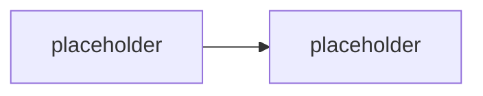

# M<D>.<I> · <Název modulu>

> Typ: povinný | volitelný · Den: <N> · Odhad: <min>

## Cíle
- <co student po modulu umí>

## Výklad

<text; názvy nástrojů/API proti GLOSSARY.md>

## Klíčové rozlišení
- <pojmy, které se pletou>

## Lab
Viz [`lab-<slug>.md`](lab-<slug>.md).

## Zdroje (Microsoft)
- <link na learn.microsoft.com>

## Stav produktu / delta
- <co ověřit k datu běhu>
