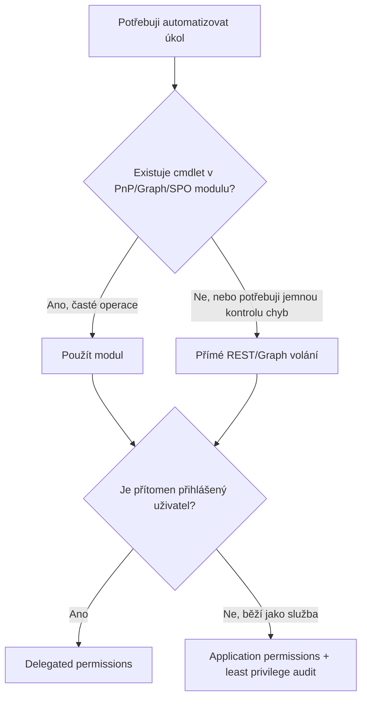

# Strategie automatizace & nástrojová mapa

> Typ: povinný · Den: 1 · Odhad: 40 min výklad + 45 min lab

## Cíle
- PowerShell vs Graph vs PnP vs REST — kdy který.
- App registration & identity strategie.
- Bezpečnostní postoj a least privilege jako výchozí návyk.

## Výklad

### PowerShell vs Graph vs PnP vs REST
Tři PowerShell moduly z GLOSSARY.md (PnP.PowerShell, Microsoft.Graph, SPO Management Shell) jsou
wrappery nad dvěma REST rozhraními — Microsoft Graph a SharePoint REST/CSOM. Rozhodovací otázka
není "PowerShell nebo REST", ale "wrapper, nebo přímé volání": moduly šetří boilerplate
(auth, paging, serializace), přímé REST volání dává plnou kontrolu tam, kde modul nemá cmdlet
pro potřebnou operaci nebo kde je nutná jemná kontrola nad chybovými stavy (viz [`../../day-2/graph-fundamentals/`](../../day-2/graph-fundamentals/)).

Vedle PowerShell trojice mapa obsahuje dva doplňky s úzkou rolí: **CLI for Microsoft 365**
(npm/Node, bez PowerShell závislosti) pro CI/CD pipeline a SPFx tooling — ne jako obecnou
alternativu PnP pro administraci; a **TypeScript/Node cestu** (Graph JS SDK + PnPjs) pro
vývojářské týmy — detail v [`explainer-typescript-graph.md`](explainer-typescript-graph.md).
Širší mapa modulů mimo fokus kurzu (Exchange, Teams, Entra, Power Platform) a jejich
evoluce je v [`../../GLOSSARY.md`](../../GLOSSARY.md) — klíčová pointa: **moduly umírají
(MSOnline, AzureAD), REST API zůstává** — proto se kurz učí principy nad Graph/REST, ne
jen cmdlety.

### App registration & identity strategie
Každá automatizace potřebuje identitu, pod kterou běží. Rozhodnutí padá na dvou osách:
delegated (uživatel je přítomen, přihlašuje se) vs application (běží bez přihlášeného uživatele,
jako služba) a interaktivní vs headless. Microsoft doporučuje delegated tam, kde je to možné —
aplikační oprávnění (application permissions) se udělují na úrovni celého tenantu a
rozšiřují útočnou plochu víc než permission vázaná na konkrétního uživatele.

Aplikace má přitom v Entra ID **dvě tváře**: **app registraci** (globální šablona s
credentials a požadovanými permissions, žije v domovském tenantu) a **Enterprise
Application** (service principal — lokální instance s uděleným consentem, v každém tenantu,
kde aplikace působí). S tím souvisí volba **single-tenant vs multi-tenant**
(`signInAudience`) — single-tenant je doporučený default, multi-tenant patří jen k reálným
multi-tenant scénářům a nese consent-governance povinnosti. Detail vč. doporučených practices:
[`explainer-app-registrations-enterprise-apps.md`](explainer-app-registrations-enterprise-apps.md).

### Bezpečnostní postoj a least privilege
Žádat jen oprávnění nezbytná pro danou akci, pravidelně auditovat přiřazená oprávnění proti
skutečně použitým a odebírat nadbytečná (např. `User.ReadWrite.All`, když stačí `User.Read.All`).
Samostatné app registrace pro samostatné účely — nesdílet jednu aplikaci mezi nesouvisejícími
automatizacemi, aby kompromitace jedné neotevřela přístup ke všem.

## Klíčové rozlišení
- **App registrace (šablona, domovský tenant, credentials) vs Enterprise Application
  (service principal, per-tenant instance, udělený consent)** — dvě položky v portálu pro
  jednu aplikaci; viz [`explainer-app-registrations-enterprise-apps.md`](explainer-app-registrations-enterprise-apps.md).
- **Single-tenant (doporučený default) vs multi-tenant (`signInAudience`)** — multi-tenant
  jen s reálným důvodem a consent governance.
- **Delegated vs application permissions** — delegated je vázané na přihlášeného uživatele a jeho
  oprávnění, application permission platí tenant-wide bez ohledu na to, kdo skript spustí.
- **PnP.PowerShell vs SPO Management Shell překryv** — viz `GLOSSARY.md`; preferovat PnP pro
  čitelnost, SPO modul jen tam, kde chybí PnP ekvivalent.
- **Modul (wrapper) vs přímé REST/Graph volání** — modul je rychlejší start, přímé volání je
  nutné pro jemnou kontrolu retry/error handlingu ([`../../day-2/graph-fundamentals/`](../../day-2/graph-fundamentals/)).

## Lab
Viz [`lab-app-registration.md`](lab-app-registration.md).

## Zdroje (Microsoft)
- [Increase application security with the principle of least privilege](https://learn.microsoft.com/en-us/entra/identity-platform/secure-least-privileged-access)
- [Security best practices for application properties](https://learn.microsoft.com/en-us/entra/identity-platform/security-best-practices-for-app-registration)
- [Overview of permissions and consent in the Microsoft identity platform](https://learn.microsoft.com/en-us/entra/identity-platform/permissions-consent-overview)

## Stav produktu / delta
- Ověřit k datu běhu — doporučený least-privilege permission model se zpřesňuje (Microsoft
  postupně označuje širší oprávnění jako "reducible" ve prospěch užších ekvivalentů); před
  během zkontrolovat, zda konkrétní permissions v labu nemají nově doporučenou užší alternativu.
