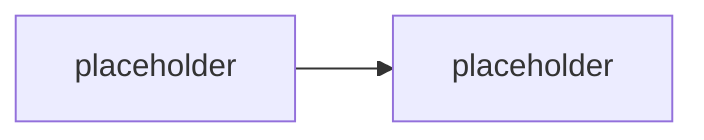

# M1.2 · Strategie automatizace & nástrojová mapa

> Typ: povinný · Den: 1 · Odhad: <min>

## Cíle
- <PowerShell vs Graph vs PnP vs REST — kdy který>
- <App registration & identity strategie>
- <Bezpečnostní postoj a least privilege>

## Výklad

<TODO: rozhodovací rámec PowerShell vs Graph vs PnP vs REST — viz GLOSSARY.md>

<TODO: app registration a identity strategie — delegated vs application permissions, kdy který auth mode>

<TODO: bezpečnostní postoj — least privilege jako defaultní návyk, ne dodatečná úprava>

## Klíčové rozlišení
- <delegated vs application permissions>
- <PnP.PowerShell vs SPO Management Shell překryv — viz GLOSSARY.md>
- <REST/Graph přímo vs přes PowerShell modul>

## Lab
Viz [`lab-app-registration.md`](lab-app-registration.md).

## Zdroje (Microsoft)
- <TODO: Microsoft identity platform — app registration dokumentace>
- <TODO: Graph permissions reference>

## Stav produktu / delta
- <TODO: ověřit aktuální doporučené permission model (least-privilege scopes) k datu běhu>
