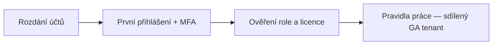

# Onboarding & pravidla práce

> Typ: povinný · Den: 1 (otvírák) · Odhad: AM blok
> Prostředí: viz [`../../environment.md`](../../environment.md)

## Cíle
- Student je přihlášen do tenantu `cloudedu.cz` účtem `jmeno.prijmeni@cloudedu.cz` a má zaregistrované MFA.
- Student rozumí tomu, že **všichni mají roli Global administrator ve sdíleném tenantu** — a co z toho plyne za pravidla.
- Student zná governance ground-rules kurzu ([`ways-of-working.md`](ways-of-working.md)), na které navazuje celý zbytek týdne.

## Průběh bloku

1. **Rozdání účtů a hesel** — každý student dostane `jmeno.prijmeni@cloudedu.cz` a heslo.
2. **První přihlášení** — portal.office.com, reset hesla + **registrace MFA** (postup: [`mfa-setup.md`](mfa-setup.md)). Účet slouží celý týden jako pracovní účet v učebně (profil Edge).
3. **Ověření role a přístupu** — student ověří přiřazenou E5 licenci a roli Global administrator (viz lab).
4. **Pravidla způsobu práce** — [`ways-of-working.md`](ways-of-working.md). U tohoto kurzu klíčové: 25 Global adminů v jednom tenantu funguje jen díky disciplíně, ne díky technickým zábranám.

## Proč Global admin pro všechny

Kurz je o automatizaci na úrovni tenantu — app registrace, `Invoke-PnPTenantTemplate`,
App Catalog, tenant-wide nastavení. S nižší rolí by polovina labů byla jen instruktorské
demo. Cena za to: **žádná technická izolace mezi studenty**. To je záměrný teaching point —
least privilege z [`../automation-strategy/`](../automation-strategy/) se tu učí kontrastem:
v kurzu jsme všichni GA a chrání nás jen pravidla; v produkci je to přesně naopak.

## Klíčové rozlišení
- **Kurzovní realita (všichni GA, sdílený tenant) vs produkční praxe (least privilege,
  oddělené identity)** — pravidla z `ways-of-working.md` simulují to, co v produkci vynucují role.
- **M365 tenant (zdarma, E5 Developer) vs Azure subscription (placená, oddělená)** — laby D4
  běží nad samostatnou Azure subscription, ne nad tenantem (viz `environment.md`).

## Lab
Viz [`lab-tenant-access.md`](lab-tenant-access.md).

## Zdroje (Microsoft)
- [Microsoft 365 Developer Program](https://learn.microsoft.com/en-us/office/developer-program/microsoft-365-developer-program)

## Stav produktu / delta
> [!WARNING] Ověřit k datu běhu — dostupnost a obnova M365 Developer Program tenantu
> (program byl v roce 2024 omezen, obnova sandboxu závisí na aktivitě), přihlašovací UI M365,
> stav MFA enforcementu v tenantu.
