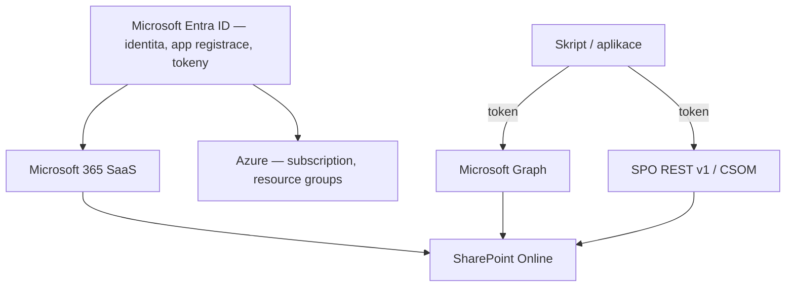

# Architektonický přehled: Azure, Entra ID, M365, Graph, SPO REST

> Typ: volitelný · Den: 1 (po onboardingu, dle času) · Odhad: 30-45 min

## Cíle
- Student umí zařadit pojmy Azure, Entra ID, Microsoft 365 a SharePoint Online do jedné mapy
  a ví, co je čeho součást.
- Student rozumí, kudy vedou API cesty k datům (Microsoft Graph vs SPO REST v1/CSOM) a kde
  v obrázku sedí autentizace.

> [!NOTE] Volitelný modul — nic povinného na něm nezávisí. Povinné moduly
> ([`../automation-strategy/`](../automation-strategy/), [`../../day-2/powershell-deep-dive/`](../../day-2/powershell-deep-dive/))
> jsou samonosné; tento blok je prohloubení pro skupiny, kde architektonický základ chybí
> nebo je nesourodý.

## Výklad

### Tři platformy, jedna identita

**Microsoft Entra ID** je identitní vrstva společná pro všechno — uživatelé, skupiny, app
registrace, role. **Microsoft 365** (SharePoint, Exchange, Teams...) je SaaS vrstva nad ní.
**Azure** je IaaS/PaaS vrstva (subscriptions, resource groups, Functions, Storage) — sdílí
s M365 tenant a identitu, ale má **oddělený billing** (subscription) a oddělený admin model
(RBAC role na resources, ne Entra admin role). Prakticky: náš kurzový M365 tenant je zdarma
(E5 Developer), Azure laby jedou nad samostatnou placenou subscription — viz
[`../../environment.md`](../../environment.md).

### API cesty k SharePoint datům

- **Microsoft Graph** (`graph.microsoft.com`) — jednotná brána nad celým M365 včetně
  SharePointu (`/sites`, `/drives`). Moderní default, konzistentní auth (Entra tokeny),
  batching/delta (viz [`../../day-2/graph-fundamentals/`](../../day-2/graph-fundamentals/)).
- **SPO REST v1** (`<tenant>.sharepoint.com/_api/...`) a **CSOM** — starší, SharePoint-native
  rozhraní. Pokrývají věci, které Graph dosud neumí (jemné detaily listů, provisioning
  artefakty) — proto PnP.PowerShell pod kapotou kombinuje obojí.
- Pravidlo: **Graph first, SPO REST tam, kde Graph nestačí** — stejná logika jako
  "wrapper vs přímé volání" v [`../automation-strategy/`](../automation-strategy/).

### Kde sedí autentizace

Každé volání — Graph i SPO REST — nese Entra token. App registrace (identita aplikace),
permissions (co token smí) a auth flow (jak se token získá) jsou společné pro všechny cesty;
liší se jen resource, na který token zní. Detajlně v
[`../../day-2/powershell-deep-dive/`](../../day-2/powershell-deep-dive/).

## Klíčové rozlišení
- **Tenant (identita + M365 služby) vs Azure subscription (billing + resources)** — jeden
  tenant může mít 0 i N subscriptions; náš kurz má tenant zdarma a subscription placenou.
- **Entra admin role (Global admin) vs Azure RBAC (Contributor na resource group)** — dvě
  různé autorizační soustavy; GA v tenantu automaticky neznamená přístup k Azure resources.
- **Graph (jednotná brána, moderní) vs SPO REST v1/CSOM (starší, širší SPO pokrytí)** —
  ne konkurence, ale doplněk; PnP je wrapper nad oběma.

## Zdroje (Microsoft)
- [Microsoft Graph overview](https://learn.microsoft.com/en-us/graph/overview)
- [Get to know the SharePoint REST service](https://learn.microsoft.com/en-us/sharepoint/dev/sp-add-ins/get-to-know-the-sharepoint-rest-service)
- [What is Microsoft Entra ID?](https://learn.microsoft.com/en-us/entra/fundamentals/whatis)

## Stav produktu / delta
- Ověřit k datu běhu — tempo přesunu SPO funkcí do Graphu (pokrytí `/sites` API roste);
  hranice "co Graph umí vs neumí nad SharePointem" se posouvá každý rok.
