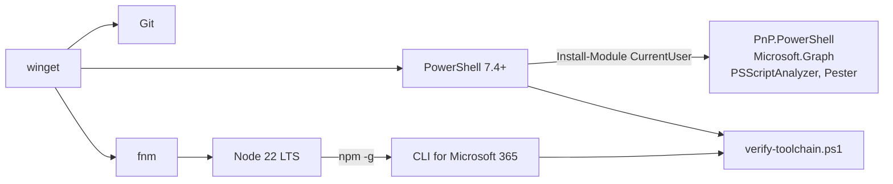

# Toolchain skriptera: PowerShell 7, Node a CLI

> Typ: povinný · Den: 1 · Odhad: 15 min výklad + 30 min lab (20 min, pokud je učebna předinstalovaná)

## Cíle
- Mít na stroji **kompletní a ověřený** toolchain, se kterým poběží všechny laby týdne —
  než se narazí na první `command not found` uprostřed labu.
- Vědět, **proč se Node instaluje přes správce verzí**, ne z instalátoru, a co to řeší.
- Umět rozlišit **globální nástroj** (PowerShell, Node, CLI) od **projektové závislosti**
  (moduly, npm balíčky v repu) a vědět, který se kam verzuje.
- Umět toolchain **ověřit jedním příkazem** a předat ten příkaz kolegovi.

## Výklad

### Tři vrstvy, které se pletou

| Vrstva | Co to je | Kam se verzuje |
|---|---|---|
| **Runtime** | PowerShell 7, Node.js | na stroj, přes `winget`/správce verzí |
| **Globální nástroj** | CLI for Microsoft 365, PSScriptAnalyzer, Pester | na uživatele (`-Scope CurrentUser`, `npm -g`) |
| **Projektová závislost** | moduly a balíčky, které skript vyžaduje | do repa (`#Requires`, `package.json`) |

Pravidlo: **co skript potřebuje k běhu, patří do repa, ne do hlavy admina.** Globálně se
instaluje jen to, co spouštíte vy jako člověk — ne to, na čem stojí skript.

### PowerShell 7, ne 5.1
Kurz je PS7-first. **PnP PowerShell vyžaduje PowerShell 7.4.0 nebo novější** — na Windows
PowerShellu 5.1 se modul nenačte. Windows PowerShell 5.1 na stroji zůstává (systém ho
používá), jen se v něm nepracuje; jsou to dva vedle sebe žijící produkty, ne upgrade.
Detail k modulům a jejich verzování:
[`../../day-2/powershell-deep-dive/explainer-module-management.md`](../../day-2/powershell-deep-dive/explainer-module-management.md).

### Node přes fnm, ne z instalátoru
Node je v tomto kurzu potřeba kvůli **CLI for Microsoft 365** — je to npm balíček
(`@pnp/cli-microsoft365`) a jinou distribuci nemá. To je celý důvod, proč Node instalujeme;
kurz v Node nic nevyvíjí.

Instalovat ho ale **z `.msi` je past**, i když to na první pohled stačí: jeden globální Node
na stroji znamená, že jakýkoli další projekt s jinou požadovanou verzí vás donutí Node
přeinstalovat — a to typicky zjistíte u zákazníka, ne doma. **fnm** (Fast Node Manager) drží
víc verzí vedle sebe a přepíná mezi nimi podle souboru `.node-version` v repozitáři: vejdete
do složky projektu a jste na správné verzi, aniž byste na to museli myslet.

> [!NOTE] Microsoft doporučuje jen „nainstaluj Node LTS"
> Správce verzí je **naše** doporučení, ne převzaté z dokumentace. Odůvodnění je provozní
> (víc projektů s různými požadavky na jednom stroji), ne technické — kdo má na stroji
> jediný projekt, vystačí si s instalátorem.

### Ověřování patří do skriptu, ne do hlavy
Seznam „co má být nainstalované" v hlavě nebo v e-mailu je nespolehlivý. Ověřovací skript,
který vypíše verze a řekne, co chybí, je artefakt, který se dá poslat kolegovi, spustit
v CI a přiložit k dokumentaci projektu. Přesně to student v labu vyrobí.

## Klíčové rozlišení
- **Runtime vs globální nástroj vs projektová závislost** — tři různé životní cykly a tři
  různá místa, kde se verzují; smíchat je znamená „u mě to funguje".
- **PowerShell 7 vs Windows PowerShell 5.1** — dva souběžně žijící produkty, ne upgrade;
  PnP PowerShell běží jen na 7.4+.
- **fnm/nvm vs instalátor Node** — správce verzí řeší víc projektů na jednom stroji;
  instalátor je v pořádku pro jediný projekt a nic víc.
- **`-Scope CurrentUser` vs `AllUsers`** — instalace do uživatelského profilu nepotřebuje
  administrátora a v učebně ani u zákazníka na ni nemusíte čekat; `AllUsers` je pro image.
- **Ověřovací skript vs seznam v dokumentaci** — první se dá spustit, druhý se dá jen číst.

## Lab
Viz [`lab-toolchain-verify.md`](lab-toolchain-verify.md).

## Zdroje (Microsoft)
- [Installing PowerShell on Windows](https://learn.microsoft.com/en-us/powershell/scripting/install/installing-powershell-on-windows)
- [Using Visual Studio Code for PowerShell Development](https://learn.microsoft.com/en-us/powershell/scripting/dev-cross-plat/vscode/using-vscode)
- [PnP PowerShell — Installation](https://pnp.github.io/powershell/articles/installation.html)
- [CLI for Microsoft 365 — Install the CLI](https://pnp.github.io/cli-microsoft365/user-guide/installing-cli/)
- [fnm — Fast Node Manager](https://github.com/Schniz/fnm)

## Stav produktu / delta
> [!WARNING] Ověřit k datu běhu — stav k 2026-09.
> **PnP PowerShell vyžaduje PowerShell 7.4.0+**, **CLI for Microsoft 365 v11 je testované
> na Node 18+** (doporučené je aktuální LTS, tj. **Node 22**). Minimální verze se u obou
> posouvají po měsících — před KAŽDÝM během ověřit na
> [PnP PowerShell Installation](https://pnp.github.io/powershell/articles/installation.html)
> a [CLI installing](https://pnp.github.io/cli-microsoft365/user-guide/installing-cli/),
> a projet lab na čistém stroji.
