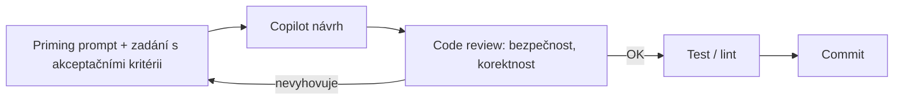

# Inženýrské prostředí, VS Code a Copilot

> Typ: povinný · Den: 1 · Odhad: 40 min výklad + 45 min lab

## Cíle
- Ovládat VS Code jako pracovní prostředí pro automatizační skripty (workspace, `tasks.json`, formátování, ladění).
- Dodržovat základní hygienu repozitáře — malé commity s popisnou zprávou, `pull` před
  `push`, review před nasazením — a umět rozhodnout, kde má repozitář organizace bydlet
  (viz [`explainer-git-hosting.md`](explainer-git-hosting.md)).
- Používat **Microsoft Copilot Chat** zodpovědně — s explicitním promptingem, priming promptem
  proti fantazii modelu, bezpečnostními mantinely a akceptačními kritérii, ne slepým přijímáním návrhů.
- Vědět, co je v Copilotu součástí stávajícího předplatného a kde začíná měřená spotřeba —
  viz [`explainer-copilot-licensing.md`](explainer-copilot-licensing.md).
- Rozumět tomu, **z čeho se skládá deklarativní agent** a proč umí věci, na které obecný chat
  nedosáhne (MCP grounding, vynucené guardrails) — viz
  [`explainer-declarative-agent.md`](explainer-declarative-agent.md) a kompletní zdrojový kód
  kurzovního agenta v [`agent-scripting-advisor/`](agent-scripting-advisor/).
- Rozumět třem runtime prostředím automatizace (DEV stanice, kontejner/CI, server) — viz
  [`explainer-runtime-environments.md`](explainer-runtime-environments.md).

## Výklad

### VS Code pro automatizaci

**`tasks.json` je seznam pojmenovaných tlačítek pro jeden konkrétní projekt.** Příkazy,
které se v repu pořád opakují — lint, testy, formátování — přestanou žít ve vaší hlavě
nebo v `README` a stanou se něčím, co jde vybrat ze seznamu (`Ctrl+Shift+P` →
*Tasks: Run Task*). `"version": "2.0.0"` je jen verze formátu, jiná se dnes nepoužívá.

```json
{
  "version": "2.0.0",
  "tasks": [
    {
      "label": "lint",
      "type": "shell",
      "command": "Invoke-ScriptAnalyzer",
      "args": [ "-Path", "./scripts", "-Recurse" ],
      "group": "test"
    },
    {
      "label": "test",
      "type": "shell",
      "command": "Invoke-Pester",
      "args": [ "-Path", "./tests" ],
      "group": { "kind": "test", "isDefault": true }
    }
  ]
}
```

`label` je jméno v seznamu, `command` co se spustí, `args` argumenty **zvlášť** (vyhnete se
tím problémům s uvozovkami a mezerami v cestách). `type: "shell"` spustí příkaz přes shell,
takže fungují roury a rozbalování cest; `"process"` spustí program přímo, bez shellu —
hodí se, když nechcete, aby shell do příkazu jakkoli zasahoval. `group` zařadí úlohu jako
`build` nebo `test`, čímž zprovozní klávesové zkratky, a `isDefault` říká, kterou z nich
zkratka spustí, když jich je víc.

**Umístění v `.vscode/` je to podstatné.** VS Code má dvě různá místa pro nastavení:
uživatelský profil (platí pro všechny vaše projekty, **kolega ho nevidí**) a `.vscode/`
v repozitáři (platí pro tenhle projekt a **je commitnuté**). Tlačítka v repu znamenají,
že kolega si naklonuje projekt a má je taky, aniž byste mu něco vysvětlovali — stejná
logika jako `.node-version` a `.vscode/extensions.json` z
[`../toolchain-setup/`](../toolchain-setup/). Sousedský `launch.json` dělá totéž pro
ladění: po `F5` běží skript s breakpointy (PowerShell extension i Node debugger).

**Formátování při uložení a podtrhávání chyb v editoru je pohodlné — a je to past, pokud
je to jediné místo, kde kontrola žije.** Stojí to na třech podmínkách: máte VS Code, máte
rozšíření, máte zapnuté nastavení. **CI pipeline nemá ani jednu z nich** — na buildovacím
serveru žádný editor neběží. Kolega bez toho nastavení si nekvalitní kód commitne a
pipeline to nezachytí, protože nemá čím. Jako úloha je to naopak obyčejný příkaz, který
spustí kdokoli a cokoli: vy z editoru, kolega z terminálu, CI z pipeline.

Test, kterým si to ověříte: **jde ta kontrola spustit, aniž bych otevřel VS Code?**
Když ne, není to kontrola kvality, ale váš osobní zvyk.

### PowerShell extension — náhrada za ISE
VS Code s **PowerShell extension** je Microsoftem doporučené prostředí pro vývoj PowerShell
skriptů — a jediné podporované pro PowerShell 7. **Windows PowerShell ISE** stále existuje,
ale není aktivně vyvíjené a **umí jen Windows PowerShell 5.1** — pro tento kurz (PS7-first,
viz [`../../day-2/powershell-deep-dive/explainer-module-management.md`](../../day-2/powershell-deep-dive/explainer-module-management.md))
je tedy mimo hru. Extension dává vše, co ISE, a navíc: IntelliSense nad cmdlety, integrovaný
debugger (breakpointy, `launch.json`), PSScriptAnalyzer linting přímo v editoru, spouštění
výběru F8 a integrovanou PowerShell konzoli. Pro adminy zvyklé na ISE existuje **ISE Mode**
(Command Palette → "PowerShell: Enable ISE Mode") — přepne layout, barvy a klávesové zkratky
na ISE zvyklosti, takže přechod nebolí.

### Git základy a hygiena repozitáře
**Skripty jsou kód a kód patří do Gitu** — bez ohledu na to, kde repozitář bydlí. Vstupní
úroveň, kterou po sobě chtějte hned: malé commity s popisnou zprávou (**proč**, ne jen co),
`pull` před `push`, a review — byť vlastní — před tím, než se něco pustí na produkční
tenant. Review checklist je zaměřený na automatizační kód: hardcoded identifikátory
(tenant ID, ClientId, secrety), chybějící error handling, chybějící `-WhatIf`
u destruktivních skriptů.

**Branch per feature a PR jako povinná brána do `main` je cílový stav pro tým, ne vstupní
požadavek.** Kurz jede lineárně v `main` s malými commity — to je pracovní návyk, který
si odnesete i jako jednotlivec. PR gate má smysl zavádět, až workflow drží celý tým;
zavedený předčasně vede k tomu, že se obchází. Slovníček pojmů (commit, push/pull, branch,
pull request, merge, `.gitignore`), srovnání hostingů **GitHub vs Azure DevOps vs
self-hosted** a rozhodovací osa pro repozitář se skripty k produkčnímu tenantu:
[`explainer-git-hosting.md`](explainer-git-hosting.md).

### Microsoft Copilot Chat zodpovědně
Kurz používá **Microsoft Copilot Chat** — asistenta dostupného v rámci firemního přihlášení, s ochranou firemních dat (prompty a odpovědi netrénují modely). Žádná samostatná vývojářská AI licence se nekupuje; co je součástí předplatného, kde začíná měřená spotřeba a jak se pay-as-you-go zapíná a hlídá, řeší [`explainer-copilot-licensing.md`](explainer-copilot-licensing.md).

Copilot je nástroj ke generování návrhu, ne náhrada za review — každý návrh je nutné před merge stejně důkladně prověřit jako kód od libovolného jiného přispěvatele: testy, kontrola bezpečnostních zranitelností, soulad s interními standardy. Bezpečnostní mantinely: nikdy nevkládat do promptu tenant ID, secrety, cert thumbprinty ani jiné citlivé identifikátory. Akceptační kritéria patří do promptu explicitně (co má kód dělat, jaké má mít okrajové podmínky), ne až do následné kontroly.

Model si ochotně **vymyslí** neexistující cmdlet nebo parametr — a stejně ochotně zopakuje roky starou praxi, která dnes spadne. Proto každá konverzace začíná **priming promptem** se závaznými pravidly: [`copilot-priming-prompt.md`](copilot-priming-prompt.md). Otestovaná sada pravidel je zároveň polotovar **deklarativního agenta** — tím vkládání promptu končí. Generování fiktivních testovacích dat (a proč do promptu nepatří reálná): [`guide-dummy-data.md`](guide-dummy-data.md).



### Od priming promptu k agentovi
Priming prompt řeší správný problém špatnou cestou: musí se vložit na začátku každé
konverzace, každý den, každým členem týmu — a kdo ho vloží jen napůl, pracuje s jiným
nástrojem než ostatní. **Deklarativní agent je ta stejná sada pravidel zabalená do
publikovaného artefaktu**, který se schvaluje a verzuje jako každá jiná aplikace v tenantu.

Navíc přidává dvě věci, které pouhý prompt neumí. **Grounding přes MCP** — kurzovní agent
volá Microsoft Learn MCP server a dokumentaci si v konverzaci *čte*, místo aby ji rekonstruoval
z vah modelu; prompt umí říct „nevymýšlej si", ale nedá modelu čím to nahradit. A **hranice,
které nelze zapomenout** — agent nemá jedinou capability sahající na data tenantu, takže není
otázka disciplíny, jestli se dostane k zákaznickým datům.

Kurz jednoho takového agenta používá celý týden. Architektura:
[`explainer-declarative-agent.md`](explainer-declarative-agent.md). Kompletní zdrojový kód
včetně instrukcí a testovacích otázek: [`agent-scripting-advisor/`](agent-scripting-advisor/).

## Klíčové rozlišení
- **VS Code + PowerShell extension vs Windows PowerShell ISE** — ISE není aktivně vyvíjené a
  umí jen Windows PowerShell 5.1; pro PS7 je VS Code s extension jediné podporované
  prostředí. ISE Mode v extension usnadní přechod, ale cíl je plný VS Code workflow
  (tasks, debugger, linting), ne trvalé žití v ISE emulaci.
- **Copilot návrh vs přijatý/otestovaný kód** — návrh je vstup k review, ne hotový výstup; odpovědnost za merge nese student, ne nástroj.
- **Vymyšlený cmdlet vs zastaralá praxe** — dvě různé tváře fantazie modelu; první chytí
  pravidlo „nevymýšlej názvy", druhou až explicitní pravidlo o aktuálním postupu (viz
  [`copilot-priming-prompt.md`](copilot-priming-prompt.md)).
- **Copilot Chat (součást předplatného) vs agent nad firemními daty (měřená spotřeba)** —
  licenční hranice, kterou musí admin znát dřív, než agenty pustí do tenantu.
- **Vložený prompt vs zabalený guardrail** — prompt lze zapomenout, vložit napůl nebo
  upravit; agent je publikovaný artefakt s verzí, vydavatelem a schvalovacím krokem.
- **Model knowledge vs grounding** — co model „ví" z tréninku vs co si v konverzaci
  skutečně přečte z dokumentace; jen druhé je ověřitelné a citovatelné (viz
  [`explainer-declarative-agent.md`](explainer-declarative-agent.md)).
- **Formátování vs linting** — formátování řeší styl (whitespace, odsazení), linting hledá reálné chyby a anti-patterny (PSScriptAnalyzer pravidla); obojí patří do `tasks.json`, aby fungovalo i mimo editor (CI).
- **Nastavení editoru vs úloha v repu** — nastavení platí jen tomu, kdo ho má; úloha
  v `.vscode/tasks.json` je příkaz, který spustí i kolega a i CI. Kontrola kvality, kterou
  nelze spustit bez editoru, není brána, ale zvyk.
- **Vstupní úroveň vs cílový stav Gitu** — malé commity, `pull` před `push` a review před
  nasazením zvládne jednotlivec od prvního dne; branch per feature s PR gate má smysl, až
  workflow drží celý tým. Zavedený předčasně se obchází.

## Lab
Viz [`lab-repo-scaffold.md`](lab-repo-scaffold.md).

## Zdroje (Microsoft)
- [Integrate with External Tools via Tasks (VS Code)](https://code.visualstudio.com/docs/debugtest/tasks)
- [Using Visual Studio Code for PowerShell Development](https://learn.microsoft.com/en-us/powershell/scripting/dev-cross-plat/vscode/using-vscode)
- [How to replicate the ISE experience in Visual Studio Code](https://learn.microsoft.com/en-us/powershell/scripting/dev-cross-plat/vscode/how-to-replicate-the-ise-experience-in-vscode)
- [Microsoft Copilot Chat — přehled](https://learn.microsoft.com/en-us/copilot/overview)
- [Agents for Microsoft Copilot Chat](https://learn.microsoft.com/en-us/copilot/agents)
- [Declarative agent schema 1.8 for Microsoft 365 Copilot](https://learn.microsoft.com/en-us/microsoft-365/copilot/extensibility/declarative-agent-manifest-1.8)
- [API plugin manifest schema 2.4 (runtime `RemoteMCPServer`)](https://learn.microsoft.com/en-us/microsoft-365-copilot/extensibility/api-plugin-manifest-2.4)

## Stav produktu / delta
> [!WARNING] Ověřit k datu běhu — stav k 2026-09.
> Funkce Copilot Chatu (dostupnost, vstupní URL, trvalé instrukce, tvorba agentů) i licenční
> hranice pay-as-you-go se vyvíjejí rychle — ověřit před KAŽDÝM během včetně dostupnosti na
> kurzovním tenantu. Zdroje a detail: [`explainer-copilot-licensing.md`](explainer-copilot-licensing.md).
