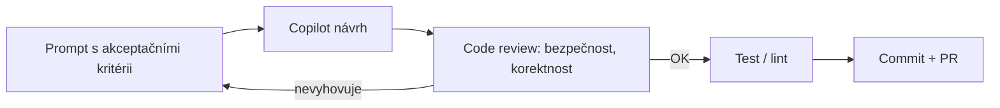

# Inženýrské prostředí, VS Code a Copilot

> Typ: povinný · Den: 1 · Odhad: AM blok

## Cíle
- Ovládat VS Code jako pracovní prostředí pro automatizační skripty (workspace, `tasks.json`, formátování, ladění).
- Dodržovat základní hygienu repozitáře — branch strategie, commit zprávy, PR a code review.
- Používat GitHub Copilot zodpovědně — s explicitním promptingem, bezpečnostními mantinely a akceptačními kritérii, ne slepým přijímáním návrhů.
- Rozumět třem runtime prostředím automatizace (DEV stanice, kontejner/CI, server) — viz
  [`explainer-runtime-environments.md`](explainer-runtime-environments.md).

## Výklad

### VS Code pro automatizaci
`.vscode/tasks.json` (verze `2.0.0`) definuje opakovatelné akce — build/test/lint — jako `type: "shell"` nebo `"process"` úlohy s `label`, `command`, `args` a `group` (`build`/`test`, případně `isDefault`). Umístění v `.vscode/` znamená, že konfigurace jde do repozitáře a sdílí se s týmem, ne jen s jedním strojem. `launch.json` řeší ladění (PowerShell extension i Node debugger). Formátování při uložení + linting (PSScriptAnalyzer pro PowerShell) patří do tasků, ne jen do nastavení editoru — jinak selžou v CI, kde editor neběží.

### PowerShell extension — náhrada za ISE
VS Code s **PowerShell extension** je Microsoftem doporučené prostředí pro vývoj PowerShell
skriptů — a jediné podporované pro PowerShell 7. **Windows PowerShell ISE** stále existuje,
ale není aktivně vyvíjené a **umí jen Windows PowerShell 5.1** — pro tento kurz (PS7-first,
viz [`../powershell-deep-dive/explainer-module-management.md`](../powershell-deep-dive/explainer-module-management.md))
je tedy mimo hru. Extension dává vše, co ISE, a navíc: IntelliSense nad cmdlety, integrovaný
debugger (breakpointy, `launch.json`), PSScriptAnalyzer linting přímo v editoru, spouštění
výběru F8 a integrovanou PowerShell konzoli. Pro adminy zvyklé na ISE existuje **ISE Mode**
(Command Palette → "PowerShell: Enable ISE Mode") — přepne layout, barvy a klávesové zkratky
na ISE zvyklosti, takže přechod nebolí.

### Git základy a hygiena repozitáře
Branch per feature/fix, malé commity s popisnou zprávou (proč, ne jen co), PR jako povinná brána před merge do `main`, code review checklist zaměřený na automatizační kód: hardcoded identifikátory (tenant ID, ClientId, secrety), chybějící error handling, chybějící `-WhatIf` u destruktivních skriptů.

### GitHub Copilot zodpovědně
Copilot je nástroj ke generování návrhu, ne náhrada za review — každý návrh je nutné před merge stejně důkladně prověřit jako kód od libovolného jiného přispěvatele: testy, kontrola bezpečnostních zranitelností, soulad s interními standardy. Bezpečnostní mantinely: nikdy nevkládat do promptu tenant ID, secrety, cert thumbprinty ani jiné citlivé identifikátory — kontext promptu může být zpracován mimo hranice tenantu. Akceptační kritéria patří do promptu explicitně (co má kód dělat, jaké má mít okrajové podmínky), ne do až následné kontroly.

## Klíčové rozlišení
- **VS Code + PowerShell extension vs Windows PowerShell ISE** — ISE není aktivně vyvíjené a
  umí jen Windows PowerShell 5.1; pro PS7 je VS Code s extension jediné podporované
  prostředí. ISE Mode v extension usnadní přechod, ale cíl je plný VS Code workflow
  (tasks, debugger, linting), ne trvalé žití v ISE emulaci.
- **Copilot návrh vs přijatý/otestovaný kód** — návrh je vstup k review, ne hotový výstup; odpovědnost za merge nese student, ne nástroj.
- **Formátování vs linting** — formátování řeší styl (whitespace, odsazení), linting hledá reálné chyby a anti-patterny (PSScriptAnalyzer pravidla); obojí patří do `tasks.json`, aby fungovalo i mimo editor (CI).
- **Lokální commit vs PR review gate** — lokální historie je studentova pracovní plocha, `main` je chráněná větev s vynuceným review před mergem.

## Lab
Viz [`lab-repo-scaffold.md`](lab-repo-scaffold.md).

## Zdroje (Microsoft)
- [Integrate with External Tools via Tasks (VS Code)](https://code.visualstudio.com/docs/debugtest/tasks)
- [Using Visual Studio Code for PowerShell Development](https://learn.microsoft.com/en-us/powershell/scripting/dev-cross-plat/vscode/using-vscode)
- [How to replicate the ISE experience in Visual Studio Code](https://learn.microsoft.com/en-us/powershell/scripting/dev-cross-plat/vscode/how-to-replicate-the-ise-experience-in-vscode)
- [Responsible use of GitHub Copilot features](https://docs.github.com/en/copilot/responsible-use)

## Stav produktu / delta
- Ověřit k datu běhu — GitHub Copilot funkce (chat mode, agent mode, coding agent) se vyvíjí rychle; ověřit aktuální feature set a doporučené modely/nastavení organizace před během.
