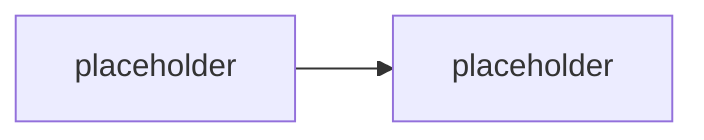

# M1.1 · Inženýrské prostředí, VS Code a Copilot

> Typ: povinný · Den: 1 · Odhad: AM blok

## Cíle
- <VS Code workspace pro automatizaci: tasks, formátování, ladění>
- <Git základy, hygiena repozitáře, PR a code review>
- <GitHub Copilot zodpovědně: prompting, bezpečnostní mantinely, akceptační kritéria>

## Výklad

<TODO: VS Code pro automatizaci — workspace, tasks.json, launch.json, formátování/linting>

<TODO: Git základy a hygiena repozitáře — branch strategie, commit zprávy, PR, code review checklist>

<TODO: GitHub Copilot zodpovědně — explicitní prompting, bezpečnostní mantinely (nikdy tenant ID/secrety do promptu), akceptační kritéria před merge>

## Klíčové rozlišení
- <Copilot návrh vs přijatý/otestovaný kód>
- <formátování vs linting>
- <lokální commit vs PR review gate>

## Lab
Viz [`lab-repo-scaffold.md`](lab-repo-scaffold.md).

## Zdroje (Microsoft)
- <TODO: VS Code workspace/tasks dokumentace>
- <TODO: GitHub Copilot dokumentace — bezpečnostní doporučení>

## Stav produktu / delta
- <TODO: Copilot chat/agent mode se vyvíjí rychle — ověřit aktuální feature set před během>
