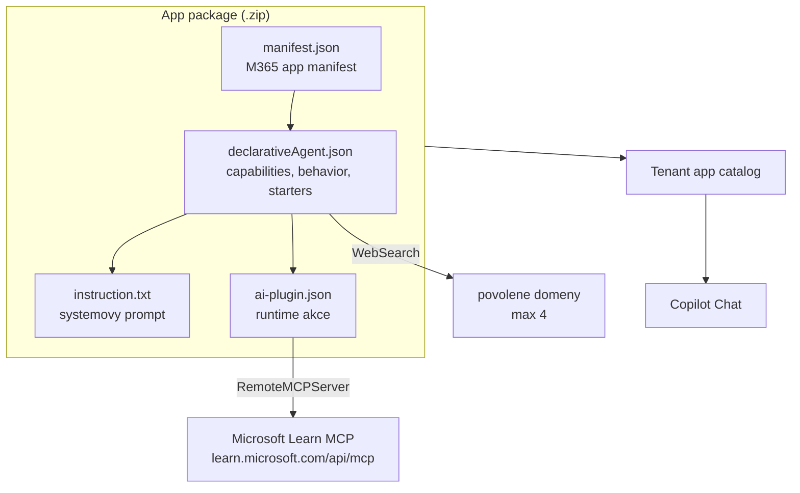

# Explainer · Deklarativní agent: když guardrails přestanou být promptem a stanou se nástrojem

[`copilot-priming-prompt.md`](copilot-priming-prompt.md) řeší reálný problém — model si vymýšlí
cmdlety a opakuje léta zastaralou praxi — ale řeší ho ručně. Prompt se musí vložit na začátku
každé konverzace, každý den, každým členem týmu. Kdo ho vloží jen napůl nebo vůbec, dostane
jiný nástroj než ostatní.

**Deklarativní agent je ta stejná sada pravidel zabalená do artefaktu, který se publikuje
jednou a chová se stejně všem.** Nic víc, ale ani nic míň: přidává navíc řízený grounding
a auditovatelné hranice, na které samotný chat nedosáhne.

Kurz jednoho takového agenta používá — [`agent-scripting-advisor/`](agent-scripting-advisor/)
obsahuje jeho **kompletní zdrojový kód**. Tenhle explainer vysvětluje, z čeho se skládá.

## Čtyři vrstvy

| Vrstva | Soubor | Co dělá |
|---|---|---|
| **Instrukce** | `instruction.txt` | systémový prompt agenta — chování, priority, zákazy. Limit **8 000 znaků** |
| **Grounding (capabilities)** | `declarativeAgent.json` → `capabilities` | znalostní zdroje: web search, OneDrive/SharePoint, Copilot connectors, e-mail, Teams zprávy, embedded soubory |
| **Actions** | `ai-plugin.json`, odkázaný z `actions` | volání ven — OpenAPI plugin nebo **MCP server**; 1 až 10 akcí |
| **Behavior overrides** | `declarativeAgent.json` → `behavior_overrides` | režim odpovědi, potlačení model knowledge, návrhy |

Nad tím ještě jedna obálka: `manifest.json` je **Microsoft 365 app manifest** — jméno, ikony,
vydavatel, privacy/terms URL. Agent se do tenantu dostává jako aplikace, ne jako nastavení
v chatu; proto ho lze publikovat, schvalovat a odebrat běžnými nástroji správy aplikací.



## Grounding: MCP jako normativní zdroj

Nejdůležitější řádek celého agenta není v instrukcích, ale v `ai-plugin.json`:

```json
"runtimes": [
    {
        "type": "RemoteMCPServer",
        "auth": { "type": "None" },
        "run_for_functions": [ "*" ],
        "spec": { "url": "https://learn.microsoft.com/api/mcp" }
    }
]
```

**MCP (Model Context Protocol)** je otevřený protokol, kterým agent volá externí server
a dostává zpět nástroje a data. Microsoft Learn ho provozuje veřejně a bez autentizace.
Prázdné pole `functions` a `run_for_functions: ["*"]` znamená **dynamic tool discovery** —
agent se seznam nástrojů zeptá serveru za běhu, místo aby ho měl natvrdo v manifestu.

Praktický dopad: **agent si nepamatuje dokumentaci, on ji čte.** Když se ptáte na parametr
cmdletu nebo na oprávnění ke Graph endpointu, odpověď nevzniká z vah modelu, ale z výsledku
volání do Learn. Tohle je ten rozdíl proti obecnému chatu, který stojí za pozornost —
priming prompt umí modelu říct „nevymýšlej si", ale nedá mu čím to nahradit.

Zbytek groundingu je `WebSearch` se **třemi doménami ze čtyř možných**:
`pnp.github.io` (dokumentace PnP PowerShell, CLI for Microsoft 365 i PnP script samples
v jednom slotu), `devblogs.microsoft.com`, `techcommunity.microsoft.com`. `learn.microsoft.com`
tam vědomě **není** — duplikovalo by MCP akci, která má lepší retrieval. Čtvrtý slot zůstal
volný záměrně.

## Hranice, které si agent nese s sebou

Agent **nemá jedinou capability, která sahá na data tenantu** — žádný `OneDriveAndSharePoint`,
`GraphConnectors`, `Email`, `People` ani `TeamsMessages`. To je zaprvé principiální rozhodnutí
(nástroj na psaní skriptů nepotřebuje vidět zákaznická data), zadruhé licenční: podle
dokumentace platí, že *uživatelé mají přístup k deklarativním agentům s jinými capabilities
než Web search jen tehdy, pokud jejich tenant povoluje měřenou spotřebu nebo mají licenci
Microsoft 365 Copilot*. Agent bez tenant-data capabilities je tedy dostupný i bez licence
a bez pay-as-you-go — viz [`explainer-copilot-licensing.md`](explainer-copilot-licensing.md).

Zbytek hranic je v `instruction.txt` a čte se jako code review checklist:

- **zdrojová hierarchie** — Learn je normativní pro signatury, PnP/CLI reference pro své
  dva nástroje, komunitní samply jsou vzory, nikdy ne signatury;
- **least privilege** — pojmenovat nejužší oprávnění, vždy říct delegated vs application,
  preferovat `Sites.Selected`;
- **dry-run first** — u destruktivní operace nejdřív `-WhatIf` nebo report-only průchod;
- **data sovereignty** — nikdy nenavrhnout architekturu, kde data opustí tenant zákazníka;
- **epistemická poctivost** — „nejsem si jistý, ověř tady" je lepší odpověď než věrohodný odhad.

Pozoruhodné je `"discourage_model_knowledge": false`. Přepínač existuje a nutí agenta
odpovídat jen ze zdrojů — jenže Learn **nedokumentuje PnP PowerShell**, takže zapnutí by
udělalo do znalostí díru. Břemeno proti fantazii modelu proto nese instrukce, ne přepínač.
To je typický kompromis, který v návrhu agenta musíte umět obhájit.

## Jak se pozná, že agent funguje

Tvrzení „agent je lepší než chat" je potřeba doložit. K tomu slouží
[`agent-scripting-advisor/eval-questions.md`](agent-scripting-advisor/eval-questions.md):
**20 otázek, z toho 8 v oblastech, pro které agent nebyl groundovaný** — a tam je přiznaná
nejistota **procházející** odpovědí, ne selháním. Hlavní metrika je **míra halucinací
a laťka je nula**: pro výukový nástroj není poškozující tenká odpověď, ale sebejistá
nesprávná, protože ji student nerozezná.

Netriviální detail, který stojí za zapamatování: **výchozí evaluátory Relevance a Coherence
vymyšlený cmdlet neodhalí.** Odpověď s neexistujícím parametrem je perfektně relevantní
i koherentní. Automatické skóre je regresní test plynulosti; manuální hodnocení proti rubrice
je to primární.

## Klíčové rozlišení

- **Priming prompt vs deklarativní agent** — stejná pravidla, ale prompt se vkládá ručně
  a lze ho zapomenout; agent je publikovaný artefakt s verzí, vydavatelem a schvalováním.
- **Capabilities vs actions** — capabilities jsou *znalost, ze které agent čerpá*
  (a licenčně drahá část), actions jsou *volání ven*; MCP patří mezi actions.
- **Model knowledge vs grounding** — co model „ví" z tréninku vs co si v konverzaci
  skutečně přečte; jen druhé je ověřitelné a citovatelné.
- **Agent vs Copilot Studio bot** — deklarativní agent je konfigurace nad hostovaným
  Copilotem (žádný hosting, žádný orchestrátor); custom engine agent je vlastní aplikace
  s vlastními náklady a provozem.
- **Halucinace vs zastaralá praxe** — dvě různá selhání; první chytí grounding,
  druhé jen explicitní pravidlo o aktuálním postupu.

## Zdroje (Microsoft)

- [Declarative agent schema 1.8 for Microsoft 365 Copilot](https://learn.microsoft.com/en-us/microsoft-365/copilot/extensibility/declarative-agent-manifest-1.8)
- [API plugin manifest schema 2.4 (runtime `RemoteMCPServer`)](https://learn.microsoft.com/en-us/microsoft-365-copilot/extensibility/api-plugin-manifest-2.4)
- [Microsoft 365 App Model for Agents](https://learn.microsoft.com/en-us/microsoft-365/copilot/extensibility/agents-are-apps)
- [Write effective instructions for declarative agents](https://learn.microsoft.com/en-us/microsoft-365/copilot/extensibility/declarative-agent-instructions)
- [Troubleshoot MCP apps in Microsoft 365 Copilot](https://learn.microsoft.com/en-us/microsoft-365/copilot/extensibility/plugin-mcp-apps-troubleshooting)
- [Agents for Microsoft Copilot Chat](https://learn.microsoft.com/en-us/copilot/agents)

## Stav produktu / delta
> [!WARNING] Ověřit k datu běhu — stav k 2026-09.
> Schéma deklarativního agenta se posouvá po měsících (**v1.8** je aktuální k 2026-08;
> v1.8 přidala `EmailActions` a `MeetingActions` oproti v1.7). Před během ověřit, zda
> `version` v [`agent-scripting-advisor/declarativeAgent.json`](agent-scripting-advisor/declarativeAgent.json)
> stále odpovídá poslední verzi, a projít odkazy výše.

> [!WARNING] Ověřit k datu běhu — metering MCP akce.
> Dokumentace váže měřenou spotřebu na **capabilities jiné než Web search**. Zda deklarovaná
> **MCP akce** zařazení mění, dokumentace explicitně neříká — ověřit na řádku agenta
> v Copilot Credits reportu (Reports > Usage > Microsoft Copilot > Credits) **před během**.
> Dokud to není ověřeno, jede se agent jako instruktorské demo na jednom sedadle, ne hands-on
> pro celou učebnu.
