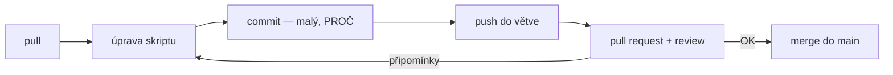

# Explainer · Git vs hosting: GitHub, Azure DevOps, self-hosted — a kam s repozitářem

Deep-dive k [`README.md`](README.md). Automatizační skripty jsou kód a kód patří do
verzovacího systému. Tento explainer odpovídá na dvě otázky, které se pletou do jedné:
co je Git a kde má repozitář se skripty k tenantu bydlet.

## Git != hosting — dvě různá rozhodnutí

**Git** je nástroj na disku: eviduje verze souborů, kdo–kdy–co–proč změnil, a umí se
vrátit k libovolnému stavu. Funguje i offline, bez jakékoli služby. **GitHub / Azure
DevOps / GitLab** jsou hostingy: místo, kde repozitář bydlí, kde tým dělá review a odkud
se automatizuje (pipelines). Git je rozhodnutí, které se neřeší — **verzovat budete
v každém případě**. Hosting je volba podle organizace.

## Kam s repozitářem

| Služba | Silné stránky | K zvážení |
|---|---|---|
| **Azure DevOps** | přihlášení **Entra ID** (tytéž účty, MFA, Conditional Access a offboarding jako M365), volba regionu při založení organizace, Repos + Boards + Pipelines pohromadě | UI konzervativnější než GitHub; menší komunitní ekosystém |
| **GitHub** | největší ekosystém a dokumentace, Actions, nejtěsnější integrace vývojářských AI nástrojů | Entra SSO a řízení lokality dat až ve vyšších tierech; v nižších tierech účty žijí mimo vaši identitu |
| **GitLab / Gitea (self-hosted)** | plná kontrola nad umístěním dat — repo ve vlastní infrastruktuře | provozujete a zabezpečujete sami (patche, zálohy, dostupnost) — reálné náklady |

**Rozhodovací osa pro repozitář se skripty, které sahají na produkční tenant:** rozhoduje
**identita**. Kód, který má přístupové recepty k vašemu M365, má být chráněný stejnými
účty, MFA a podmíněným přístupem jako tenant sám — a odchod zaměstnance má automaticky
znamenat konec přístupu i ke kódu. To je argument pro Azure DevOps u organizací, které
už na Entra ID stojí. GitHub je rovnocenná volba tam, kde tým chce jeho ekosystém a je
ochoten zaplatit tier s Entra SSO. Self-hosted volit jen při tvrdém interním nebo
regulatorním požadavku na umístění dat ve vlastní infrastruktuře — s vědomím, že
provozní odpovědnost přechází na vás.

V každém případě platí dvě věci bez výjimky: repo se skripty k tenantu je **vždy
neveřejné** a **nikdy neobsahuje identifikátory a tajemství**
(viz [`../onboarding/ways-of-working.md`](../onboarding/ways-of-working.md)).

## Hygiena práce s Gitem

- **commit** — uložený snímek změny. Malý (jedna logická změna) a se zprávou, která říká
  **proč**, ne jen co: `Oprava strankovani - bez nextLink vracel jen 1. stranku` je
  zpráva; `update` není.
- **push / pull** — odeslání commitů na hosting / stažení cizích commitů. Návyk:
  **pull před push**.
- **branch** — oddělená linie práce; `main` je vždy funkční stav.
- **pull request (PR)** — žádost o začlenění větve spojená s **review**. U skriptů
  s přístupem k tenantu je PR review totéž co čtyři oči na produkční změně.
- **merge / konflikt** — když dva změnili totéž místo, rozhoduje člověk (VS Code
  konflikt zobrazí přehledně).
- **.gitignore** — seznam toho, co do repa nikdy nevstoupí: `*.pfx`, `*.pem`,
  `*credentials*`, exporty s reálnými daty. Tajemství, které se do gitu jednou dostane,
  **zůstává v historii** — proto se tam nesmí dostat vůbec.

## Klíčové rozlišení

- **Git (nástroj, lokální historie) vs hosting (kde repo bydlí a kdo se k němu dostane)** —
  bezpečnostní rozhodnutí je hosting, ne Git.
- **Identita repozitáře vs identita tenantu** — pokud nejsou tytéž, offboarding se dělá
  dvakrát (a jednou se zapomene).
- **Tajemství v `.gitignore` vs tajemství v historii** — prevence funguje, dodatečný
  úklid historie je vždy bolestivý a nikdy úplný.

## Zdroje

- [Azure DevOps Repos — dokumentace](https://learn.microsoft.com/en-us/azure/devops/repos/)
- [Azure DevOps — data locality / volba regionu](https://learn.microsoft.com/en-us/azure/devops/organizations/security/data-location)
- [Pro Git — kniha zdarma, česky](https://git-scm.com/book/cs/v2)
- [Removing sensitive data from a repository (GitHub)](https://docs.github.com/en/authentication/keeping-your-account-and-data-secure/removing-sensitive-data-from-a-repository)

## Stav produktu / delta
> [!WARNING] Ověřit k datu běhu — stav k 2026-09.
> Tiery, ceny a dostupnost Entra SSO / volby regionu se u GitHubu i Azure DevOps mění;
> před doporučením konkrétní organizaci zkontrolovat aktuální ceník a podmínky.
