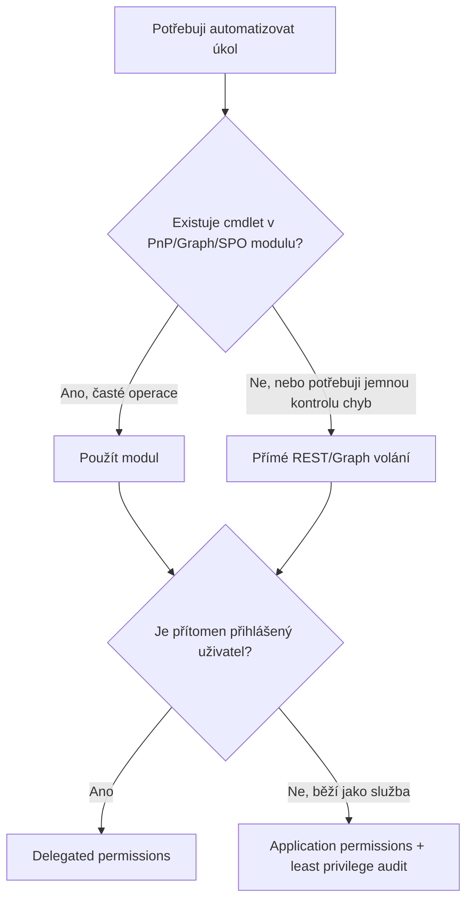
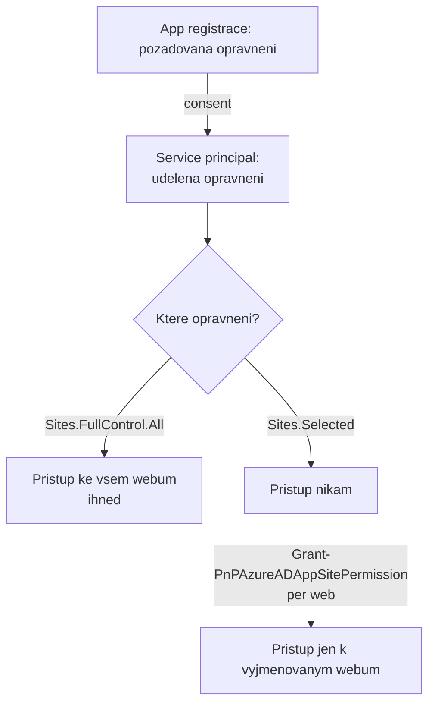

# Strategie automatizace: nástroje, identita a oprávnění

> Typ: povinný · Den: 2 (otvírák) · Odhad: 50 min výklad + 55 min lab

Otvírák dne 2 a rozhodovací rámec pro celý zbytek týdne. Dvě otázky, na které tady
dostanete odpověď: **čím to automatizovat** a **pod jakou identitou to poběží**.

Druhá je ta důležitější. Za chvíli v [`../powershell-deep-dive/`](../powershell-deep-dive/)
přihlásíte aplikaci **bez přihlášeného uživatele** — poprvé v celém kurzu. Do té chvíle
za vás všechno dělal váš vlastní účet a jeho oprávnění. Application permission je něco
jiného: platí tenant-wide, nikdo ji neomezuje právy člověka, a jednou udělená tam
zůstane, dokud ji někdo vědomě neodebere.

## Cíle
- Rozhodnout mezi PowerShell, Microsoft Graph, PnP a REST — a umět to zdůvodnit.
- Rozumět tomu, že aplikace má v Entra ID **dvě tváře** (app registrace vs Enterprise
  Application) a co z toho plyne pro multi-tenant scénáře.
- Rozlišit **delegated a application** permission nejen definicí, ale důsledkem: čím je
  každá z nich shora omezená.
- Popsat **consent** jako samostatný krok — kdo ho smí udělit a proč přidání oprávnění
  na app registraci nic nezmění, dokud se consent neobnoví.
- Použít **`Sites.Selected`** místo tenant-wide oprávnění a vědět, že samotný consent
  u něj **nedává přístup nikam** — i kdy naopak nestačí.
- Zjistit skriptem, **co má aplikace v tenantu skutečně udělené**.

## Výklad

### PowerShell vs Graph vs PnP vs REST
Tři PowerShell moduly z GLOSSARY.md (PnP.PowerShell, Microsoft.Graph, SPO Management Shell) jsou
wrappery nad dvěma REST rozhraními — Microsoft Graph a SharePoint REST/CSOM. Rozhodovací otázka
není "PowerShell nebo REST", ale "wrapper, nebo přímé volání": moduly šetří boilerplate
(auth, paging, serializace), přímé REST volání dává plnou kontrolu tam, kde modul nemá cmdlet
pro potřebnou operaci nebo kde je nutná jemná kontrola nad chybovými stavy (viz [`../graph-fundamentals/`](../graph-fundamentals/)).

Vedle PowerShell trojice mapa obsahuje dva doplňky s úzkou rolí: **CLI for Microsoft 365**
(npm/Node, bez PowerShell závislosti) pro CI/CD pipeline a skriptování mimo PowerShell — ne jako obecnou
alternativu PnP pro administraci; a **TypeScript/Node cestu** (Graph JS SDK + PnPjs) pro
vývojářské týmy — detail v [`explainer-typescript-graph.md`](explainer-typescript-graph.md).
Širší mapa modulů mimo fokus kurzu (Exchange, Teams, Entra, Power Platform) a jejich
evoluce je v [`../../GLOSSARY.md`](../../GLOSSARY.md) — klíčová pointa: **moduly umírají
(MSOnline, AzureAD), REST API zůstává** — proto se kurz učí principy nad Graph/REST, ne
jen cmdlety.



### Aplikace má dvě tváře
Každá automatizace potřebuje identitu, pod kterou běží. Aplikace má přitom v Entra ID
**app registraci** (globální šablona s credentials a požadovanými permissions, žije
v domovském tenantu) a **Enterprise Application** (service principal — lokální instance
s uděleným consentem, v každém tenantu, kde aplikace působí). S tím souvisí volba
**single-tenant vs multi-tenant** (`signInAudience`) — single-tenant je doporučený default,
multi-tenant patří jen k reálným multi-tenant scénářům a nese consent-governance povinnosti.
Detail vč. doporučených practices:
[`explainer-app-registrations-enterprise-apps.md`](explainer-app-registrations-enterprise-apps.md).

### Delegated vs application — rozdíl je ve stropu

| | Delegated | Application (app-only) |
|---|---|---|
| Kdo jedná | aplikace **jménem přihlášeného uživatele** | aplikace **sama za sebe** |
| Strop | průnik oprávnění aplikace **a práv toho uživatele** | jen oprávnění aplikace |
| Kdo smí consentovat | podle nastavení tenantu i běžný uživatel | **vždy jen admin** |
| Typické použití | interaktivní skript, nástroj pro admina | scheduled task, Azure Function, služba |

Nosná věta: **delegated oprávnění je shora omezené člověkem, application není.**
`Sites.Read.All` jako delegated dá skriptu přístup k tomu, co vidí přihlášený uživatel.
Totéž jako application permission dá přístup **ke všem webům v tenantu** bez ohledu
na to, kdo skript spustil. Stejný název, jiný svět.

Praktický důsledek, na který se naráží v [`../powershell-deep-dive/troubleshooting-auth.md`](../powershell-deep-dive/troubleshooting-auth.md):
app-only připojení **ignoruje delegated oprávnění**. Přidáte oprávnění do špatné
záložky, connect projde, a první cmdlet vrátí `Unauthorized` s prázdnou odpovědí.

### Consent je samostatný krok, ne detail registrace

App registrace drží **požadovaná** oprávnění (co si aplikace přeje). Service principal
drží **udělená** oprávnění (co jí kdo skutečně dovolil). Consent je operace, která
z prvního udělá druhé — a je to jediná chvíle, kdy se rozhoduje o riziku.

Tři důsledky, které se pletou:

1. **Přidání oprávnění na app registraci samo o sobě nic nedělá.** Service principal
   drží starý stav, dokud consent neproběhne znovu. U multi-tenant aplikace to znamená
   obejít **každého** zákazníka.
2. **Admin consent uděluje oprávnění celému tenantu**, ne sobě. Kliknutí „Grant admin
   consent for &lt;org&gt;" je rozhodnutí za všechny uživatele.
3. **User consent lze omezit i vypnout.** Volný user consent je vektor
   *illicit consent grant* útoku — uživatel odklikne souhlas podvržené aplikaci a ta
   dostane přístup k jeho datům bez jediného hesla.

> [!IMPORTANT] Past, kterou v tomto kurzu neuvidíte sami
> Všichni jste v kurzovním tenantu **Global administrator**, takže consent máte
> implicitně a nikdy nenarazíte na obrazovku souhlasu, kterou nelze odklepnout.
> **Doma to tak nebude.** Pravidlo: aplikaci určenou běžným uživatelům otestujte pod
> **běžným účtem**, ne pod svým. Test pod adminem neprokáže vůbec nic.

### `Sites.Selected` — klíč od jedné kanceláře

Pro app-only přístup k SharePointu existují tři úrovně a rozdíl mezi nimi je zásadní:

| Oprávnění | Co dá aplikaci |
|---|---|
| `Sites.FullControl.All` | plná kontrola nad **každým webem v tenantu** |
| `Sites.ReadWrite.All` | zápis do **každého webu v tenantu** |
| **`Sites.Selected`** | **nic** — dokud správce nevyjmenuje konkrétní weby |

`Sites.Selected` je jediné z nich, které se chová jako least privilege: consent je
**první** krok, per-site grant je **druhý** a bez něj aplikace nevidí ani jeden web.
Je to zároveň nejčastější zdroj zmatku („dal jsem consent a nic nefunguje", což je
správné chování).

Aplikace se `Sites.FullControl.All` obejde všechnu governance práci, kterou tenhle kurz
dělá pět dní: nezajímá ji dědičnost oprávnění, sdílení ani labely. Když se její certifikát
dostane ven, je to plný přístup k obsahu celého tenantu.



### Kdy `Sites.Selected` nestačí — least privilege, které funguje

`Sites.Selected` dává přístup k **vyjmenovaným, existujícím** webům. Neumí proto:

- **vypsat weby tenantu** (`Get-PnPTenantSite`, discovery neznámých webů),
- **založit web** (`New-PnPSite`) — provisioning je tenant-scoped operace,
- cokoli dalšího, co se ptá admin endpointu `<tenant>-admin.sharepoint.com`.

Hned následující [`../powershell-deep-dive/`](../powershell-deep-dive/) přesně tohle dělá
a `Sites.FullControl.All` tam je **správná volba**, ne selhání disciplíny.

Nosná věta bloku: **least privilege není „vždy vyber nejužší název", ale „nejužší rozsah,
který úlohu skutečně splní".** Reflexivní sáhnutí po `Sites.Selected` u úlohy, kterou
neumí obsloužit, je stejná chyba jako `FullControl` ze zvyku — jen se hůř odhaluje,
protože vypadá zodpovědně.

Z toho plyne druhá půlka pravidla, na kterou navazuje audit v
[`../../day-5/security-hardening/`](../../day-5/security-hardening/): u širokého oprávnění
si rovnou zapište, **kdy přestane být potřeba**. Provisioning je typicky jednorázový;
oprávnění po něm zůstává roky.

### Ověřit, ne věřit

Co si aplikace přeje, je v manifestu. Co skutečně dostala, se ptá service principalu:

```powershell
# aplikacni opravneni (app roles) udelena service principalu
Get-MgServicePrincipalAppRoleAssignment -ServicePrincipalId <sp-object-id>

# delegovana opravneni (OAuth2 grants)
Get-MgOauth2PermissionGrant -Filter "clientId eq '<sp-object-id>'"

# u Sites.Selected: kterym webum aplikace skutecne rozumi
Get-PnPAzureADAppSitePermission -AppIdentity <client-id>
```

Rozdíl mezi požadovaným a uděleným je běžný nález auditu — typicky proto, že někdo
oprávnění přidal a consent už neobnovil. Samostatné app registrace pro samostatné
účely: nesdílet jednu aplikaci mezi nesouvisejícími automatizacemi, aby kompromitace
jedné neotevřela přístup ke všem.

## Klíčové rozlišení
- **Modul (wrapper) vs přímé REST/Graph volání** — modul je rychlejší start, přímé volání je
  nutné pro jemnou kontrolu retry/error handlingu ([`../graph-fundamentals/`](../graph-fundamentals/)).
- **App registrace (šablona, domovský tenant, credentials) vs Enterprise Application
  (service principal, per-tenant instance, udělený consent)** — dvě položky v portálu pro
  jednu aplikaci.
- **Single-tenant (doporučený default) vs multi-tenant (`signInAudience`)** — multi-tenant
  jen s reálným důvodem a consent governance.
- **Delegated vs application** — první je shora omezené právy člověka, druhé ničím.
  Stejný název oprávnění znamená v každém režimu něco jiného.
- **Požadované vs udělené oprávnění** — app registrace vs service principal; audit se
  ptá druhého, ne prvního.
- **Consent vs přístup** — u `Sites.Selected` jsou to dva samostatné kroky a consent
  sám o sobě nedává přístup nikam.
- **Admin consent vs user consent** — první rozhoduje za celý tenant, druhý za jednoho
  uživatele a je vektorem illicit-consent-grant útoku.
- **Test pod adminem vs pod běžným účtem** — admin má souhlas implicitně; test pod
  vlastním účtem neprokáže, že to bude fungovat komukoli jinému.
- **Nejužší název vs nejužší rozsah, který funguje** — `Sites.Selected` u úlohy, kterou
  neumí obsloužit (discovery, provisioning), je stejná chyba jako `FullControl` ze zvyku.
- **Jednorázově potřebné vs trvale udělené** — u širokého oprávnění patří do poznámky
  věta „kdy přestane být potřeba"; bez ní tam zůstane napořád.

## Lab
Viz [`lab-app-registration.md`](lab-app-registration.md).

## Zdroje (Microsoft)
- [Increase application security with the principle of least privilege](https://learn.microsoft.com/en-us/entra/identity-platform/secure-least-privileged-access)
- [Security best practices for application properties](https://learn.microsoft.com/en-us/entra/identity-platform/security-best-practices-for-app-registration)
- [Overview of permissions and consent in the Microsoft identity platform](https://learn.microsoft.com/en-us/entra/identity-platform/permissions-consent-overview)
- [Overview of user and admin consent](https://learn.microsoft.com/en-us/entra/identity/enterprise-apps/user-admin-consent-overview)
- [Configure how users consent to applications](https://learn.microsoft.com/en-us/entra/identity/enterprise-apps/configure-user-consent)
- [Microsoft Graph permissions reference](https://learn.microsoft.com/en-us/graph/permissions-reference)

## Stav produktu / delta
> [!WARNING] Ověřit k datu běhu — stav k 2026-09.
> Doporučený least-privilege permission model se zpřesňuje (Microsoft postupně označuje
> širší oprávnění jako „reducible" ve prospěch užších ekvivalentů) — před během zkontrolovat,
> zda konkrétní permissions v labu nemají nově doporučenou užší alternativu.
>
> Rozsah `Sites.Selected` se rozšiřuje a názvy PnP cmdletů pro per-site grant se mezi
> verzemi měnily — ověřit `Get-Command -Module PnP.PowerShell *SitePermission*` a
> [permissions reference](https://learn.microsoft.com/en-us/graph/permissions-reference).
> Defaulty user consent v nových tenantech se zpřísňují.

> [!NOTE] Sloučeno 2026-09-07
> Blok vznikl spojením `automation-strategy` (D1) a `permissions-consent` (D2). Důvod je
> obsahový i časový: oba mluvily o least privilege, oba laby pracovaly na **téže app
> registraci**, a den 2 potřeboval ušetřit čas. Spojením zmizel kontextový přesun mezi
> dvěma bloky nad jedním artefaktem.
