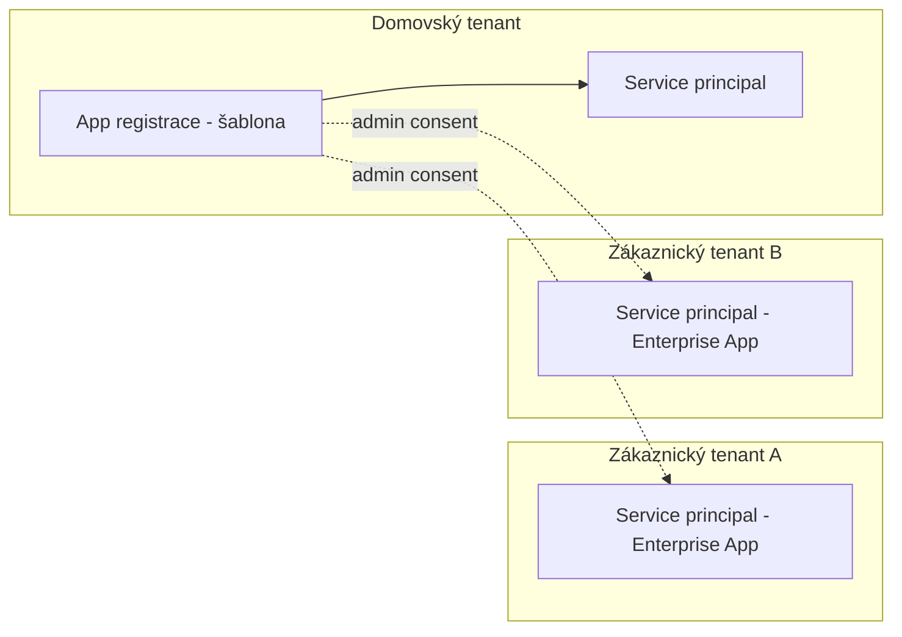

# Explainer · App registrace vs Enterprise Applications, single vs multi-tenant

Deep-dive k [`README.md`](README.md). V Entra ID má každá aplikace **dvě tváře** — a kdo
nechápe rozdíl, ten se ztratí v první chvíli, kdy consent v cizím tenantu "záhadně" vytvoří
novou položku, kterou nikdo neregistroval.

## Application object vs service principal

| | **App registrace** (application object) | **Enterprise Application** (service principal) |
|---|---|---|
| Co to je | Globální **definice/šablona** aplikace | **Lokální instance** aplikace v konkrétním tenantu |
| Kde žije | Jen v domovském tenantu (kde byla registrována) | V každém tenantu, kde aplikace působí |
| Kde v portálu | Entra ID → App registrations | Entra ID → Enterprise applications |
| Co se tam konfiguruje | API permissions (požadované), credentials (secret/cert), branding, app roles, manifest | Udělený consent (permissions granted), assignment uživatelů/skupin, sign-in logy, vlastní Conditional Access |

Registrací aplikace v portálu vzniknou **oba objekty najednou** (app registrace + service
principal v domovském tenantu) — proto rozdíl není vidět, dokud aplikace nepřekročí hranici
tenantu. Service principal **není kopie** app registrace; je to odkaz na ni s vlastním,
per-tenant stavem (co bylo skutečně odsouhlaseno zde).

## Single-tenant vs multi-tenant

Řídí vlastnost **`signInAudience`** v manifestu app registrace:

| Hodnota | Význam |
|---|---|
| `AzureADMyOrg` | **Single-tenant** — jen domovský tenant |
| `AzureADMultipleOrgs` | **Multi-tenant** — libovolný organizační tenant |
| `AzureADandPersonalMicrosoftAccount` | Multi-tenant + osobní Microsoft účty |

U multi-tenant aplikace: app registrace zůstává **jen v domovském tenantu**; v každém
zákaznickém tenantu vznikne po consentu **jen service principal** (Enterprise Application).

## Admin consent URL — portál vám ji nedá

Consent v cizím tenantu se spouští odkazem, který si **musíte složit sami**. Panel
*Endpoints* v App registrations vypisuje OAuth 2.0 authorize/token, metadata OpenID Connect (OIDC) a SAML (Security Assertion Markup Language)
endpointy — **admin consent URL mezi nimi není**. Z portálu potřebujete jen
**Application (client) ID**.

Minimální tvar (v1.0 endpoint) — to, co pošlete e-mailem:

```text
https://login.microsoftonline.com/<tenantId>/adminconsent?client_id=<clientId>
```

Dokumentovaný **v2.0** endpoint má ale dva **povinné** parametry navíc, na které se naráží:

```text
https://login.microsoftonline.com/<tenantId>/v2.0/adminconsent
  ?client_id=<clientId>
  &scope=https://graph.microsoft.com/.default
  &redirect_uri=<musi presne odpovidat registrovane redirect URI>
  &state=<cokoli>
```

- **`scope` musí být `/.default`, pokud žádáte aplikační oprávnění.** Dynamické scopes
  (výčet konkrétních permissions) aplikační oprávnění **nezahrnou** — `/.default` říká
  „všechno, co je v *Required permissions* app registrace".
- **`redirect_uri` se musí přesně shodovat** s některým registrovaným redirect URI (Uniform Resource Identifier) redirect URI.
  Neshoda je nejčastější příčina selhání, které vypadá jako problém s oprávněními.

> [!IMPORTANT] Tři věci, které consent v cizím tenantu shodí
> - **Aplikace musí být multi-tenant.** Single-tenant app (`AzureADMyOrg`, doporučený
>   default!) skončí chybou „application not found in directory" — a protože default je
>   správný, je tohle nejčastější příčina.
> - **Nepoužívat `common`.** Dokumentace to říká výslovně: osobní účty nemohou udělit admin
>   consent. Použijte **tenant GUID** (verified domain funguje taky). U práce napříč víc
>   zákaznickými tenanty je GUID bezpečnější návyk — odstraňuje možnost consentovat
>   v cizím adresáři omylem.
> - **Role v cílovém tenantu**: Global Administrator, Privileged Role Administrator, nebo
>   Cloud Application Administrator.

Po každém přidání permission na app registraci je nutné consent v konzumujících tenantech
**obnovit** — service principal drží to, co bylo odsouhlaseno, ne to, co si šablona
aktuálně přeje. A po consentu **ověřit, že grant skutečně přistál**
(`Get-MgServicePrincipalAppRoleAssignment`), ne usuzovat z toho, že se redirect vrátil
bez chyby.



## Doporučené practices

1. **Single-tenant jako default** — Microsoft explicitně doporučuje single-tenant pro
   většinu aplikací; multi-tenant volit jen s reálným multi-tenant scénářem (ISV produkt,
   správa více zákaznických tenantů). Každý tenant navíc = širší útočná plocha.
2. **Multi-tenant jen s omezením publika** — u multi-tenant app zvážit
   `signInAudienceRestrictions` (whitelist konkrétních tenant ID) místo "kdokoli"; a
   testovat v tenantu se zapnutými Conditional Access politikami.
3. **Consent governance na straně tenantu** — omezit user consent (jen verified publishers
   + vybraná low-risk permissions, nebo úplně vypnout s admin consent workflow); volný user
   consent je vektor illicit-consent-grant útoků. Pravidelně auditovat Enterprise
   Applications — co má v tenantu udělený consent a kdo to vlastní.
4. **Minimálně dva vlastníci každé app registrace** — ownerless aplikace po odchodu autora
   nikdo nespravuje ani nezruší.
5. **Credentials jen na app registraci v domovském tenantu** — secret/cert patří šabloně;
   konzumující tenant nikdy nedostává klíče, jen uděluje consent (přímý průmět data-boundary
   myšlení do identity vrstvy).

## Vazby v kurzu

- Registrace v labu ([`lab-app-registration.md`](lab-app-registration.md)) je single-tenant —
  správný default; po registraci si v portálu prohlédni **obě** položky (App registrations
  i Enterprise applications), ať vidíš dvojici na vlastní oči.
- Audit a hardening obou objektů uzavírá [`../../day-5/security-hardening/`](../../day-5/security-hardening/).
- PnP.PowerShell historie je případová studie: sdílená multi-tenant "PnP Management Shell"
  aplikace byla v 2024 zrušena právě kvůli rizikům široce consentované multi-tenant app —
  dnes si každý tenant registruje vlastní (viz [`../../GLOSSARY.md`](../../GLOSSARY.md)).

## Zdroje (Microsoft)

- [Apps & service principals in Microsoft Entra ID](https://learn.microsoft.com/en-us/entra/identity-platform/app-objects-and-service-principals)
- [Single and multitenant apps in Microsoft Entra ID](https://learn.microsoft.com/en-us/entra/identity-platform/single-and-multi-tenant-apps)
- [Microsoft identity platform admin consent protocols](https://learn.microsoft.com/en-us/entra/identity-platform/v2-admin-consent) — tvar URL a parametry
- [Grant tenant-wide admin consent to an application](https://learn.microsoft.com/en-us/entra/identity/enterprise-apps/grant-admin-consent)
- [Convert single-tenant app to multitenant](https://learn.microsoft.com/en-us/entra/identity-platform/howto-convert-app-to-be-multi-tenant)
- [Overview of user and admin consent](https://learn.microsoft.com/en-us/entra/identity/enterprise-apps/user-admin-consent-overview)
- [Configure how users consent to applications](https://learn.microsoft.com/en-us/entra/identity/enterprise-apps/configure-user-consent)

## Stav produktu / delta

> [!WARNING] Ověřit k datu běhu — stav k 2026-09.
> **Tvar admin consent URL a povinnost `scope`/`redirect_uri`** na v2.0 endpointu ověřit
> proti [admin consent protocols](https://learn.microsoft.com/en-us/entra/identity-platform/v2-admin-consent)
> — v1.0 tvar bez těch parametrů funguje dlouhodobě, ale je to starší endpoint. Panel
> *Endpoints* v portálu admin consent URL nenabízí; kdyby ji Microsoft doplnil, zkrátit
> tuhle sekci na odkaz.
>
> `signInAudienceRestrictions` je novější mechanismus — ověřit aktuální dostupnost a stav obecné dostupnosti (GA, general availability)
> a přesnou konfiguraci před demonstrací; defaulty user consent nastavení v nových tenantech
> se v čase zpřísňují.
