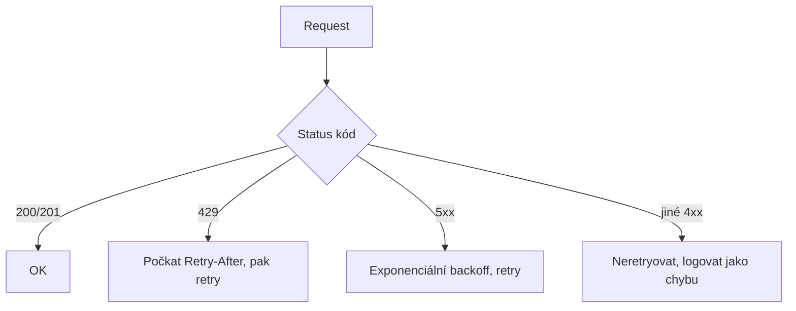

# M2.1 · Microsoft Graph — inženýrské základy

> Typ: povinný · Den: 2 · Odhad: <min>

## Cíle
- Batching, delta, řízení throttlingu.
- Klasifikace chyb a retry strategie.

## Výklad

### Batching (`$batch`)
JSON batching kombinuje až 20 jednotlivých requestů do jednoho HTTP volání
(`POST /$batch`) a snižuje počet round-tripů. Odpověď má vlastní pole `responses` s
individuálním status kódem pro každý dílčí request — **HTTP 200 na úrovni batch odpovědi
neznamená, že uspěly všechny dílčí requesty**. Každý request v batchi se navíc vyhodnocuje
proti throttling limitům samostatně; pokud jeden překročí limit, vrátí se 429 jen pro něj,
zbytek batch odpovědi může být v pořádku.

### Delta query
Delta query (`delta()`) je pull model pro inkrementální synchronizaci — server vrací jen
entity vytvořené/změněné/smazané od posledního volání, ne plný re-scan. Odpověď obsahuje buď
`@odata.nextLink` (další stránka téhož požadavku, se `skipToken`) nebo `@odata.deltaLink`
(uložit a použít při příštím inkrementálním dotazu, obsahuje `deltatoken`). Delta query je
protiklad k push modelu change notifications (webhooks) z M4.1 — different účel: delta = "co se
změnilo od X", webhook = "informuj mě hned, až se něco změní".

### Throttling (429) — řízení
Graph vrací HTTP 429 s hlavičkou `Retry-After` v sekundách — to číslo je závazné, ne
orientační. Nezkracovat, nezkoušet dřív "pro jistotu" — předčasný retry throttling jen
prodlouží. Pokud `Retry-After` chybí, použít exponenciální backoff. Graph SDK už mají vestavěné
retry handlery řešící `Retry-After` nebo výchozí backoff politiku — ne psát vlastní retry smyčku
od nuly, pokud SDK toto řeší.

### Klasifikace chyb a retry strategie
Chybový objekt Graphu má strojově čitelnou vlastnost `code` — kód programu se má vázat na ni,
ne na text `message` (ten se může kdykoli změnit). `innererror` může obsahovat vnořené, přesnější
kódy — projít je všechny a použít nejkonkrétnější, kterému aplikace rozumí. Ke každému requestu
přidat vlastní `client-request-id` (GUID) — usnadní to dohledání requestu při hlášení problému
Microsoftu. 429 a 5xx (transient) → retry s backoff; ostatní 4xx (permanentní, např. 403/404)
→ neretryovat, logovat jako chybu k řešení, ne jako throttling.

## Klíčové rozlišení
- **Batch-level 200 vs jednotlivý request status** — vždy kontrolovat `responses[].status`,
  ne jen kód celé batch odpovědi.
- **Delta query (pull, "co se změnilo") vs change notifications (push, "informuj mě hned")** —
  různé účely, viz M4.1.
- **`code` (stabilní, programově použitelný) vs `message` (lidsky čitelný, může se měnit)**
  v chybovém objektu.

## Lab
Viz [`lab-graph-ingest.md`](lab-graph-ingest.md).

## Zdroje (Microsoft)
- [Microsoft Graph throttling guidance](https://learn.microsoft.com/en-us/graph/throttling)
- [Combine multiple HTTP requests using JSON batching](https://learn.microsoft.com/en-us/graph/json-batching)
- [Use delta query to track changes in Microsoft Graph data](https://learn.microsoft.com/en-us/graph/delta-query-overview)
- [Microsoft Graph error responses and resource types](https://learn.microsoft.com/en-us/graph/errors)

## Stav produktu / delta
- Ověřit k datu běhu — service-specific throttling limity (počet requestů/sec per aplikace/tenant)
  se liší po workloadu a mění se; ověřit aktuální hodnoty na [Microsoft Graph service-specific throttling limits](https://learn.microsoft.com/en-us/graph/throttling-limits) před demonstrací.
