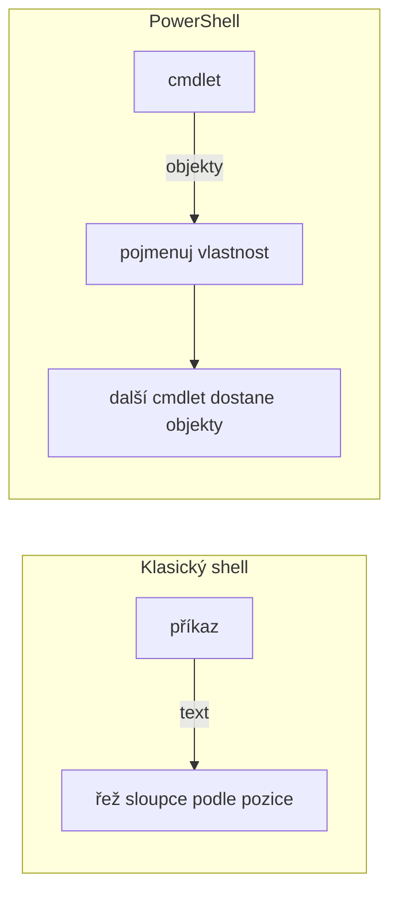

# PowerShell — základy pro ty, kdo je nemají

> Typ: volitelný · Den: 2 (blok 2, jen podle stavu skupiny) · Odhad: 40 min výklad + 20 min cvičení

## Cíle

- Vědět, že pipeline nese **objekty, ne text** — a co z toho plyne pro každý příkaz v týdnu.
- Umět si sám zjistit, co neznámý cmdlet vrátil (`Get-Member`) a jak se volá (`Get-Help`).
- Filtrovat na správném místě (`-Filter` vs `Where-Object`) a vědět, proč to není kosmetika.
- Rozpoznat čtyři pasti, na kterých v tomto kurzu reálně padají skripty: unwrapping polí,
  `Format-*` v pipeline, non-terminating chyba a porovnání s `$null`.
- Sáhnout po `-WhatIf`, než se cokoli pustí na živý tenant.

> [!NOTE] Tenhle blok se nespouští vždy
> Je to **záchranná síť**, ne plnohodnotný blok. Jede jen tehdy, když se u labu bloku 1
> ukáže, že část skupiny neumí přečíst, co jí cmdlet vrátil. Kdo PowerShell má, o nic
> nepřichází — všechno tady je předpoklad, ne obsah zkoušený dál.

## Výklad

### PowerShell vrací objekty, ne text

Tohle je jediná věc, kterou si z bloku musíte odnést. V klasickém shellu příkaz vypíše
**text** a vy z něj vyřezáváte sloupce. V PowerShellu příkaz vrátí **objekty** a vy
pojmenováváte jejich vlastnosti.

```powershell
Get-Service -Name w32time | Select-Object -Property Status, DisplayName
```

Nic se tu neřeže podle pozice znaků. `Status` a `DisplayName` jsou vlastnosti objektu,
který `Get-Service` vrátil.

Důsledek, na který se v kurzu naráží pořád: **to, co vidíte na obrazovce, není ta data.**
Je to jejich vykreslení. Objekt má typicky mnohem víc vlastností, než kolik jich výpis
ukáže — a ty nezobrazené jsou pořád k dispozici.



### Tři cmdlety, kterými se vyznáte v čemkoli

Kurz vás postaví před moduly s tisíci cmdletů. Nemá smysl je znát — má smysl umět se
zorientovat:

| Otázka | Cmdlet |
|---|---|
| Co vůbec existuje? | `Get-Command -Module PnP.PowerShell *Site*` |
| Jak se to volá? | `Get-Help Get-PnPList -Examples` |
| **Co mi to vrátilo?** | `Get-PnPList \| Get-Member` |

Ten třetí je ten důležitý. Jméno cmdletu si najdete kdekoli, ale **jaké vlastnosti má
objekt, který vrátil**, vám neřekne nikdo než `Get-Member`. Návyk na celý týden: neznámý
cmdlet nejprve pošlete do `Get-Member`, a teprve pak pište zbytek řádku.

Cmdlety se jmenují **Verb-Noun** (`Get-`, `Set-`, `New-`, `Remove-`). Sloveso napoví, co
příkaz udělá — a `Get-` je jediné, které je bezpečné zkusit naslepo.

### Filtrujte vlevo

Microsoft to formuluje jako best practice: *„filter the results as early as possible in the
pipeline"*, tedy **filter left**. Prakticky to znamená použít parametr cmdletu, když ho má,
a ne stahovat všechno a filtrovat až potom.

```powershell
# spravne - filtr je uvnitr dotazu
Get-Service -Name w32time

# nespravne - stahne vsechno a pak vyhodi vetsinu
Get-Service | Where-Object Name -EQ w32time
```

U dvaceti služeb je to jedno. U seznamu s 200 000 položkami nebo u tenantu s tisíci weby
je to rozdíl mezi „proběhne" a „narazí na throttling" — čím se zabývá
[`../../day-3/graph-fundamentals/`](../../day-3/graph-fundamentals/) a
[`../../day-3/graph-fundamentals/explainer-large-lists.md`](../../day-3/graph-fundamentals/explainer-large-lists.md).

**Past na pořadí:** `Select-Object` před `Where-Object` filtr rozbije, protože vlastnost,
podle které chcete filtrovat, už v pipeline není:

```powershell
# nefunguje - CanPauseAndContinue Select-Object vyhodil
Get-Service | Select-Object DisplayName, Status | Where-Object CanPauseAndContinue

# funguje - filtruj, pak vybirej
Get-Service | Where-Object CanPauseAndContinue | Select-Object DisplayName, Status
```

### Čtyři pasti, na kterých tady padají skripty

**1. `Format-*` ukončuje pipeline.** `Format-Table` a spol. nevrací vaše data — vrací
formátovací objekty. Cokoli za nimi dostane nesmysl. Patří tedy **jen na konec řádku**,
nikdy do prostředka. Cvičení si to ověří na vlastní oči.

**2. Pole se při návratu z funkce rozbalí.** Prázdné pole se vrátí jako `$null`
a jednoprvkové jako ten jediný prvek — takže `.Count` na výsledku spadne. Obrana je
`@()` okolo volání. Není to kosmetika: přesně na tomhle stálo tři testy v referenčním
řešení [`../../day-4/azure-integration-patterns/solution/Sync-CourseList.ps1`](../../day-4/azure-integration-patterns/solution/Sync-CourseList.ps1),
kde je to i okomentované.

**3. Non-terminating chyba skript nezastaví.** Cmdlet ohlásí chybu a jde dál, takže
`try/catch` ji vůbec nezachytí. Chcete-li ji chytit, musíte ji nejdřív povýšit:
`-ErrorAction Stop`. Proč to není detail, ukazuje referenční řešení
[`../powershell-deep-dive/solution/Connect-CourseTarget.ps1`](../powershell-deep-dive/solution/Connect-CourseTarget.ps1)
— používá `Write-Error` právě proto, aby volajícímu nezahodilo návratovou hodnotu.

**4. `$null` patří vlevo.** `$array -eq $null` porovnává **každý prvek** a vrátí ty, které
se rovnají — ne `$true`/`$false`. Správně je `if ($null -eq $array)`. A index mimo rozsah
nevyhodí chybu, jen tiše vrátí `$null`.

### Než to pustíte na živý tenant: `-WhatIf`

Většina cmdletů, které něco mění, podporuje `-WhatIf` — vypíše, co by udělaly, a neudělá
nic. Je to nejlevnější pojistka v celém kurzu:

```powershell
Remove-PnPListItem -List "Dokumenty" -Identity 42 -WhatIf
```

> [!WARNING] `-WhatIf` není univerzální
> Podporují ho jen cmdlety, které ho mají implementovaný, a pokrytí napříč PnP.PowerShell
> je **nerovnoměrné**. Ověřte si to u konkrétního cmdletu (`Get-Help <cmdlet> -Full`,
> sekce parametrů) — ne předpokládejte. Absence `-WhatIf` je sama o sobě signál, že si
> ten příkaz máte nejdřív zkusit na sandboxu.

### Dvě drobnosti, které matou

**Uvozovky.** `'jednoduché'` je literál, `"dvojité"` expanduje proměnné. Microsoft
doporučuje jednoduché jako default a dvojité jen tam, kde skutečně expandujete.

**Zalomení dlouhého řádku.** Nejlepší místo je **za `|`** — pipeline pokračuje sama, bez
jakéhokoli znaku pro pokračování. Backtick (`` ` ``) je až druhá volba pro případy, kde
přirozené zalomení není; nikdy ne zpětné lomítko, to je z bashe.

## Klíčové rozlišení

- **Objekt vs text na obrazovce** — výpis je vykreslení dat, ne data. Nezobrazené
  vlastnosti existují dál.
- **`-Filter` (filtruje zdroj) vs `Where-Object` (filtruje až u vás)** — u velkých
  datových sad je to rozdíl mezi průchodem a throttlingem.
- **`Select-Object` (vybere vlastnosti, data jdou dál) vs `Format-Table` (vyrobí
  formátovací objekty, data končí)** — první patří kamkoli, druhé jen na konec.
- **Terminating vs non-terminating chyba** — jen první zastaví běh a jde ji chytit
  `try/catch`; druhou je nutné povýšit `-ErrorAction Stop`.
- **`'literál'` vs `"$expanze"`** — jednoduché uvozovky nic neparsují.
- **`$null` vlevo vs vpravo** — vpravo od `-eq` u pole dostanete filtrovaný seznam, ne
  pravdivostní hodnotu.

## Cvičení

Viz [`exercise-objects-pipeline.md`](exercise-objects-pipeline.md) — 20 min, **bez tenantu
a bez psaní kódu**. Běží na lokálních cmdletech, takže ho nezablokuje účet ani síť.

## Zdroje (Microsoft)

- [One-liners and the pipeline — PowerShell 101](https://learn.microsoft.com/en-us/powershell/scripting/learn/ps101/04-pipelines) — *filter left*, pořadí `Where-Object`/`Select-Object`, uvozovky, zalomení řádku
- [Discovering objects — PowerShell 101](https://learn.microsoft.com/en-us/powershell/scripting/learn/ps101/03-discovering-objects) — `Get-Member` a zjišťování typu objektu
- [about_Pipelines](https://learn.microsoft.com/en-us/powershell/module/microsoft.powershell.core/about/about_pipelines)
- [Everything you wanted to know about arrays](https://learn.microsoft.com/en-us/powershell/scripting/learn/deep-dives/everything-about-arrays) — unwrapping při návratu z funkce, `$null` vlevo, `@()`, index mimo rozsah
- [about_CommonParameters](https://learn.microsoft.com/en-us/powershell/module/microsoft.powershell.core/about/about_commonparameters) — `-WhatIf`, `-Confirm`, `-ErrorAction`

## Stav produktu / delta

Jazykové základy PowerShellu se prakticky nemění — tenhle modul je z celého kurzu ten
nejstabilnější a currency marker nepotřebuje.

> [!WARNING] Ověřit k datu běhu — jediná měnící se položka
> **Pokrytí `-WhatIf` v PnP.PowerShell** se mezi verzemi modulu mění. Před během ověřit
> u toho konkrétního cmdletu, který se v ukázce použije, ať demo neselže na tom, že
> parametr neexistuje.
