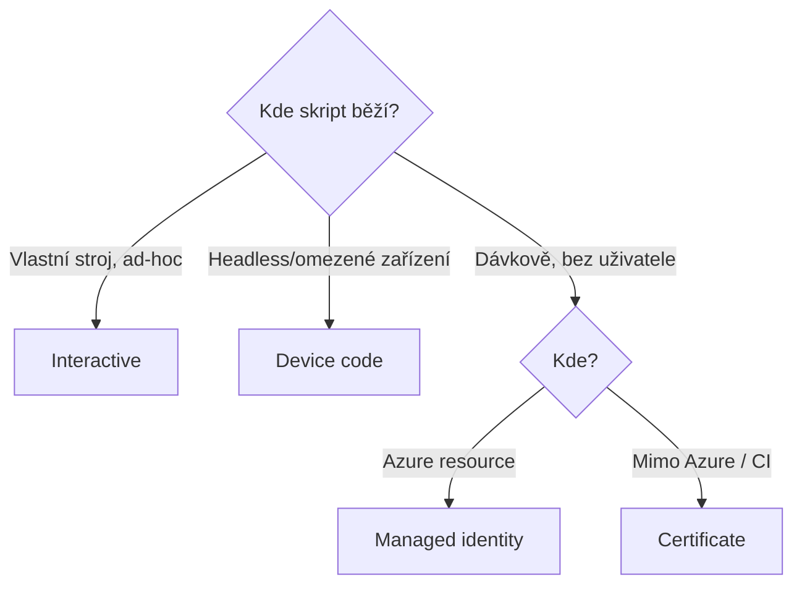

# PowerShell do hloubky

> Typ: povinný · Den: 2 · Odhad: 45 min výklad + 90 min Lab 1

## Cíle
- Moduly: PnP.PowerShell, Microsoft.Graph, SPO Management Shell — rozdíly a použití.
- Autentizace: interaktivní, device code, certifikát, managed identity.
- Správa modulů v čase: scopes, version pinning, PSResourceGet — viz
  [`explainer-module-management.md`](explainer-module-management.md).
- Ověřit po každém připojení, **kdo jsem a co smím** (connection → token → reálné volání),
  a umět rozplést typické chyby — viz [`troubleshooting-auth.md`](troubleshooting-auth.md).
- Vědomě pracovat s formáty a kódováním na hranici skript/soubor (UTF-8, CSV pro Excel) —
  viz [`explainer-formats-encoding.md`](explainer-formats-encoding.md).

## Výklad

### Tři PowerShell moduly
**PnP.PowerShell** je community-driven modul s nejširším pokrytím SharePoint Online (weby,
listy, provisioning šablony, branding) — stovky cmdletů, běží kdekoli (Windows/Mac/Linux/Azure
Function/Runbook). **Microsoft.Graph** je oficiální PowerShell SDK generovaný přímo ze schématu
Microsoft Graph API — pokrývá identity, skupiny, Teams a cokoli napříč M365, co SPO moduly
neřeší. Modul je rozdělen na desítky submodulů (`Microsoft.Graph.Users`, `Microsoft.Graph.Sites`
atd.), takže lze instalovat jen potřebnou část. **SPO Management Shell**
(`Microsoft.Online.SharePoint.PowerShell`) je oficiální tenant-admin modul pro nastavení
mimo rozsah PnP — typicky `Set-SPOTenant` a nejnovější preview nastavení, která často
přistanou v SPO modulu dřív než v PnP ekvivalentu. Konkrétně, co tím jde vypnout a co je
naopak jen kosmetika, je v [`comparison-spo-switches.md`](comparison-spo-switches.md);
SPO modul je zároveň jediná cesta k DAG reportům SharePoint Advanced Management
([`../../day-5/permission-discovery/`](../../day-5/permission-discovery/)).

### Autentizační módy
- **Interaktivní** — `-Interactive` (PnP) otevře webový dialog / WAM prompt s MFA flow; vhodné
  pro ad-hoc práci na vlastním stroji.
- **Device code** — dvoukrokový flow pro headless/omezená zařízení: aplikace vygeneruje kód,
  uživatel ho zadá na jiném zařízení přes browser a projde běžnou autentizací včetně MFA;
  nevyžaduje client secret. Dostupné jen pro **public client** aplikace — tedy ty, které
  běží na zařízení uživatele a neudrží tajemství, takže se prokazuje jen uživatel.
  Technický detail, který ušetří hodinu ladění: device code **nemá redirect URI**, takže
  Entra typ klienta nepozná z platformy a sáhne po fallbacku — přepínači *Authentication →
  Allow public client flows* (`isFallbackPublicClient`). Vypnutý fallback = `AADSTS7000218`.
  Interaktivního přihlášení se přepínač **netýká** — tam typ vyplývá z redirect URI
  `http://localhost` na platformě *Mobile and desktop applications*.
- **Certifikát** — asymetrický klíč nahraný jako app credential místo sdíleného secretu;
  Microsoft doporučuje certifikáty jako bezpečnější variantu pro app-only scénáře (dávkové
  operace, žádný přihlášený uživatel). Aplikace je tu **confidential client** — prokazuje
  se sama sebou. Formáty souborů, úložiště a žebříček credentialů:
  [`explainer-certificates-keys.md`](explainer-certificates-keys.md).
- **Managed identity** — identita vázaná přímo na Azure resource (Function App, Automation
  Account); systémově přiřazená (1:1 s resourcem, zanikne s ním) nebo uživatelsky přiřazená
  (nezávislý životní cyklus, lze přiřadit více resourcům). Žádný spravovaný secret/cert.



### Ověření stavu připojení — první příkazy po každém Connect
Návyk od prvního připojení: **connection objekt → token → reálné volání.** Připojení není
důkaz oprávnění (**authn != authz**) — důkazem je až token a odpověď serveru.

```powershell
# 1. Kam a jak jsem pripojeny (stav v pameti PowerShellu)
Get-PnPConnection | Select-Object Url, ConnectionType, ClientId, Tenant

# 2. Analyza tokenu - koho/co token skutecne reprezentuje
$t = Get-PnPAccessToken -ResourceTypeName SharePoint -Decoded
$t.Audiences                                    # aud: https://<tenant>.sharepoint.com
$t.Claims | Where-Object Type -in 'roles','scp','upn','appid','app_displayname' |
  Select-Object Type, Value

# 3. Realne volani - teprve tohle je dukaz
Get-PnPWeb | Select-Object Title, Url
```

Čtení tokenu je nejrychlejší rozlišení identity: **app-only má `roles` a žádné `upn`;
delegated má `upn` (+ `scp` se scopes) a žádné `roles`.** Token je přitom jen JSON
v base64url — tři části oddělené tečkou, payload obyčejný JSON, který jde dekódovat i bez
PnP (a nezávisle na verzi modulu). Proto do tokenu nikdy nepatří tajemství: **kdo token
drží, přečte si ho** — podpis brání změnám, ne čtení. Když krok 3 selže, postupovat podle
[`troubleshooting-auth.md`](troubleshooting-auth.md).

## Klíčové rozlišení
- **PnP.PowerShell vs SPO Management Shell** — viz `GLOSSARY.md`; PnP pro čitelnost a širší
  funkčnost, SPO modul pro tenant-wide nastavení bez PnP ekvivalentu.
- **Kosmetika vs skutečná hranice** — skrýt tlačítko (`commandBarProps`, per view,
  obejitelné) není totéž co vypnout cestu (`BlockDownloadPolicy`, permission level).
  Zadavatel chce skoro vždy druhé a popíše první: [`comparison-spo-switches.md`](comparison-spo-switches.md).
- **Interaktivní/device code (delegated) vs certifikát/managed identity (app-only)** — první
  dvojice vyžaduje přihlášeného uživatele a jeho oprávnění, druhá běží jako samostatná identita
  s vlastními aplikačními oprávněními.
- **Systémově vs uživatelsky přiřazená managed identity** — 1:1 vázaná na resource vs sdílená
  napříč více resourcy s nezávislým životním cyklem.
- **Public client vs confidential client** — prokazuje se člověk vs prokazuje se aplikace;
  public client (konzole na stroji uživatele) tajemství neudrží, confidential client
  (server, Function) drží secret nebo certifikát. Interactive + device code = public client
  flows; certifikátový app-only = confidential. Jedna app registrace může podporovat obojí.

## Volitelné demo
Hardware klíč (YubiKey/PIV) jako credential aplikace — [`demo-yubikey.md`](demo-yubikey.md),
30 min, spouštět jen při reálné rezervě. Nástroje pro samostudium: [`setup-ykman.md`](setup-ykman.md).

## Lab
Viz [`lab-cert-auth-sites.md`](lab-cert-auth-sites.md) — první velký lab kurzu: certifikát,
bezpečné uložení, app-only přihlášení, skriptované vytvoření pracovních webů a unified
connect wrapper. Volitelně navazuje [`lab-write-identities.md`](lab-write-identities.md) —
mini-lab „tři podpisy zápisu" (UI vs delegated vs app-only ve sloupci Vytvořil), při skluzu
zadat jako samostudium.

## Tipy
- **Tahák na troubleshooting připojení**: [`troubleshooting-auth.md`](troubleshooting-auth.md)
  — tři úrovně důkazu, tabulka symptomů (`AADSTS700016`, `AADSTS7000218`, „not of type RSA",
  401 s prázdnou odpovědí = past Delegated vs Application) a proč se po každé změně consentu
  připojovat znovu.
- Instalaci tří modulů spustit hned na začátku bloku na pozadí — na pomalejší síti zabere
  10–15 minut.
- Nikdy neexportovat `.pfx` „pro zálohu" — pointa labu je, že privátní klíč neopouští
  stroj; jediný soubor, který se přenáší, je `.cer`.
- SPO Management Shell v PowerShell 7 může vyžadovat
  `Import-Module Microsoft.Online.SharePoint.PowerShell -UseWindowsPowerShell`.
- Weby vytvářet smyčkou přes `dev/test/prod`, ne 3x ručně v UI — parametrizace je návyk,
  který se v ověření labu kontroluje.

## Zdroje (Microsoft)
- [PnP PowerShell — Connect-PnPOnline](https://pnp.github.io/powershell/cmdlets/Connect-PnPOnline.html)
- [Microsoft Graph PowerShell SDK overview](https://learn.microsoft.com/en-us/powershell/microsoftgraph/overview?view=graph-powershell-1.0)
- [Connect-SPOService (SharePoint Online Management Shell)](https://learn.microsoft.com/en-us/powershell/module/microsoft.online.sharepoint.powershell/connect-sposervice?view=sharepoint-ps)
- [OAuth 2.0 device authorization grant](https://learn.microsoft.com/en-us/entra/identity-platform/v2-oauth2-device-code)
- [Microsoft identity platform certificate credentials](https://learn.microsoft.com/en-us/entra/identity-platform/certificate-credentials)
- [Managed identities for Azure resources — overview](https://learn.microsoft.com/en-us/entra/identity/managed-identities-azure-resources/overview)

## Stav produktu / delta
- Ověřit k datu běhu — PnP.PowerShell od 9. 9. 2024 vyžaduje vlastní registrovanou aplikaci
  (`-ClientId`) i pro interaktivní přihlášení (sdílené výchozí ClientId bylo odebráno) —
  ověřit, že tato změna je v aktuální verzi modulu stále platná a promítá se do labu.
