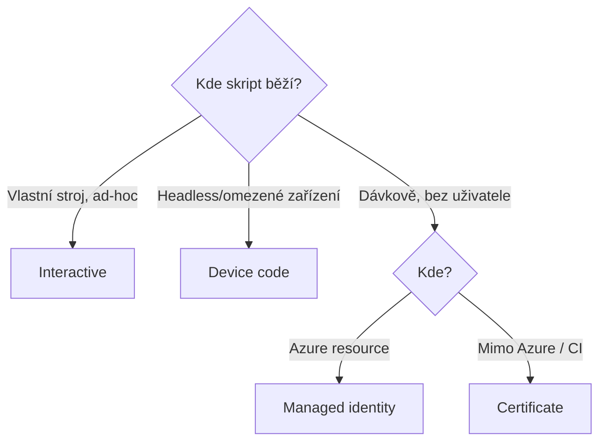

# PowerShell do hloubky

> Typ: povinný · Den: 2 (otvírák) · Odhad: 45 min výklad + 90 min Lab 1

## Cíle
- Moduly: PnP.PowerShell, Microsoft.Graph, SPO Management Shell — rozdíly a použití.
- Autentizace: interaktivní, device code, certifikát, managed identity.
- Správa modulů v čase: scopes, version pinning, PSResourceGet — viz
  [`explainer-module-management.md`](explainer-module-management.md).

## Výklad

### Tři PowerShell moduly
**PnP.PowerShell** je community-driven modul s nejširším pokrytím SharePoint Online (weby,
listy, provisioning šablony, branding) — stovky cmdletů, běží kdekoli (Windows/Mac/Linux/Azure
Function/Runbook). **Microsoft.Graph** je oficiální PowerShell SDK generovaný přímo ze schématu
Microsoft Graph API — pokrývá identity, skupiny, Teams a cokoli napříč M365, co SPO moduly
neřeší. Modul je rozdělen na desítky submodulů (`Microsoft.Graph.Users`, `Microsoft.Graph.Sites`
atd.), takže lze instalovat jen potřebnou část. **SPO Management Shell**
(`Microsoft.Online.SharePoint.PowerShell`) je oficiální tenant-admin modul pro nastavení
mimo rozsah PnP — typicky `Set-SPOTenant` a nejnovější preview nastavení, která často
přistanou v SPO modulu dřív než v PnP ekvivalentu.

### Autentizační módy
- **Interaktivní** — `-Interactive` (PnP) otevře webový dialog / WAM prompt s MFA flow; vhodné
  pro ad-hoc práci na vlastním stroji.
- **Device code** — dvoukrokový flow pro headless/omezená zařízení: aplikace vygeneruje kód,
  uživatel ho zadá na jiném zařízení přes browser a projde běžnou autentizací včetně MFA;
  nevyžaduje client secret. Dostupné jen pro public client aplikace.
- **Certifikát** — asymetrický klíč nahraný jako app credential místo sdíleného secretu;
  Microsoft doporučuje certifikáty jako bezpečnější variantu pro app-only scénáře (dávkové
  operace, žádný přihlášený uživatel).
- **Managed identity** — identita vázaná přímo na Azure resource (Function App, Automation
  Account); systémově přiřazená (1:1 s resourcem, zanikne s ním) nebo uživatelsky přiřazená
  (nezávislý životní cyklus, lze přiřadit více resourcům). Žádný spravovaný secret/cert.

## Klíčové rozlišení
- **PnP.PowerShell vs SPO Management Shell** — viz `GLOSSARY.md`; PnP pro čitelnost a širší
  funkčnost, SPO modul pro tenant-wide nastavení bez PnP ekvivalentu.
- **Interaktivní/device code (delegated) vs certifikát/managed identity (app-only)** — první
  dvojice vyžaduje přihlášeného uživatele a jeho oprávnění, druhá běží jako samostatná identita
  s vlastními aplikačními oprávněními.
- **Systémově vs uživatelsky přiřazená managed identity** — 1:1 vázaná na resource vs sdílená
  napříč více resourcy s nezávislým životním cyklem.

## Lab
Viz [`lab-cert-auth-sites.md`](lab-cert-auth-sites.md) — první velký lab kurzu: certifikát,
bezpečné uložení, app-only přihlášení, skriptované vytvoření pracovních webů a unified
connect wrapper.

## Zdroje (Microsoft)
- [PnP PowerShell — Connect-PnPOnline](https://pnp.github.io/powershell/cmdlets/Connect-PnPOnline.html)
- [Microsoft Graph PowerShell SDK overview](https://learn.microsoft.com/en-us/powershell/microsoftgraph/overview?view=graph-powershell-1.0)
- [Connect-SPOService (SharePoint Online Management Shell)](https://learn.microsoft.com/en-us/powershell/module/microsoft.online.sharepoint.powershell/connect-sposervice?view=sharepoint-ps)
- [OAuth 2.0 device authorization grant](https://learn.microsoft.com/en-us/entra/identity-platform/v2-oauth2-device-code)
- [Microsoft identity platform certificate credentials](https://learn.microsoft.com/en-us/entra/identity-platform/certificate-credentials)
- [Managed identities for Azure resources — overview](https://learn.microsoft.com/en-us/entra/identity/managed-identities-azure-resources/overview)

## Stav produktu / delta
- Ověřit k datu běhu — PnP.PowerShell od 9. 9. 2024 vyžaduje vlastní registrovanou aplikaci
  (`-ClientId`) i pro interaktivní přihlášení (sdílené výchozí ClientId bylo odebráno) —
  ověřit, že tato změna je v aktuální verzi modulu stále platná a promítá se do labu.
