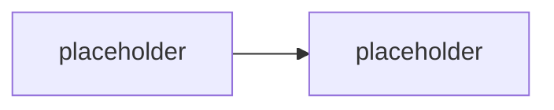

# M2.2 · Staging prostředí: DEV, TEST, PROD

> Typ: povinný · Den: 2 · Odhad: <min>

## Cíle
- <Role tenantů/prostředí a bezpečné nasazování změn>
- <Porovnání prostředí, webů, seznamů, položek; detekce driftu>
- <Automatizace baseline a diffů>

## Výklad

<TODO: role DEV/TEST/PROD prostředí, kdo tam smí zasahovat, jak se změna promuje mezi prostředími>

<TODO: porovnávání webů/listů/položek napříč prostředími, detekce driftu (konfigurace se rozjela od baseline)>

## Klíčové rozlišení
- <baseline (očekávaný stav) vs drift (skutečný stav) vs diff (mezi dvěma prostředími)>
- <konfigurační drift vs obsahový drift>

## Naše prostředí
<TODO: jak jsou DEV/TEST/PROD simulované v kurzovém tenantu — per-student sandbox weby>

## Lab
Viz [`lab-diff-baseline.md`](lab-diff-baseline.md).

## Zdroje (Microsoft)
- <TODO: dokumentace k site design/site script jako zdroj baseline>

## Stav produktu / delta
- <TODO: ověřit aktuální doporučené nástroje pro cross-environment porovnání k datu běhu>
