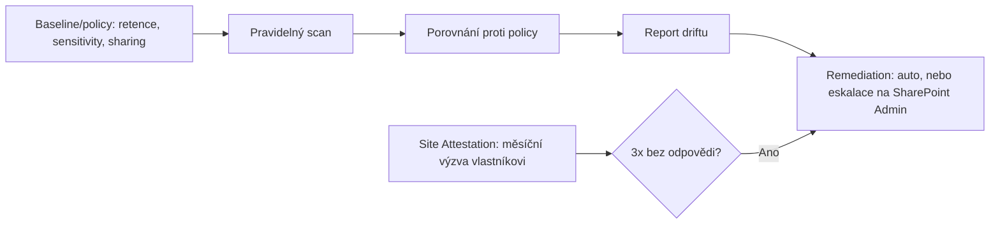

# M3.3 · Lifecycle & compliance enforcement

> Typ: povinný · Den: 3 · Odhad: <min>

## Cíle
- Skripty pro retenci a citlivost.
- Governance sdílení a detekce driftu.

## Výklad

### Retention a sensitivity labels — automatizace
Retention labely (Purview) lze aplikovat automaticky na základě citlivých informací,
klíčových slov nebo natrénovaných klasifikátorů, nebo programově přes Graph API pro
hromadné/dávkové scénáře nad existujícím obsahem v SharePoint/OneDrive. Sensitivity labely
lze na položku (`driveItem`) aplikovat přes `assignSensitivityLabel` — jde o tzv. metered
API (zpoplatněné/měřené, vyžaduje explicitní zapnutí a odpovídající oprávnění jako
`Files.ReadWrite.All`/`Sites.ReadWrite.All`) — nepočítat s tím jako s běžným bezplatným
voláním bez přípravy.

### Governance sdílení
External sharing má nastavení na úrovni organizace i jednotlivého webu — pokud se liší,
**platí vždy restriktivnější hodnota** (web nemůže být otevřenější než tenant-wide policy).
Čtyři úrovně: Anyone (odkaz bez přihlášení) → New and existing guests → Existing guests only
→ Only people in your organization. Změnu na úrovni webu smí provést jen SharePoint
Administrator, ne vlastník webu — to je důležité pro návrh automatizace: skript čekající
"vlastník si to opraví sám" nebude fungovat, enforcement musí jít přes administrátorskou
identitu.

### Site Attestation — nativní enforcement (SharePoint Advanced Management)
Site Attestation posílá vlastníkům webu pravidelné (měsíční) actionable-message výzvy k
potvrzení údajů o webu (nutnost, vlastníci, sdílení). Web bez potvrzení po **třech** po sobě
jdoucích měsíčních výzvách spadá do "unattested" stavu, na který lze navázat vynucenou akci
(např. omezení přístupu) — přímý nativní ekvivalent k "attestaci vlastníků" z Orchestry
simulace v M3.2, tentokrát jako standardní Microsoft funkce bez 3rd-party licence.

## Klíčové rozlišení
- **Report-only drift detekce vs auto-remediation** — auto-remediation bez lidského review je
  riziko (může napravit "drift", který byl ve skutečnosti záměrná výjimka).
- **Web-level sharing setting vs org-level policy** — vždy vyhrává restriktivnější, ne ten,
  co nastavil vlastník webu naposledy.
- **Site Attestation (nativní, časovaný cyklus s eskalací) vs jednorázový Site Access Review**
  (na vyžádání, detailní přehled oprávnění) — různé nástroje pro různý účel.

## Lab
Viz [`lab-compliance-drift.md`](lab-compliance-drift.md).

## Zdroje (Microsoft)
- [Automatically apply a retention label to Microsoft 365 items](https://learn.microsoft.com/en-us/purview/apply-retention-labels-automatically)
- [Automatically apply a sensitivity label to Microsoft 365 data](https://learn.microsoft.com/en-us/purview/apply-sensitivity-label-automatically)
- [Manage sharing settings for SharePoint and OneDrive](https://learn.microsoft.com/en-us/sharepoint/turn-external-sharing-on-or-off)
- [Request recurring site attestations for SharePoint sites](https://learn.microsoft.com/en-us/sharepoint/request-site-attestations)

## Stav produktu / delta
- Ověřit k datu běhu — Site Attestation vyžaduje SharePoint Advanced Management licenci (viz
  ekvivalent produktu v GOC224 GLOSSARY, dva licenční modely); ověřit, zda kurzový tenant má
  SAM licenci aktivní pro živou demonstraci, jinak jen simulace na screenshotech.
