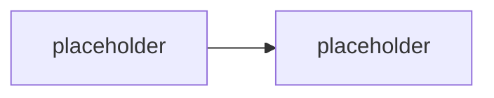

# M3.3 · Lifecycle & compliance enforcement

> Typ: povinný · Den: 3 · Odhad: <min>

## Cíle
- <Skripty pro retenci a citlivost>
- <Governance sdílení a detekce driftu>

## Výklad

<TODO: automatizace retention/sensitivity label enforcement>

<TODO: governance sdílení (external sharing policy) a detekce driftu proti baseline z M2.2>

## Klíčové rozlišení
- <detekce driftu vs vynucení (enforcement) — report-only vs auto-remediation>
- <retence obsahu vs retence logů (viz GLOSSARY.md, M4.2)>

## Lab
Viz [`lab-compliance-drift.md`](lab-compliance-drift.md).

## Zdroje (Microsoft)
- <TODO: Microsoft Purview retention/sensitivity labels dokumentace>
- <TODO: SharePoint sharing policy dokumentace>

## Stav produktu / delta
- <TODO: ověřit aktuální rozsah automatizace label enforcement přes Graph/PnP k datu běhu>
