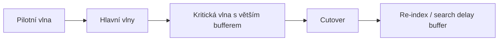

# Skladba migrací

> Typ: povinný · Den: 3 · Odhad: **45 min výklad** (povinné jádro) + **volitelný Lab 2, 105 min** — ověřeno reálným během 2026-09-09

## Cíle
- Předmigrační kontroly a plánování.
- Paralelizace, wave planning, cutover taktiky.
- Velké seznamy, verze, throttling, zpoždění vyhledávání.
- Nástrojová mapa migrace: SPMT (+ PS modul), Migration Manager, 3rd-party (ShareGate a spol.)
  — viz [`explainer-migration-tools.md`](explainer-migration-tools.md).
- Assessment mrtvých vrstev na zdroji (Add-ins/ACS, custom script, `.wsp`/`.stp` šablony) —
  co v cíli nemá kam přistát: [`explainer-legacy-layers.md`](explainer-legacy-layers.md).

## Výklad

### Předmigrační kontroly a plánování
Microsoft doporučuje migrační fáze: plán → assess & remediate → příprava cílového prostředí →
migrace → onboarding uživatelů. Assessment nástroje (např. SharePoint Migration Assessment
Tool pro on-prem zdroje) skenují zdrojová data a hledají problémy dřív, než začne samotný
přesun — chybějící metadata, nepodporované typy sloupců, příliš hluboké struktury složek.
Exekuci pak dělá konkrétní nástroj — SPMT (vč. skriptovatelného PS modulu), Migration
Manager, nebo komerční 3rd-party (ShareGate, AvePoint, Quest); rozhodovací osa a cmdlet
pipeline v [`explainer-migration-tools.md`](explainer-migration-tools.md).

### Wave planning a cutover taktiky
Rozdělení migrace do vln podle rizika/velikosti/závislostí, ne abecedně nebo podle toho, co je
"po ruce". Pilotní vlna (malý, nízkorizikový vzorek) ověří proces, hlavní vlny migrují většinu
obsahu, kritická vlna (nejdůležitější/nejsledovanější weby) jde poslední s největším bufferem
na rollback. Cutover = okamžik přepnutí uživatelů na nové umístění — plánovat mimo špičku,
s jasným komunikačním plánem a definovaným rollback krokem.

### Velké seznamy, verze, throttling
**List view threshold** je defaultně 5000 položek v SharePoint Online a **nejde změnit** —
ale to neznamená limit velikosti listu (list může mít až 30 milionů položek), jen limit na
počet položek vrácených v jednom dotazu/view bez indexovaného sloupce. Migrační skripty musí
stránkovat/filtrovat přes indexované sloupce, ne spoléhat na plný `Get-*` bez limitu.
**Verze souborů** — výchozí limit je 500 verzí na soubor (lze zvýšit až na 50 000, snížit na
100, nebo přepnout na automatické ořezávání dle stáří) na úrovni organizace/webu/knihovny;
při aktivní retention policy nebo eDiscovery holdu SharePoint verze **nemůže** ořezat, i když
je nastaven nižší limit — to přímo násobí objem migrovaných dat, pokud se neřeší předem.
**Search crawl delay** — obsah po migraci není okamžitě vyhledatelný, cutover plán musí počítat
s rezervou na re-index, jinak uživatelé po přepnutí nenajdou nedávno přesunutý obsah.

## Klíčové rozlišení
- **List view threshold (limit na dotaz/view, obchází se indexací/filtrem) vs celková
  kapacita listu (30 milionů položek, netýká se threshold)**.
- **Ořezávání verzí podle limitu vs retention/eDiscovery hold** — hold má vždy přednost, verze
  se neořežou bez ohledu na nastavený limit.
- **Migrace obsahu vs migrace metadat/verzí** — druhé výrazně zvyšuje objem přenášených dat a
  je snadné ho v odhadu opomenout.

## Lab
Viz [`lab-fileshare-migration.md`](lab-fileshare-migration.md) — druhý velký lab kurzu:
migrace z on-prem fileshare do SPO knihoven řízená JSON plánem (vlny, cíle, mapování
metadat), exekuce přes SPMT PS modul, doplnění metadat PnP skriptem.

## Zdroje (Microsoft)
- [Migration planning for SharePoint and OneDrive rollout](https://learn.microsoft.com/en-us/sharepoint/plan-rollout-migration)
- [Overview of the SharePoint Migration Tool (SPMT)](https://learn.microsoft.com/en-us/sharepointmigration/introducing-the-sharepoint-migration-tool)
- [Migrate to SharePoint and OneDrive using PowerShell cmdlets](https://learn.microsoft.com/en-us/sharepointmigration/overview-spmt-ps-cmdlets)
- [The number of items in this list exceeds the list view threshold](https://learn.microsoft.com/en-us/troubleshoot/sharepoint/lists-and-libraries/items-exceeds-list-view-threshold)
- [Version history limits for document library and OneDrive overview](https://learn.microsoft.com/en-us/sharepoint/document-library-version-history-limits)

## Stav produktu / delta
- Ověřit k datu běhu — výchozí a maximální hodnoty limitu verzí (500 default / 50 000 max) a
  chování automatického ořezávání se v poslední době měnily; ověřit aktuální hodnoty na
  [Version history limits](https://learn.microsoft.com/en-us/sharepoint/document-library-version-history-limits) před přípravou čísel do slidů.
