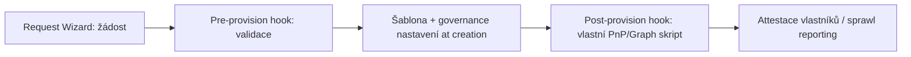

# Orchestry integrace & vlastní skripty (simulace)

> Typ: volitelný · Den: 3 (dle času, po provisioningu) · Odhad: 100 min

> [!NOTE] Volitelný modul — nic povinného na něm nezávisí (leaf node). Governance koncepty
> (attestace, sprawl) mají nativní protějšek v [`../lifecycle-compliance/`](../lifecycle-compliance/),
> který běží nezávisle na tomto bloku.

## Cíle
- Request center a životní cyklus šablon pracovních prostorů.
- Hooky: pre-provision, post-provision, compliance kontroly.
- Integrace s PnP.PowerShell / Microsoft Graph.
- Governance artefakty: attestace vlastníků, citlivost, sprawl.

## Výklad

### Request center a šablony
Orchestry (3rd-party SaaS) staví nad stejným problémem jako [`../provisioning-patterns/`](../provisioning-patterns/) — provisioning s metadaty
a governance — ale jako hotový produkt, ne vlastní kód. Request Wizard vede uživatele
žádostí o nový pracovní prostor (Teams/SharePoint) v rámci předdefinovaných šablon, s
kontrolou duplicit (upozorní, pokud podobný prostor už existuje) a směrováním přes
konfigurovatelný schvalovací proces (jednoduchý i vícekrokový). Governance nastavení
(sensitivity label webu, výchozí sensitivity label knihovny) se aplikují **v okamžiku
vytvoření** — prostor nikdy nevznikne bez governance nastavení, "dodatečné dolaďování" odpadá.

### Hooky a integrace s vlastním kódem
Koncepčně: **pre-provision hook** validuje žádost dřív, než cokoli vznikne (kontrola názvu,
oprávněnosti žadatele), **post-provision hook** provádí akce po vzniku prostoru (notifikace,
zápis do externího CMDB, spuštění vlastního PnP skriptu pro doplňkovou konfiguraci, kterou
vendor šablona nepokrývá). Toto je integrační bod, kde vlastní PnP.PowerShell/Graph kód ([`../provisioning-patterns/`](../provisioning-patterns/))
doplňuje vendor platformu tam, kde je specifický požadavek zákazníka mimo standardní šablonu.

### Governance artefakty
Attestace vlastníků (pravidelné potvrzení "tento prostor pořád existuje z důvodu X, vlastník
je pořád Y"), sensitivity labeling při vzniku, sprawl reporting (přehled neaktivních/duplicitních
prostorů) — koncepty, které v [`../lifecycle-compliance/`](../lifecycle-compliance/) uvidíme jako nativní Microsoft funkce (Site Attestation v
rámci SharePoint Advanced Management) — Orchestry a nativní SAM řeší podobný problém, srovnání
je součástí labu.

## Klíčové rozlišení
- **Vendor platforma (Orchestry) vs vlastní PnP kód ([`../provisioning-patterns/`](../provisioning-patterns/))** — platforma dává rychlejší start
  a governance "by default", vlastní kód dává plnou kontrolu a žádný licenční náklad/vendor
  lock-in; hooky jsou místo, kde se obě strategie potkávají.
- **Governance at creation (Orchestry přístup) vs governance po vzniku** (dodatečné nastavení
  sensitivity/retention) — first je odolnější vůči lidské chybě "zapomněl jsem to nastavit".

## Lab
Viz [`lab-orchestry-integration-design.md`](lab-orchestry-integration-design.md).

## Zdroje
- [Orchestry — MS Teams & SharePoint Provisioning](https://www.orchestry.com/ms-teams-workspace-provisioning) (vendor dokumentace, ne Microsoft)
- [Introducing the PnP provisioning engine](https://learn.microsoft.com/en-us/sharepoint/dev/solution-guidance/introducing-the-pnp-provisioning-engine) (integrační bod pro vlastní skripty)

## Stav produktu / delta
- Ověřit k datu běhu — toto je simulace bez živé Orchestry licence; konkrétní názvy
  funkcí/kroků wizardu se mohou lišit od aktuální verze produktu. Před přípravou demo
  materiálů zkontrolovat aktuální stav na orchestry.com, ne spoléhat na tento popis jako
  finální specifikaci.
