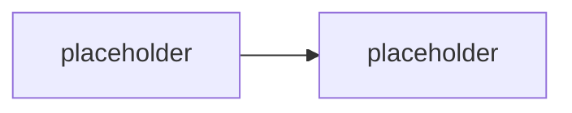

# M3.2 · Orchestry integrace & vlastní skripty (simulace)

> Typ: povinný · Den: 3 · Odhad: <min>

## Cíle
- <Request center a životní cyklus šablon pracovních prostorů>
- <Hooky: pre-provision, post-provision, compliance kontroly>
- <Integrace s PnP.PowerShell / Microsoft Graph>
- <Governance artefakty: attestace vlastníků, citlivost, sprawl>

## Výklad

<TODO: Orchestry request center a katalog šablon pracovních prostorů — viz GLOSSARY.md>

<TODO: lifecycle hooky — pre-provision (validace žádanky), post-provision (konfigurace, notifikace), compliance kontroly>

<TODO: integrační body s vlastními PnP.PowerShell/Graph skripty (webhook/API rozhraní)>

<TODO: governance artefakty — attestace vlastníků, sensitivity labeling, sprawl reporting>

## Klíčové rozlišení
- <vlastní PnP kód vs vendor platforma — kontrola vs rychlost/náklad>
- <pre-provision hook (validace před vznikem) vs post-provision hook (akce po vzniku)>

## Lab
Viz [`lab-orchestry-integration-design.md`](lab-orchestry-integration-design.md).

## Zdroje (Microsoft)
- <TODO: Microsoft Graph webhooks/subscriptions dokumentace (relevantní pro hook integraci)>

## Stav produktu / delta
- <TODO: toto je simulace bez živé Orchestry licence — ověřit, zda popisovaný hook model odpovídá aktuální verzi produktu při přípravě demo materiálů>
