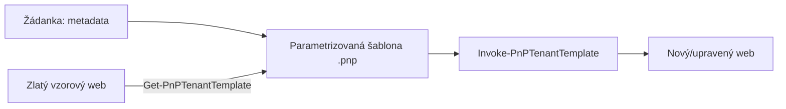

# Vzory automatizace zřizování

> Typ: povinný · Den: 3 · Odhad: 40 min výklad + 60 min lab

## Cíle
- PnP provisioning vs Orchestry katalog (přehled).
- Žádanky na weby a zachycení metadata.
- Deklarativní vrstva vedle PnP enginu — site scripty, site templates, **list designy**
  a reverzní cesta `Get-PnPSiteScriptFromWeb`; kdy JSON nestačí:
  [`explainer-site-list-templates.md`](explainer-site-list-templates.md).

## Výklad

### PnP Provisioning Engine a tenant templates
Šablona (`.pnp` balíček nebo XML) deklarativně popisuje, co se má na webu nastavit — listy,
sloupce, content types, theme, navigace, tenant-wide nastavení. `Get-PnPTenantTemplate`
**exportuje aktuální konfiguraci existujícího webu jako šablonu** — to je přímé pojítko na
baseline koncept z [`../../day-2/staging-environments/`](../../day-2/staging-environments/): baseline lze vytvořit jak ručně (site script), tak exportem ze
vzorového ("zlatého") webu. `Invoke-PnPTenantTemplate -Path sablona.pnp` šablonu aplikuje;
parametr `-Handlers` omezuje, které části šablony se skutečně provedou (např. jen `Lists,Fields`,
ne celé `All`) — užitečné, když šablona obsahuje víc, než chceme na konkrétní web aplikovat.

> [!IMPORTANT] Oprávnění
> `Invoke-PnPTenantTemplate` vyžaduje roli **Global Administrator** — to je v přímém napětí s
> least-privilege principem z [`../../day-1/automation-strategy/`](../../day-1/automation-strategy/)/[`../../day-5/security-hardening/`](../../day-5/security-hardening/). V produkčním nasazení nikdy nespouštět interaktivně pod
> osobním Global Admin účtem; provisioning automatizace běží pod vyhrazenou app-only identitou s
> touto rolí přiřazenou jen jí, ne lidem.

### Žádanky na weby a zachycení metadata
Šablona podporuje parametry — token `{parameter:NázevParametru}` v šabloně se při aplikaci
nahradí hodnotou z `-Parameters @{"NázevParametru"="hodnota"}`. Toto je mechanismus, jak
metadata ze žádanky (název webu, účel, vlastník, citlivost) propsat do konkrétní instance
šablony bez ruční úpravy šablony samotné.

## Klíčové rozlišení
- **Deklarativní šablona (co má web mít) vs imperativní skript (jak toho krok za krokem
  dosáhnout)** — PnP šablona je deklarativní, engine řeší "jak".
- **Export ze vzorového webu (`Get-PnPTenantTemplate`) vs ruční autoring šablony od nuly** —
  export je rychlejší start, ale přenáší i nechtěné artefakty vzorového webu, pokud se
  `-Handlers` nerozsah neomezí.

## Lab
Viz [`lab-pnp-provisioning.md`](lab-pnp-provisioning.md).

## Zdroje (Microsoft)
- [Introducing the PnP provisioning engine](https://learn.microsoft.com/en-us/sharepoint/dev/solution-guidance/introducing-the-pnp-provisioning-engine)
- [PnP Provisioning Tenant Templates](https://learn.microsoft.com/en-us/sharepoint/dev/solution-guidance/pnp-provisioning-tenant-templates)
- [Invoke-PnPTenantTemplate (PnP PowerShell)](https://pnp.github.io/powershell/cmdlets/Invoke-PnPTenantTemplate.html)

## Stav produktu / delta
- Ověřit k datu běhu — seznam podporovaných `-Handlers` a Global Admin požadavek na
  `Invoke-PnPTenantTemplate` se může v novějších verzích PnP.PowerShell zpřesnit; ověřit
  aktuální minimální roli před demonstrací.
