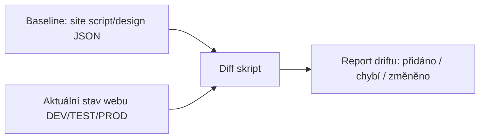

# Staging prostředí: DEV, TEST, PROD

> Typ: povinný · Den: 3 · Odhad: **30 min — jen lab** (ověřeno reálným během 2026-09-09); výklad je podklad k přečtení, nepřednáší se

## Cíle
- Role tenantů/prostředí a bezpečné nasazování změn.
- Porovnání prostředí, webů, seznamů, položek; detekce driftu.
- Automatizace baseline a diffů.

## Výklad

> [!NOTE] Výklad se na běhu nepřednáší — je to podklad k přečtení
> Reálný běh 2026-09-09 odučil tenhle blok za **30 minut jako čistý lab** a výklad vypustil;
> den 3 tím vyšel podle plánu. Text níž proto zůstává jako **referenční podklad** —
> studenti si ho čtou, instruktor ho neprochází. Nahlas musí padnout dvě věty: **co je
> baseline** a **co je drift**. Zbytek je k dohledání a vrací se k tomu lab.

### Role DEV/TEST/PROD
Změna (nová šablona webu, upravené sloupce, nové oprávnění) se nejdřív ověří v DEV, pak
potvrdí v TEST na datech blízkých produkčním, teprve pak jde do PROD. Kdo smí zasahovat kam se
zpřísňuje směrem k PROD — v DEV může měnit kdokoli z týmu, v PROD jen schválená automatizace
nebo vyjmenovaní administrátoři.

### Baseline jako deklarativní artefakt
Site script (JSON popisující akce, které se mají po vytvoření webu provést — nastavit theme,
vytvořit listy, nastavit sloupce) + site design (pojmenovaná kolekce site scriptů) je
deklarativní způsob, jak zapsat *očekávaný* stav webu. `Add-SPOSiteScript`/`Add-SPOSiteDesign`
registrují artefakt v tenantu (limit: 100 site scriptů a 100 site designů na tenant). Tento
artefakt slouží jako baseline — očekávaný stav, proti kterému se porovnává realita.

### Porovnání prostředí a detekce driftu
Drift = rozdíl mezi tím, co baseline (site script/šablona) předepisuje, a tím, co web skutečně
obsahuje teď (přidané sloupce mimo šablonu, změněná oprávnění, smazané listy). Diff skript
čte aktuální stav webu (Graph/PnP) a porovnává ho strukturovaně proti baseline JSON — výstup je
seznam odchylek, ne jen "stejné/různé".

## Klíčové rozlišení
- **Baseline (očekávaný stav, deklarativní) vs drift (skutečný stav se od baseline odchýlil)
  vs diff (mezi dvěma konkrétními prostředími, ne nutně proti baseline)**.
- **Konfigurační drift** (sloupce, oprávnění, nastavení webu) **vs obsahový drift** (počet
  položek, obsah souborů) — diff skripty pro oba typy se liší rozsahem dat, která čtou.

## Naše prostředí
Per-student sandbox weby simulují DEV/TEST/PROD trojici v rámci jednoho studentského webu
(`/sites/user.<N>`) — tři podsložky/subweby s úmyslně vloženým rozdílem pro cvičení diffu.

## Lab
Viz [`lab-diff-baseline.md`](lab-diff-baseline.md).

## Zdroje (Microsoft)
- [SharePoint site template and site script overview](https://learn.microsoft.com/en-us/sharepoint/dev/declarative-customization/site-design-overview)
- [Get started creating SharePoint site templates and site scripts](https://learn.microsoft.com/en-us/sharepoint/dev/declarative-customization/get-started-create-site-design)

## Stav produktu / delta
- Ověřit k datu běhu — limit 100 site scriptů/site designů na tenant a aktuální JSON schéma
  akcí (`site-design-script-actions.schema.json`) se může rozšiřovat o nové akce; zkontrolovat
  před přípravou demo baseline.
