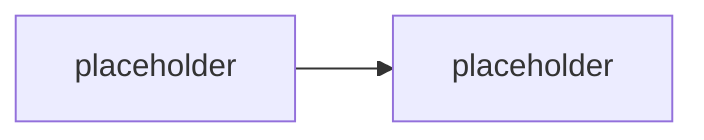

# M4.1 · Azure integrační vzory

> Typ: povinný · Den: 4 · Odhad: <min>

## Cíle
- <Logic Apps vs Functions vs Runbooks>
- <Event/webhook subscription, change notifications>

## Výklad

<TODO: Logic Apps vs Azure Functions vs Automation Runbooks — kdy který, viz GLOSSARY.md>

<TODO: Graph change notifications (webhooks) — subscription lifecycle, obnovování platnosti>

## Klíčové rozlišení
- <low-code orchestrace (Logic Apps) vs pro-code (Functions) vs scheduled runbook>
- <push (webhook/change notification) vs pull (polling) model>

## Lab
Viz [`lab-change-notifications-function.md`](lab-change-notifications-function.md).

## Zdroje (Microsoft)
- <TODO: Microsoft Graph change notifications dokumentace>
- <TODO: Azure Functions vs Logic Apps vs Automation — srovnávací dokumentace>

## Stav produktu / delta
- <TODO: ověřit aktuální maximální dobu platnosti subscription per resource type k datu běhu>
