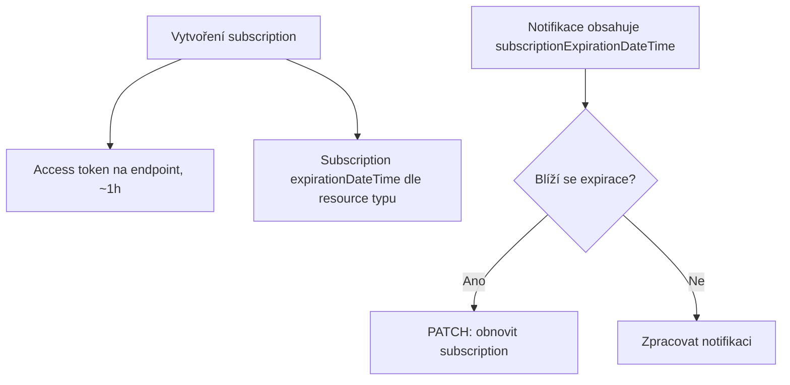

# Azure integrační vzory

> Typ: povinný · Den: 4 · Odhad: 40 min výklad + 90 min Lab 3 + 20 min instruktorské demo (kopie dat se zachováním metadat)

## Cíle
- Logic Apps vs Functions vs Runbooks — a kdy nic z toho, ale Power Automate flow
  ([`comparison-power-automate.md`](../elevated-access/comparison-power-automate.md)).
- Event/webhook subscription, change notifications.
- **Tři update typy a to, že se vzájemně vylučují**: zachovat původní autory a časy jde
  jen za cenu spuštění flow, a zápis, který flow nespustí, je neviditelný pro detekci
  driftu podle `Modified` ([`guide-copy-metadata.md`](guide-copy-metadata.md)).
- Orientace v Azure před laby dne (tenant vs subscription, RBAC vs Entra role, kde skript
  běží, kontejnery) — k přečtení předem: [`explainer-azure-orientation.md`](explainer-azure-orientation.md).

## Výklad

### Logic Apps vs Functions vs Automation Runbooks
**Azure Functions** je code-first serverless compute — plná kontrola nad logikou, retry,
error handlingem. **Logic Apps** je orchestration-first, low-code, s 200+ předpřipravenými
konektory (vč. SharePoint) — silný tam, kde jde o propojení víc služeb bez psaní kódu, slabý
tam, kde je potřeba komplexní vlastní logika. **Automation Runbooks** je odlehčené,
nákladově efektivní řešení pro přímočaré, PowerShell-native scheduled úlohy (typicky
jednodušší remediace). Klíčové technické omezení: **PowerShell neběží nativně uvnitř Logic
App** — potřebuje-li workflow spustit PowerShell, musí zavolat Function nebo Automation
Runbook jako druhý krok.

> [!NOTE] „A proč to nenapsat v Power Automate?"
> Ten dotaz padne skoro vždycky a je legitimní — flow má zákazník nasazený a pro schvalování
> i notifikace je správnou odpovědí. Rozhodovací hranice ale neleží v tom, co která
> platforma umí, nýbrž **pod čí identitou to běží**: elevace v Power Automate se dělá
> sdílením flow, kde konektor zůstane na vlastníkovi, takže automatizace visí na osobním
> účtu. Srovnání a nasaditelná náhrada:
> [`comparison-power-automate.md`](../elevated-access/comparison-power-automate.md)
> a [`../elevated-access/lab-elevated-access.md`](../elevated-access/lab-elevated-access.md).

### Plánované běhy: on-premise vs Azure — a auth bez člověka
Čtvrtá varianta vedle Azure trojice je klasický **on-premise server s Task Schedulerem** —
pořád legitimní tam, kde skript potřebuje dosáhnout na on-prem zdroje nebo kde Azure
subscription není k dispozici. Rozhodovací tabulka včetně autentizace (žádný scénář
plánovaného běhu nesmí spoléhat na interaktivní přihlášení):

| Kde běží | Plánovač | Auth | Secret management |
|---|---|---|---|
| On-premise server | Task Scheduler | certifikát (app-only) | **machine** certificate store — ne user store, task běží pod servisním účtem; nikdy secret v definici tasku |
| Azure — reakce na event | Function (timer / event trigger) | **managed identity** | žádný spravovaný secret — identita vázaná na resource |
| Azure — periodická remediace | Automation Runbook | **managed identity** | dtto; pozor, runbook **neprojde** firewallem na Key Vaultu |
| Azure — dávka s vlastním runtime | **Container Apps Job** (cron, UTC) | **managed identity** | dtto; moduly zapečené v image, scale-to-zero |
| CI/CD pipeline | pipeline scheduler | certifikát / federated credentials | pipeline secret store (Key Vault-backed), nikdy repo |

Ta tabulka odpovídá na otázku *„kde bydlí credential"*. Druhá otázka — *„co to udělá
s PowerShellovým skriptem"* (jak se dovnitř dostanou moduly, kdo drží jejich verzi, jaký je
strop doby běhu) — rozhoduje často víc a má vlastní srovnání:
[`comparison-scheduled-runtimes.md`](comparison-scheduled-runtimes.md).

Vazba na auth módy z [`../../day-2/powershell-deep-dive/`](../../day-2/powershell-deep-dive/)
a runtime prostředí z [`../../day-1/vscode-copilot-env/explainer-runtime-environments.md`](../../day-1/vscode-copilot-env/explainer-runtime-environments.md);
rotaci certifikátů řeší [`../../day-5/security-hardening/`](../../day-5/security-hardening/).

### Graph change notifications — subscription lifecycle
Subscription má omezenou životnost, kterou je nutné před vypršením obnovit (`PATCH` s novým
`expirationDateTime`), jinak zanikne a je nutné vytvořit novou. Maximální životnost se **liší
podle typu resource** — např. `driveItem` (OneDrive/SharePoint soubory) až ~42 300 minut
(cca 30 dní), zatímco Teams change notifications mají max. jen 60 minut. Minimální
životnost je 45 minut (kratší požadavek se automaticky posune na 45 min od teď).

Access token doručený při vytvoření subscription má **vlastní, nezávislou** životnost (typicky
kolem 1 hodiny) — nezaměňovat s životností subscription samotné. Lifecycle eventy
`reauthorizationRequired` (potřeba obnovit autorizaci endpointu) a `subscriptionRemoved`
(Graph subscription zrušil) je nutné zpracovat samostatně od běžných change notifications.
Každá notifikace nese `subscriptionExpirationDateTime` — použít jako spolehlivý signál, kdy
obnovit, ne počítat expiraci ručně z data vytvoření.

## Klíčové rozlišení
- **Logic Apps (orchestrace, konektory, no PowerShell nativně) vs Functions (kód, plná
  kontrola) vs Runbooks (jednoduché scheduled PowerShell úlohy)**.
- **Životnost access tokenu (endpoint auth, ~1h) vs životnost subscription (dny, dle resource
  typu)** — dvě nezávislé věci, obě je nutné hlídat.
- **Delta query (pull, [`../../day-3/graph-fundamentals/`](../../day-3/graph-fundamentals/)) vs change notifications (push, zde)** — push vyžaduje správu
  subscription lifecycle, pull ne.

## Laby
Pull i push strana integrace:

- [`lab-batch-sync-task.md`](lab-batch-sync-task.md) — třetí velký lab kurzu: idempotentní
  dávkový CRUD sync seznamu pod aplikační identitou, registrovaný jako plánovaný task
  (scheduled/pull model). Studenti dělají celý.
- [`lab-change-notifications-function.md`](lab-change-notifications-function.md) — Function
  jako endpoint pro Graph change notifications (event-driven/push model). **Celé
  samostudium** dle zadání labu; subscription lifecycle zůstává ve výkladu výše.
  Instruktorské demo tohle **není** — viz poznámka o přestavbě níž.

## Tutorial

- [`tutorial-script-to-azure.md`](tutorial-script-to-azure.md) — **krok za krokem, jak
  dostat skript do Azure a spustit ho tam.** Část A (10 min) dokáže celou cestu na
  triviálním skriptu, část B (15 min) ho napojí na SharePoint přes managed identitu
  a zřídí web ze šablony. Vede přes **Automation Runbook**, ne Function — packaging
  `PnP.PowerShell` do deployment package je to, co první nasazení zabije.
- Blok 2 [`../elevated-access/`](../elevated-access/) na tenhle postup staví: jeho lab ho
  v kroku 8 použije a neopakuje.

## Instruktorské demo (mimo agendu, spouští se na dotaz)

- [`guide-copy-metadata.md`](guide-copy-metadata.md) — 20 min. Kopie dat se zachováním
  původního `Created`/`Modified`/`Author`/`Editor`. **Čí identitu po sobě zanechá** — a proč
  zápis přes `SystemUpdate` neuvidí detekce driftu z
  [`../lifecycle-compliance/`](../lifecycle-compliance/).

> [!NOTE] Přestavba 2026-09-09
> Třetím prvkem bloku bylo ~30min instruktorské demo change notifications. Nahradilo ho
> 20min demo kopie s metadaty — z těch dvou je to jediné, které **reálně zapíše do
> SharePointu z Functiony běžící v Azure**; handshake demo vracelo validační token
> a logovalo. Blok se tím zkrátil o 10 min a Function App, kterou demo nasadí, je zároveň
> ten skeleton, který si přebírá [`../siem-blob-integration/`](../siem-blob-integration/).
>
> Zadání labu change notifications **zůstává v repu** jako samostudium a subscription
> lifecycle zůstává ve výkladu — vypuštěné je jen to demo.

## Zdroje (Microsoft)
- [Integration and automation platform options in Azure](https://learn.microsoft.com/en-us/azure/azure-functions/functions-compare-logic-apps-ms-flow-webjobs)
- [Set up notifications for changes in resource data](https://learn.microsoft.com/en-us/graph/change-notifications-overview)
- [Reduce missing change notifications and removed subscriptions](https://learn.microsoft.com/en-us/graph/change-notifications-lifecycle-events)

## Stav produktu / delta
- Ověřit k datu běhu — maximální životnost subscription per resource typ se liší a
  příležitostně se mění; ověřit aktuální hodnoty (zejména pro resource typ použitý v labu)
  na [subscription resource type](https://learn.microsoft.com/en-us/graph/api/resources/subscription?view=graph-rest-1.0) před přípravou demonstrace.
