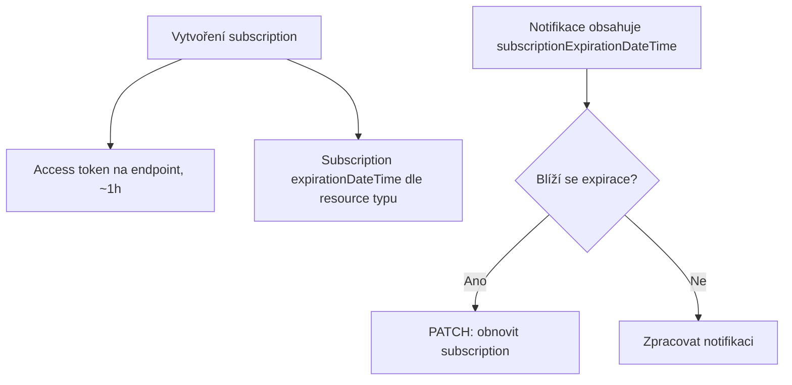

# M4.1 · Azure integrační vzory

> Typ: povinný · Den: 4 · Odhad: <min>

## Cíle
- Logic Apps vs Functions vs Runbooks.
- Event/webhook subscription, change notifications.

## Výklad

### Logic Apps vs Functions vs Automation Runbooks
**Azure Functions** je code-first serverless compute — plná kontrola nad logikou, retry,
error handlingem. **Logic Apps** je orchestration-first, low-code, s 200+ předpřipravenými
konektory (vč. SharePoint) — silný tam, kde jde o propojení víc služeb bez psaní kódu, slabý
tam, kde je potřeba komplexní vlastní logika. **Automation Runbooks** je odlehčené,
nákladově efektivní řešení pro přímočaré, PowerShell-native scheduled úlohy (typicky
jednodušší remediace). Klíčové technické omezení: **PowerShell neběží nativně uvnitř Logic
App** — potřebuje-li workflow spustit PowerShell, musí zavolat Function nebo Automation
Runbook jako druhý krok.

### Graph change notifications — subscription lifecycle
Subscription má omezenou životnost, kterou je nutné před vypršením obnovit (`PATCH` s novým
`expirationDateTime`), jinak zanikne a je nutné vytvořit novou. Maximální životnost se **liší
podle typu resource** — např. `driveItem` (OneDrive/SharePoint soubory) až ~42 300 minut
(cca 30 dní), zatímco Teams change notifications mají max. jen 60 minut. Minimální
životnost je 45 minut (kratší požadavek se automaticky posune na 45 min od teď).

Access token doručený při vytvoření subscription má **vlastní, nezávislou** životnost (typicky
kolem 1 hodiny) — nezaměňovat s životností subscription samotné. Lifecycle eventy
`reauthorizationRequired` (potřeba obnovit autorizaci endpointu) a `subscriptionRemoved`
(Graph subscription zrušil) je nutné zpracovat samostatně od běžných change notifications.
Každá notifikace nese `subscriptionExpirationDateTime` — použít jako spolehlivý signál, kdy
obnovit, ne počítat expiraci ručně z data vytvoření.

## Klíčové rozlišení
- **Logic Apps (orchestrace, konektory, no PowerShell nativně) vs Functions (kód, plná
  kontrola) vs Runbooks (jednoduché scheduled PowerShell úlohy)**.
- **Životnost access tokenu (endpoint auth, ~1h) vs životnost subscription (dny, dle resource
  typu)** — dvě nezávislé věci, obě je nutné hlídat.
- **Delta query (pull, M2.1) vs change notifications (push, zde)** — push vyžaduje správu
  subscription lifecycle, pull ne.

## Lab
Viz [`lab-change-notifications-function.md`](lab-change-notifications-function.md).

## Zdroje (Microsoft)
- [Integration and automation platform options in Azure](https://learn.microsoft.com/en-us/azure/azure-functions/functions-compare-logic-apps-ms-flow-webjobs)
- [Set up notifications for changes in resource data](https://learn.microsoft.com/en-us/graph/change-notifications-overview)
- [Reduce missing change notifications and removed subscriptions](https://learn.microsoft.com/en-us/graph/change-notifications-lifecycle-events)

## Stav produktu / delta
- Ověřit k datu běhu — maximální životnost subscription per resource typ se liší a
  příležitostně se mění; ověřit aktuální hodnoty (zejména pro resource typ použitý v labu)
  na [subscription resource type](https://learn.microsoft.com/en-us/graph/api/resources/subscription?view=graph-rest-1.0) před přípravou demonstrace.
