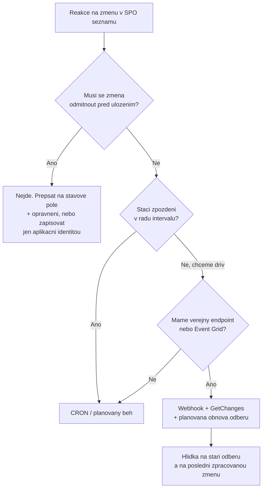

# Comparison · Jak reagovat na změnu v SharePoint seznamu

Doplněk k [`README.md`](README.md). Soubor
[`comparison-scheduled-runtimes.md`](comparison-scheduled-runtimes.md) odpovídá na otázku
**kde** skript poběží. Tenhle odpovídá na tu předchozí: **co ho vůbec spustí**, když má
zareagovat na změnu v seznamu.

Běžící příklad pro celou stránku: seznam **Žádosti** na SharePoint Online (SPO) webu. Někdo
do něj přidá položku a naše automatizace na to má zareagovat — třeba tak, jak to dělá
modul [`../elevated-access/`](../elevated-access/). Otázka zní: jak se náš kód dozví, že
se to stalo?

## Tři způsoby, a jeden z nich už neexistuje

Kdo přichází z on-premises SharePointu nebo z klasického programování, čeká tři možnosti:

1. **Event handler** — kód, který SharePoint zavolá v okamžiku změny, ještě než se uloží.
   Umí změnu odmítnout nebo doplnit.
2. **Webhook** — SharePoint pošle HTTP zprávu na naši adresu, až je změna hotová.
3. **Plánovaný běh (CRON)** — nikdo nám nic neposílá; náš skript se sám v daných
   intervalech podívá, co je nového.

První možnost v SharePoint Online **nemáme**. A protože na ní stojí hodně návrhů, které
lidé přinesou z minulosti, začneme u ní.

### Proč synchronní zásah neexistuje

Ve starém světě se tohle dělalo **remote event receiverem** z modelu SharePoint Add-ins.
Ten umožňoval takzvané *-ing* události (`ItemAdding`) — kód běžel **před** uložením a mohl
změnu zrušit. Add-ins i jejich autentizace přes Azure Access Control Services (ACS) jsou
v Microsoft 365 vypnuté, což z kurzu popisuje
[`../../day-2/automation-strategy/`](../../day-2/automation-strategy/). Náhrada se
nevytvořila: dokumentace SharePoint webhooků to říká jednou větou — *„SharePoint webhooks
only support asynchronous events. This means that webhooks are only fired after a change
happened (similar to **-ed** events), and thus synchronous (**-ing** events) are not
possible."*

> [!IMPORTANT] Změnu v SPO seznamu nelze zachytit před uložením
> Žádný z dostupných mechanismů neumí změnu odmítnout, opravit před zápisem ani zaručit,
> že uživatel neuvidí mezistav. Všechno, co postavíte, je **reakce po faktu** — dozvíte
> se o tom, co už je v seznamu uložené a co uživatel už vidí.
>
> Návrhy, které tohle ignorují, se poznají podle zadání typu „položka se nesmí uložit,
> dokud ji neschválí" nebo „nikdo nesmí vidět rozpracovaný záznam". Obojí se v SPO řeší
> **oprávněními a stavovým polem**, ne zásahem do ukládání: položka se uloží se stavem
> „nová", automatizace ji zpracuje a stav změní. Kdo potřebuje skutečné odmítnutí zápisu,
> nesmí uživatele pustit do seznamu vůbec — vstupem je formulář nebo aplikace a do seznamu
> zapisuje až aplikační identita, jako v [`../elevated-access/`](../elevated-access/).

Zůstávají tedy dvě cesty: **push** (něco nám zavolá) a **pull** (sami se ptáme).

## Push: webhook — dvě různé technologie se stejným jménem

Slovo „webhook" v SharePointu znamená dvě různé věci, a pletou se:

| | SharePoint REST webhook | Microsoft Graph change notification |
|---|---|---|
| Na co jde upsat | **jen položky seznamů a knihoven** | seznam, OneDrive, uživatelé, skupiny, Teams, pošta… |
| Cesta zdroje | SharePoint List API URL | `/sites/{site-id}/lists/{list-id}` |
| Nejdelší platnost odběru | **180 dní** (a je to i výchozí hodnota) | **42 300 minut, tedy necelých 30 dní** |
| Kam se dá doručovat | jen na vlastní HTTP endpoint | HTTP endpoint, **Azure Event Hubs**, **Azure Event Grid** |
| Obsah zprávy | ID seznamu, žádný obsah změny | ID změněného objektu (obohacená varianta zvlášť) |

Pro reakci na jeden konkrétní seznam fungují obě. Graph je širší a umí doručovat do Azure
front, takže nepotřebuje veřejně dostupnou funkci; SharePoint REST varianta má delší
platnost odběru a méně pohyblivých částí. Lifecycle odběru Graphu má kurz
v [`README.md`](README.md), lab v
[`lab-change-notifications-function.md`](lab-change-notifications-function.md).

### Co se pro náš seznam Žádosti stane doopravdy

Tady je věta, kterou se vyplatí přečíst dvakrát. Zpráva, která přijde, **neobsahuje, co se
změnilo**. Dokumentace: *„The notification doesn't include any information about the
changes that triggered it. Your application is expected to use the **GetChanges API** on
the list to query the collection of changes from the change log and store the change token
value for any subsequent calls."*

Notifikace tedy neřekne „přidal se záznam číslo 47". Řekne jen „na seznamu s tímto ID se
něco stalo". Kód musí:

1. přijmout zprávu a hned odpovědět `200`,
2. zavolat `GetChanges` s **change tokenem** uloženým z minule,
3. zpracovat vrácené změny,
4. **uložit nový change token** pro příští volání.

A právě tady je nejdůležitější poznatek celé stránky: **kroky 2 až 4 jsou pull.** Webhook
pull nenahradil — jen ho spustil dřív. Kdo má napsané body 2-4, má hotové i řešení
s plánovaným během; chybí mu jen časovač.

### Rizika push varianty

Ta nepříjemná část. Žádné z těchto selhání se neprojeví chybou v logu vaší automatizace:

- **Odběr vyprší.** Po 180 dnech (SharePoint) nebo 30 dnech (Graph) doručování prostě
  přestane. Nic nespadne, nic nehlásí chybu — jen přijde ticho, které se nedá odlišit od
  „nikdo nic nemění". Obnovu odběru musí řešit váš kód, a ten se musí spouštět
  **plánovaně** — takže i čistě push řešení potřebuje CRON na svou vlastní údržbu.
- **Zpráva se zahodí.** SharePoint zkouší doručení *„5 times with a 5-minute wait time
  between the attempts"*, a pak: *„the notification is dropped."* Bez change tokenu ta
  změna zmizí navždy. S ním ji dohoní příští notifikace — dokumentace to výslovně
  slibuje. **Change token není optimalizace, je to jediná pojistka proti ztrátě dat.**
- **Zdržení je větší, než se čeká.** U Graph notifikací pro SharePoint seznam je
  dokumentovaná průměrná latence pod 1 minutu, ale **maximální 6 hodin**. Push tedy není
  totéž co real-time a nedá se na něm postavit slib typu „do minuty".
- **Veřejný endpoint je útočná plocha.** Adresa funkce musí být dostupná z internetu, aby
  na ni SharePoint dosáhl. Ověřovat proto `clientState` a nikdy nevěřit obsahu zprávy jako
  autorizaci.
- **Zakládání odběru má pětisekundové okno.** Při vytvoření přijde validační token, který
  musí endpoint vrátit jako plain text, jinak se odběr nezaloží. Studená funkce (cold
  start) tohle umí nestihnout.

> [!WARNING] Ticho po vypršení odběru je nejhorší porucha v tomhle modulu
> Automatizace, která přestala dostávat notifikace, se chová **úplně stejně** jako
> automatizace, na kterou nikdo nic neposlal. Nikdo si toho nevšimne — dokud někdo
> nezavolá, že žádost leží tři týdny nezpracovaná. Proto ke každému push řešení patří
> **hlídka na stáří odběru** a **hlídka na dobu od poslední zpracované změny**; druhá
> odhalí i selhání, které první nevidí.

## Pull: plánovaný běh (CRON)

Plánovaný běh je opačný přístup: nikdo nám nic neposílá, náš skript se sám ptá. Jméno CRON
je z Unixu, zápis intervalu v Azure Functions se jmenuje NCRONTAB, Azure Automation používá
vlastní plánovač — princip je stejný.

Pro seznam Žádosti to znamená: každých *N* minut se připojit, zavolat `GetChanges` (nebo
u Graphu **delta query** z [`../../day-3/graph-fundamentals/`](../../day-3/graph-fundamentals/))
s uloženým tokenem, zpracovat, uložit token. Tedy body 2-4 z push varianty — beze změny.

Co pull **nepotřebuje**: veřejnou adresu, validační handshake, odběr, jeho obnovu ani
hlídku jeho expirace. Zmizí celá jedna kategorie tichých poruch.

Co pull **platí**: zdržení je až jeden celý interval, a náklad roste s frekvencí.

### Rizika pull varianty

- **Souběh běhů.** Když jeden běh trvá déle než interval, spustí se druhý nad stejnými
  daty. Řeší se zámkem (lease na blobu, příznak v seznamu), ne zkrácením intervalu.
- **Náklad roste s frekvencí, ne s prací.** Běh každou minutu nad prázdným seznamem
  se platí stejně jako nad plným. Konkrétní čísla pro jednotlivá prostředí spočítá
  [`../../day-5/performance-cost-capstone/solution/Get-HostingCost.ps1`](../../day-5/performance-cost-capstone/solution/Get-HostingCost.ps1).
- **Ztracený change token = jeden drahý běh.** Bez tokenu se čte celý seznam. U velkých
  seznamů to naráží na limity z [`../../day-3/migration-patterns/`](../../day-3/migration-patterns/).
- **Throttling při shodě času.** Dvacet plánovačů nastavených na celou hodinu udeří
  naráz. Rozptýlit start (offset), ne plánovat všechno na `0 0 * * *`.

## Kolik to stojí

Náklad se u obou cest skládá ze stejných dílů, jen v jiném poměru:

| Složka | Push (webhook) | Pull (CRON) |
|---|---|---|
| Compute | jen při změně | při **každém** intervalu |
| Compute na údržbu | plánovaná obnova odběru | žádná |
| Úložiště change tokenu | ano | ano |
| Veřejný endpoint | ano (a jeho zabezpečení) | ne |
| Logy a jejich ingest | podle počtu změn | podle počtu **běhů** |

U seznamu, do kterého přijde pár žádostí denně, je pull na prázdno běžícím compute dražší
než push. U seznamu, kde se mění stovky položek za hodinu, je to naopak — push zaplatí
vyvolání za každou dávku notifikací a k tomu se logují všechny.

Pozor na poslední řádek tabulky: **nejdražší položkou celé pipeline bývá ingest logů, ne
compute.** Kdo loguje každý prázdný běh každou minutu, zaplatí za logy víc než za všechno
ostatní — ukazuje to výpočet v
[`../../day-5/performance-cost-capstone/`](../../day-5/performance-cost-capstone/).

## Rozhodovací osa

Dvě věty, které z osy plynou:

- **Začněte plánovaným během.** Je to méně pohyblivých částí, žádné tiché vypršení a
  logika zpracování je stejná. Push přidávejte, až když zpoždění někomu reálně vadí.
- **Push je optimalizace latence, ne architektura.** Pull pod ním zůstává v obou případech,
  protože notifikace neobsahuje obsah změny a nemá garantované doručení.

## Klíčové rozlišení

- **Synchronní (*-ing*) vs asynchronní (*-ed*)** — v SPO existuje jen druhé. Zadání, které
  potřebuje první, je zadání pro jiný návrh, ne pro jinou technologii.
- **Notifikace vs data** — zpráva říká „něco se změnilo", ne „co se změnilo". Obsah se
  vždycky dotahuje pullem.
- **Change token vs čas posledního běhu** — token je autoritativní, čas je odhad. Kdo
  filtruje podle `Modified > naposledy`, přehlédne změny s posunutými hodinami a
  duplicitně zpracuje ty na hranici.
- **Vypršení odběru vs žádná změna** — dvě situace, které se navenek nedají rozlišit.
  Proto se hlídá stáří odběru zvlášť.
- **Push = nižší latence, vyšší provozní složitost** — a obojí je měřitelné, takže se
  o tom dá rozhodnout čísly, ne dojmem.

## Zdroje (Microsoft)

- [Overview of SharePoint webhooks](https://learn.microsoft.com/en-us/sharepoint/dev/apis/webhooks/overview-sharepoint-webhooks) — jen položky seznamů; 180 dní; notifikace bez obsahu změny a povinnost `GetChanges`; jen asynchronní *-ed* události; 5 pokusů po 5 minutách, pak zahození
- [SharePoint list webhooks](https://learn.microsoft.com/en-us/sharepoint/dev/apis/webhooks/lists/overview-sharepoint-list-webhooks)
- [Set up notifications for changes in resource data](https://learn.microsoft.com/en-us/graph/change-notifications-overview) — podporované zdroje, `list` max. 42 300 minut, latence průměr pod 1 min / **maximum 6 hodin**, doručení přes webhook, Event Hubs i Event Grid
- [Change notifications with resource data (rich notifications)](https://learn.microsoft.com/en-us/graph/change-notifications-with-resource-data)
- [Lifecycle notifications](https://learn.microsoft.com/en-us/graph/change-notifications-lifecycle-events)
- [Use delta query to track changes in Microsoft Graph data](https://learn.microsoft.com/en-us/graph/delta-query-overview)
- [NCRONTAB expressions — Timer trigger for Azure Functions](https://learn.microsoft.com/en-us/azure/azure-functions/functions-bindings-timer)

## Stav produktu / delta

> [!WARNING] Ověřit k datu běhu — stav k 2026-09.
> Platnosti odběrů (180 dní u SharePoint REST, 42 300 minut u Graphu), latence Graphu
> (průměr pod 1 minutu, maximum 6 hodin) a chování opakovaných pokusů o doručení jsou
> čísla z dokumentace, která se mění. Stránka *Overview of SharePoint webhooks* má
> v době psaní `ms.date` 2022-09 — u ní ověřit obzvlášť, jestli mezitím nepřibyly další
> podporované zdroje než položky seznamů.
