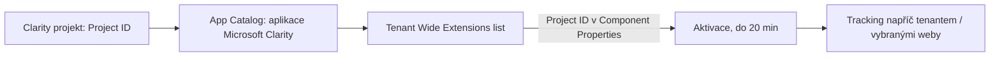

# Microsoft Clarity — konfigurace

> Typ: povinný · Den: 4 · Odhad: <min>

## Cíle
- Založení projektu: role, retence, soukromí.
- Vznik trackovacího kódu a governance.
- Injekce do SPO: SPFx App Customizer, tenant-wide, opt-out strategie.
- Compliance: souhlas/cookie banner, regionální data.

## Výklad

### Založení projektu a trackovací kód
V Clarity dashboardu (Settings → Overview) student najde **Project ID** — jedinou hodnotu
potřebnou pro instalaci do SharePointu (ne celý `<script>` tag, ten je pro obecné weby).

### Injekce do SPO — oficiálně podporovaný postup
Microsoft dokumentuje **jen organization-wide instalaci** — nasazení Clarity na jeden
konkrétní web **není podporováno** jako samostatná varianta. Postup: v SharePoint app store
najít aplikaci "Microsoft Clarity", přidat ji do App Catalogu (Add to Apps site), povolit
"Enable this app and add it to all sites", poté v App Catalogu otevřít **Tenant Wide
Extensions** list, najít záznam "Microsoft Clarity" a do Component Properties vložit
Project ID. Toto je konkrétní instance obecného SPFx tenant-wide deployment mechanismu (viz
níže) — aplikace se aktivuje až po přidání záznamu do tohoto listu, s prodlevou až 20 minut.

Pokud je cílem sledovat jen podmnožinu subwebů (ne celý tenant), Microsoft dokumentuje
alternativu: nainstalovat trackovací kód na každý subweb **jednotlivě** (ne přes tenant-wide
mechanismus) a napojit je na jeden společný Clarity projekt — to je opt-out/scoping
strategie, kterou lze v labu simulovat výběrem podmnožiny webů.

### SPFx tenant-wide deployment — obecný mechanismus
Tenant-wide deployment je podporovaný pro Application Customizery (a ListView Command Sety).
Vyžaduje `skipFeatureDeployment: true` v `package-solution.json`; generátor SPFx (od v1.6)
scaffolduje `./sharepoint/assets/ClientSideInstance.xml`, který při nahrání `.sppkg` do App
Catalogu automaticky založí záznam v **Tenant Wide Extensions** listu. Tento list (v App
Catalogu, Site Contents) je centrální místo pro správu všech tenant-wide aktivovaných
extensions — každý záznam lze cílit na konkrétní web template nebo typ listu.

### Compliance — souhlas a regionální data
Trackovací nástroj typu Clarity spadá pod cookie/souhlas požadavky dle legislativy cílové
organizace (GDPR v EU) — rollout musí řešit banner/souhlas **před** tenant-wide aktivací, ne
až po ní. Regionální ukládání dat (EU data residency) je nutné ověřit v nastavení konkrétního
Clarity projektu před nasazením u zákazníka s přísnějšími požadavky na lokalitu dat.

## Klíčové rozlišení
- **Organization-wide instalace (oficiálně podporovaná, jeden mechanismus) vs per-subweb
  ruční instalace (alternativa pro scoping, vyšší údržba)**.
- **Project ID (stačí pro SPO instalaci) vs plný `<script>` tag (pro obecné weby mimo SPO)**.
- **Aktivace přes Tenant Wide Extensions list (do 20 min, spravovatelné centrálně) vs
  ruční `Add-PnPCustomAction` na jednotlivých webech (per-web, bez centrální správy)**.

## Lab
Viz [`lab-clarity-rollout.md`](lab-clarity-rollout.md).

## Zdroje (Microsoft)
- [SharePoint Integration with Clarity](https://learn.microsoft.com/en-us/clarity/third-party-integrations/sharepoint-integration)
- [How to setup Clarity manually](https://learn.microsoft.com/en-us/clarity/setup-and-installation/clarity-setup)
- [Tenant Wide Deployment of SharePoint Framework Extensions](https://learn.microsoft.com/en-us/sharepoint/dev/spfx/extensions/basics/tenant-wide-deployment-extensions)

## Stav produktu / delta
- Ověřit k datu běhu — Microsoft dokumentuje jen organization-wide instalaci jako podporovanou;
  ověřit, zda se to do běhu kurzu nezměnilo (per-site podpora by zjednodušila opt-out strategii)
  na [SharePoint Integration with Clarity](https://learn.microsoft.com/en-us/clarity/third-party-integrations/sharepoint-integration).
