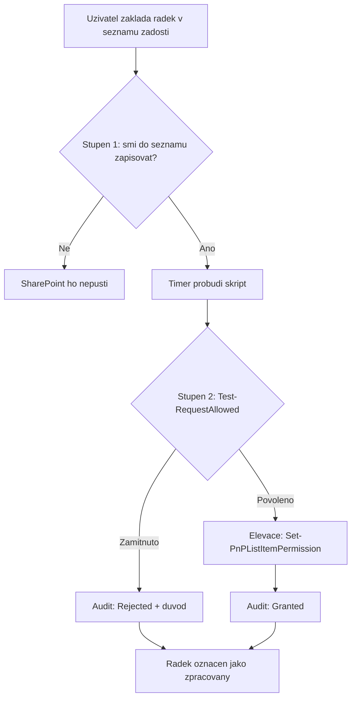

# Elevovaný přístup: self-service žádost o oprávnění

> Typ: povinný · Den: 4 · Odhad: 30 min výklad + 60 min lab

Nejčastěji stavěná automatizace nad SharePointem vůbec: **uživatel požádá o přístup
k dokumentu a automatizace mu ho přidělí.** Skoro každý zákazník to má postavené
v Power Automate a skoro každý přitom nevědomky přijal tři důsledky, které se projeví
až za pár měsíců.

Tento blok je **hands-on**. Postavíte tu operaci od nuly, nasadíte ji do Azure a dokážete
testy, že nedělá nic, co dělat neměla.

## Cíle
- Rozumět, **jak Power Automate elevaci skutečně dělá** — a proč to není přepínač,
  ale sdílení flow s connectionem vlastníka ([`comparison-power-automate.md`](comparison-power-automate.md)).
- Postavit privilegovanou operaci pod **aplikační identitou** s `Sites.Selected`
  zúženým na jeden web.
- Napsat **dvoustupňovou autorizační bránu** a rozumět, proč jeden stupeň nestačí.
- Auditovat **zamítnutí**, ne jen schválení.

## Výklad

### Jak Power Automate dělá elevaci

Power Automate nemá „run with elevated privileges". Elevace se dělá **sdílením flow
s run-only uživateli**, kde konektory zůstanou na vlastníkovi. Dokumentace Microsoftu:

> „If the flow uses the owner's connection always, the run-only user might not need any
> special role in Dataverse — **they're pressing a button and the flow uses the owner's
> privilege**."

Uživatel zmáčkne tlačítko a operace se provede **pod oprávněním vlastníka flow**. Funguje
to a pro spoustu úloh je to správná odpověď. Tři důsledky a plné srovnání jsou
v [`comparison-power-automate.md`](comparison-power-automate.md) — nejdůležitější je ten
první: **elevovaná automatizace visí na osobním účtu** a odchod toho člověka ji zabije.

Pointa bloku není „Power Automate je špatný". Je to hranice: **flow dělá interakci
s člověkem, skript dělá privilegovanou operaci.**

### Aplikační identita zúžená na jeden web

Alternativa je app registrace s **`Sites.Selected`**. Ta po consentu **nedává přístup
nikam** — to je celý její smysl. Teprve per-site grant jí dá právo na konkrétní web.
Identita tak není vázaná na člověka, ale na tenant; logika leží v repu a prochází PR.

### Autorizační brána musí být dvoustupňová

Tohle je jádro celého bloku a nejčastější chyba v takových skriptech.

Aplikace má právo zapisovat na **celý web**. Kdyby brala žádosti bez kontroly, je to
učebnicový **confused deputy**: kdokoli, kdo umí založit řádek v seznamu, si nechá
přidělit cokoli. Jeden stupeň nestačí ani jeden, ani druhý:

| Stupeň | Kde je | Na co odpovídá | Co sám nezachytí |
|---|---|---|---|
| 1. **Oprávnění seznamu žádostí** | v SharePointu | *kdo vůbec smí požádat* | žádost „za někoho jiného" |
| 2. **Kontrola v kódu** (`Test-RequestAllowed`) | ve skriptu | *co smí být požádáno* | že řádek založil kdokoli z tenantu |

Konkrétně: brána kontroluje, že **žadatel je tentýž člověk, který řádek založil**
(`Author`), a že **cílová knihovna i požadovaná role jsou v povoleném rozsahu**, který
se předává parametrem.

### Zamítnutí se auditují

Zamítnutá žádost, která nikde nezůstane, je z pohledu auditora totéž, jako kdyby nikdy
nepřišla. Skript proto zapisuje audit **u schválené i zamítnuté** žádosti — a ten audit
leží v seznamu, který vidí i zadavatel, ne v běhové historii, do které run-only uživatel
nevidí.

## Klíčové rozlišení
- **Osobní connection vs aplikační identita** — první je vázaná na člověka a jeho odchod,
  druhá na tenant.
- **Run-only sharing vs autorizace v kódu** — run-only říká *kdo smí zmáčknout tlačítko*,
  ale rozsah elevace je vždy plné oprávnění vlastníka. Ve skriptu je autorizace i rozsah
  explicitní a **testovatelný**.
- **Oprávnění seznamu vs kontrola v kódu** — dva stupně brány, ani jeden sám nestačí.
- **`Sites.Selected` po consentu vs po per-site grantu** — consent sám nedává přístup nikam.

## Naše prostředí

App registrace z [`../../day-2/automation-strategy/`](../../day-2/automation-strategy/),
certifikátová identita z [`../../day-2/powershell-deep-dive/`](../../day-2/powershell-deep-dive/).
Nasazení do Azure jde přes postup z
[`../azure-integration-patterns/tutorial-script-to-azure.md`](../azure-integration-patterns/tutorial-script-to-azure.md) —
ten už máte odučený z bloku 1, takže tady se řeší jen ta privilegovaná operace.

## Lab

[`lab-elevated-access.md`](lab-elevated-access.md) — **13 kroků v šesti částech**, každý
s vysvětlením *co* a *proč*, a kde to jde, tak **ručně i skriptem**. Linka labu je
záměrně tahle:

1. **Přidělte přístup rukama** (5 min) — spočítejte kliknutí a všimněte si, že po tom
   nezůstala žádná stopa.
2. **Terén v SharePointu** (10 min) — seznam žádostí a audit, do kterého uživatelé nesmí.
3. **Identita, která není člověk** (15 min) — app registrace a zúžení na jeden web.
4. **Skript na notebooku** (10 min) — funguje, ale **držíte certifikát**.
5. **Totéž v Azure** (20 min) — Automation account, managed identity, runbook, rozvrh.
   Certifikát zmizel. **To je pointa celého bloku.**
6. **Jedna podmínka v kódu** (5 min) — protože aplikace teď smí víc než člověk.

Referenční řešení: [`solution/Grant-RequestedAccess.ps1`](solution/Grant-RequestedAccess.ps1)
a k němu **17 testů**.

> [!IMPORTANT] Nejdůležitější není ta autorizační brána, ale rozdíl mezi částí 4 a 5
> Na notebooku se skript hlásí certifikátem, který musíte uložit, chránit a vyměňovat.
> V Azure se hlásí `-ManagedIdentity` a **v celém runbooku není žádný secret**. Přesto
> provede tutéž privilegovanou operaci.
>
> **Nezmizel principál — zmizel secret.** Identita pořád existuje v Entra, pořád má roli
> a per-site grant. Co zmizelo, je cokoli, co se dá zkopírovat nebo poslat mailem. Tohle
> je celá odpověď na otázku, k čemu je Azure jako platforma pro app-only skripty — a pro
> skupinu, která Azure nikdy nepoužila, je to ta věta, se kterou má z bloku odejít.

## Zdroje (Microsoft a PnP)

- [Guide to cloud flow sharing and permissions](https://learn.microsoft.com/en-us/power-automate/guide-to-cloud-flow-sharing-permissions) — run-only vs co-owner, „the flow uses the owner's privilege"
- [Set-PnPListItemPermission](https://pnp.github.io/powershell/cmdlets/Set-PnPListItemPermission.html) — cmdlet, kterým se elevovaná operace provádí
- [Grant-PnPEntraIDAppSitePermission](https://pnp.github.io/powershell/cmdlets/Grant-PnPEntraIDAppSitePermission.html) — per-site grant pro `Sites.Selected`
- [Connect-PnPOnline](https://pnp.github.io/powershell/cmdlets/Connect-PnPOnline.html) — `-ManagedIdentity`, `-Thumbprint`

## Stav produktu / delta

> [!WARNING] Ověřit k datu běhu — stav k 2026-09.
> Mechanismus run-only sharing a chování connectionu **provided by flow owner** ověřit
> proti [dokumentaci Power Automate](https://learn.microsoft.com/en-us/power-automate/guide-to-cloud-flow-sharing-permissions).
> Je to nosný argument celého bloku — kdyby Microsoft zavedl skutečnou elevaci bez vazby
> na vlastníka, tři důsledky v `comparison-power-automate.md` se mění.
>
> **PnP přejmenoval `*AzureAD*` cmdlety na `*EntraID*`** — materiál používá nové názvy
> (`Grant-PnPEntraIDAppSitePermission`, `Get-PnPEntraIDAppSitePermission`). Na starší
> verzi modulu platí staré. Ověřit před během:
> `Get-Command -Module PnP.PowerShell *SitePermission*`. Totéž pro parametry
> `Set-PnPListItemPermission`.
>
> **Licencování Power Automate v tomhle modulu schválně nikde není** — mění se nejčastěji
> z celého materiálu. Před během ověřit, jestli argument o nákladech pořád platí ve tvaru,
> v jakém ho chcete říct.
