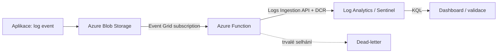

# SIEM integrace přes Azure Blob

> Typ: povinný · Den: 4 · Odhad: 45 min výklad + 75 min lab

## Cíle
- Vědět, **co SIEM je a s čím se plete** (SOAR, XDR, UEBA) — a která z jeho čtyř fází je
  vaše odpovědnost.
- Logovací strategie: schéma, minimalizace PII, retence.
- Pipeline: app › Blob › Event Grid › Function › SIEM.
- Náklady a spolehlivost (batching, retry, dead-letter).
- KQL základy pro validaci a dashboardy.

## Výklad

### Co SIEM vlastně je — a s čím se plete

Blok staví pipeline **do** SIEM, takže stojí za to vědět, co je na druhém konci. Microsoft
to definuje takhle:

> „Security information and event management (SIEM) solutions **collect, aggregate, and
> analyze large volumes of data** from organization-wide applications, devices, servers,
> and users **in real time**."

Podstatné je to poslední slovo v první části: **aggregate**. SIEM není archiv logů — je to
nástroj, který z událostí z různých zdrojů skládá obraz, který v žádném jednotlivém zdroji
není vidět.

**Čtyři fáze, kterými každý záznam projde:**

| Fáze | Co se děje | Kde to řešíte vy |
|---|---|---|
| 1. **Sběr** | příjem logů z firewallů, endpointů, cloud aplikací, serverů | váš Blob → Event Grid → Function |
| 2. **Normalizace a parsing** | sjednocení různých formátů, aby se dala data číst konzistentně | **vaše logovací schéma** — proto je sekce níž první |
| 3. **Korelace a analýza** | *„identify patterns and anomalies in the normalized data and surface potential threats"* | produkt, ne vy |
| 4. **Alerting a odezva** | dashboardy, pravidla, automatizovaná reakce | produkt, ne vy |

**Vy v tomhle bloku stavíte fázi 1 a rozhodujete o fázi 2.** Fáze 3 a 4 jsou důvod, proč
na fázi 2 záleží: co nenormalizujete, to se nezkoreluje.

#### SIEM vs SOAR vs XDR vs UEBA

Tyhle čtyři zkratky padnou v každém bezpečnostním projektu a pletou se. Nejsou to
konkurenti, jsou to vrstvy:

| | K čemu je |
|---|---|
| **SIEM** | **šířka** — viditelnost a korelace napříč celou organizací |
| **XDR** | **hloubka** — vyšetřovací kontext ke konkrétnímu zdroji (endpoint, uživatel, aplikace, cloud) |
| **SOAR** | **reakce** — orchestrace a automatizace odezvy, prioritizace alertů, které SIEM vynesl |
| **UEBA** | **chování** — insider threat a kompromitované účty přes analýzu vzorců chování |

Jednou větou: **SIEM dává šířku, XDR hloubku, SOAR automatizuje reakci, UEBA hlídá chování.**

#### Typické použití — a proč vás zajímá to druhé

- detekce a odezva na hrozby (insider threat, APT, útoky přes víc domén),
- **compliance a regulatorní reporting** (HIPAA, GDPR),
- forenzní analýza a rekonstrukce cesty útoku.

Ten prostřední bod je ten, kvůli kterému tenhle blok stojí v kurzu o automatizaci
SharePointu: **logy z vašich skriptů jsou často jediný doklad, kdo co udělal aplikační
identitou.** Audit seznam z [`../elevated-access/`](../elevated-access/) je totéž o patro
níž — a odsud jde do SIEM.

> [!NOTE] Moderní SIEM je z velké části o redukci šumu
> *„Today, SIEM solutions incorporate AI for cybersecurity and machine learning to enhance
> their analytical capabilities."* Cílem toho strojového učení není najít víc věcí, ale
> **snížit počet falešných poplachů** a umožnit behaviorální analytiku.
>
> Pro vás z toho plyne konkrétní povinnost: **co pošlete v šumu, to zvýší práh pro
> všechno ostatní.** Logovat „všechno pro jistotu" není opatrnost, je to zhoršení detekce —
> a u Log Analytics navíc [nejdražší položka rozsahu](../../day-5/performance-cost-capstone/solution/Get-HostingCost.ps1).

### Logovací schéma a minimalizace PII
Strukturované (JSON) logy s konzistentním schématem — usnadňuje pozdější KQL dotazy i
transformace. PII (UPN, e-maily, jména) minimalizovat na zdroji, ne až v SIEM — hash nebo
pseudonymizovat identifikátory tam, kde plná hodnota není nutná k analýze. Retence logů se
řeší nezávisle na retenci zdrojových dat (viz [`../../day-4/lifecycle-compliance/`](../lifecycle-compliance/)) — jiné compliance požadavky.

### Pipeline: aplikace → Blob → Event Grid → Function → SIEM
Novější verze Blob Storage rozšíření pro Azure Functions (5.x+) používají **Event Grid event
subscription** na containeru místo pollingu — funkce se spustí prakticky okamžitě při
změně, ne až při dalším pollovacím cyklu. Toto vyžaduje **general-purpose v2 storage
account**; na **Flex Consumption** plánu, na kterém jede kurzovní prostředí, není Event Grid
varianta volitelná optimalizace — Flex Consumption **podporuje výhradně event-based verzi
Blob triggeru**, polling na něm neexistuje.

Pro zápis do Log Analytics/Sentinel workspace slouží **Logs Ingestion API** — REST rozhraní,
které umí zapisovat do standardních i vlastních (custom) tabulek přes **Data Collection Rule
(DCR)**. DCR může navíc obsahovat KQL transformaci aplikovanou na data **před** uložením —
filtrování irelevantních záznamů, obohacení, maskování citlivých údajů přímo v ingest cestě,
ne až dodatečně v dotazech.

### Náklady a spolehlivost
Workspace se zapnutým Sentinelem **není** předmětem Azure Monitor ingestion filtering
poplatku bez ohledu na to, kolik dat transformace odfiltruje — cenová výhoda oproti čistému
Log Analytics workspace. Spolehlivost pipeline: batching (méně Function invocations za
stejný objem dat), retry s exponenciálním backoffem (viz [`../../day-3/graph-fundamentals/`](../../day-3/graph-fundamentals/) klasifikace chyb), dead-letter
queue pro zprávy, které trvale selhávají — nezacyklit retry donekonečna.

### KQL základy
KQL dotaz je řetězec operátorů propojených `|` (pipe) — čistě read-only, bez úpravy dat.
Jazyk je **case-sensitive** (názvy tabulek, sloupců, operátorů). Základní operátory pro
validaci ingestu: `where` (filtr), `project` (výběr sloupců), `summarize` (agregace) —
dostatečné pro ověření "dorazila data, mají očekávaný tvar" a jednoduché dashboardy.

## Klíčové rozlišení
- **SIEM (šířka) vs XDR (hloubka) vs SOAR (reakce) vs UEBA (chování)** — nejsou to
  konkurenti, jsou to vrstvy. SIEM koreluje napříč organizací, XDR přidá kontext
  k jednomu zdroji, SOAR automatizuje odezvu, UEBA hlídá vzorce chování.
- **Sběr a normalizace (vaše práce) vs korelace a alerting (produkt)** — co
  nenormalizujete, to se nezkoreluje. Proto je logovací schéma rozhodnutí, ne formalita.
- **Blob polling (starší, zpožděné) vs Event Grid subscription (novější, téměř okamžité)** —
  Flex Consumption podporuje výhradně druhou variantu.
- **Transformace v DCR (před uložením, KQL) vs transformace až v dotazu** — první šetří
  úložný prostor a skrývá PII už při zápisu.
- **Retry (transientní selhání, viz [`../../day-3/graph-fundamentals/`](../../day-3/graph-fundamentals/)) vs dead-letter (trvalé selhání, needs review)**.

## Lab
Viz [`lab-siem-ingest-blueprint.md`](lab-siem-ingest-blueprint.md).

## Demo
[`demo-sentinel-incident.md`](demo-sentinel-incident.md) — 20 min uvnitř labu: analytics
rule nad tabulkou, kterou lab právě naplnil, a z nálezu **incident**. Ukazuje hranici,
u které lab jinak končí: **log odpovídá na otázku, kterou položíte; SIEM se ptá sám.**

## Zdroje (Microsoft)
- [What is SIEM?](https://www.microsoft.com/en-us/security/business/security-101/what-is-siem) — definice, čtyři fáze zpracování, SIEM vs SOAR vs XDR vs UEBA, role AI v redukci falešných poplachů
- [Tutorial: Trigger Azure Functions on blob containers using an event subscription](https://learn.microsoft.com/en-us/azure/azure-functions/functions-event-grid-blob-trigger) — „The Flex Consumption plan only supports the event-based version of the Blob Storage trigger."
- [Flex Consumption plan](https://learn.microsoft.com/en-us/azure/azure-functions/flex-consumption-plan)
- [Logs Ingestion API in Azure Monitor](https://learn.microsoft.com/en-us/azure/azure-monitor/logs/logs-ingestion-api-overview)
- [Custom data ingestion and transformation in Microsoft Sentinel](https://learn.microsoft.com/en-us/azure/sentinel/data-transformation)
- [Kusto Query Language (KQL) overview](https://learn.microsoft.com/en-us/kusto/query/?view=microsoft-fabric)

## Stav produktu / delta
- Ověřit k datu běhu — Logs Ingestion API už od 31. 3. 2024 nevyžaduje samostatný Data
  Collection Endpoint (DCE), stačí `logsIngestion` vlastnost DCR; ověřit, že aktuální verze
  nástrojů/dokumentace v labu s tímto počítá, ne se staršími DCE-first postupy.
