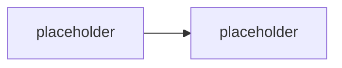

# M4.2 · SIEM integrace přes Azure Blob

> Typ: povinný · Den: 4 · Odhad: <min>

## Cíle
- <Logovací strategie: schéma, minimalizace PII, retence>
- <Pipeline: app › Blob › Event Grid › Function › SIEM>
- <Náklady a spolehlivost (batching, retry, dead-letter)>
- <KQL základy pro validaci a dashboardy>

## Výklad

<TODO: logovací schéma, minimalizace PII, retence logů odděleně od retence dat — viz GLOSSARY.md>

<TODO: pipeline aplikace → Blob → Event Grid → Function → SIEM>

<TODO: náklady/spolehlivost — batching, retry, dead-letter queue>

<TODO: KQL základy — validace ingestované telemetrie, jednoduché dashboardy>

## Klíčové rozlišení
- <retence logů vs retence zdrojových dat>
- <dead-letter (trvalé selhání) vs retry (transient selhání)>

## Lab
Viz [`lab-siem-ingest-blueprint.md`](lab-siem-ingest-blueprint.md).

## Zdroje (Microsoft)
- <TODO: Azure Blob Storage + Event Grid integrace dokumentace>
- <TODO: KQL dokumentace (Log Analytics/Sentinel)>

## Stav produktu / delta
- <TODO: ověřit aktuální ceny Blob/Event Grid/Function Consumption plan k datu běhu>
