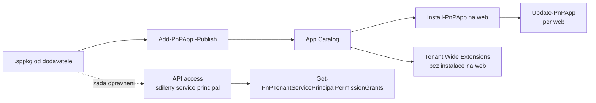

# App Catalog: nasazení, upgrady a audit řešení

> Typ: povinný · Den: 5 · Odhad: 30 min výklad + 45 min lab

Tenhle blok **neučí vývoj SPFx**. Učí druhou polovinu životního cyklu: co se správcem
tenantu děje s hotovým `.sppkg`, které dodal někdo jiný — kam ho nasadit, jaká oprávnění
mu schválit, jak zjistit, co všechno v tenantu běží, jak to upgradovat skriptem a proč je
API access nejnebezpečnější dialog v celém SharePoint admin centru.

## Cíle
- Nasadit, aktualizovat a odebrat řešení v App Catalogu **skriptem**, ne klikáním — a znát
  rozdíl mezi tenant a site collection katalogem.
- Rozumět tomu, **v čí identitě SPFx kód běží**, a proč je to jiná bezpečnostní úvaha než
  u app registrace.
- Umět odpovědět, **kdo v tenantu smí spustit kód všem uživatelům** a jak se to audituje.
- Rozpoznat, co znamená rozdíl `AppCatalogVersion` vs `InstalledVersion`, a umět ho vyřešit
  hromadně.

## Výklad

### V čí identitě SPFx běží

SPFx kód běží **v prohlížeči uživatele, pod jeho identitou a s jeho oprávněními** —
nemá vlastní credential jako app registrace. To je dobrá zpráva (uživatel neuvidí víc,
než na co má právo) i varování: **řešení může dělat cokoli, na co má právo přihlášený
uživatel** — a u správce je to hodně. Bezpečnostní posouzení SPFx je proto jiná úloha
než posouzení app registrace z [`../../day-2/automation-strategy/`](../../day-2/automation-strategy/).

### App Catalog — dvě úrovně

| Katalog | Kde | Dopad | Kdo spravuje |
|---|---|---|---|
| **Tenant App Catalog** | vyhrazený web (SharePoint admin center → More features → Apps) | řešení dostupné celému tenantu, možnost tenant-wide deploymentu | SharePoint administrator |
| **Site collection app catalog** | jednotlivá site collection (zapíná se skriptem) | řešení jen na tom webu | vlastník webu |

Site collection katalogy jsou pohodlné pro pilot, ale **rozmělňují přehled** — kód
v tenantu pak existuje na místech, kam správce nevidí. V governance pravidlech je
vyplatí povolovat vědomě, ne jako výchozí stav.

### Životní cyklus skriptem

Celý cyklus je čtyři cmdlety a jeden dotaz. Nic z toho není klikání a všechno se to dá
pustit proti seznamu webů:

```powershell
Add-PnPApp     -Path .\reseni.sppkg -Scope Tenant -Publish   # upload + trust
Get-PnPApp     -Scope Tenant | Select-Object Title, AppCatalogVersion, InstalledVersion, Deployed
Install-PnPApp -Identity <app-id> -Scope Tenant               # instalace na aktualni web
Update-PnPApp  -Identity <app-id> -Scope Tenant               # po uploadu nove verze
Uninstall-PnPApp -Identity <app-id> -Scope Tenant             # odebrani z webu
```

Pozor na dvě věci. **Bez `-Publish` (nebo bez potvrzení „make this solution available to
all sites") vypadá upload jako úspěch, ale řešení nejde použít.** A **`Update-PnPApp` je
per-web** — nahrání nové verze do katalogu samo neupgraduje weby, které řešení mají
nainstalované; ty čekají, dokud jim update někdo nepošle.

### API access — největší past

Pokud SPFx řešení volá Graph nebo jiné API nad rámec SharePointu, žádá si oprávnění —
a ta se schvalují v **SharePoint admin center → Advanced → API access**. Tři věci, které
je nutné vědět:

1. Schválením se oprávnění přidá **jedinému, celotenantnímu service principalu**
   („SharePoint Online Client Extensibility Web Application Principal"). Není to
   oprávnění „pro tuhle jednu webpart" — **sdílí ho všechna SPFx řešení v tenantu**.
2. Z toho plyne, že schválené `Sites.Read.All` může použít **jakékoli** jiné SPFx řešení,
   které do tenantu přijde později. Least privilege tady dostává tvrdou praktickou lekci:
   schvalovat jen nezbytné a evidovat, kdo o co žádal a proč.
3. Zmírnění existuje: **isolated web parts** (řešení dostane vlastní service principal) —
   u nových požadavků se na ně ptát dodavatele.

```powershell
Get-PnPTenantServicePrincipalPermissionGrants     # co je schvalene
Get-PnPTenantServicePrincipalPermissionRequests   # co ceka na schvaleni
```

Obojí patří do pravidelného auditu vedle app registrací —
[`../security-hardening/`](../security-hardening/).

### Tenant-wide extensions — kód, který běží všude

Application customizery (globální hlavička, patička, telemetrie) lze aktivovat pro celý
tenant přes seznam **Tenant Wide Extensions** na webu App Catalogu. Praktický důsledek:
existuje kód, který běží na všech stránkách, **aniž by ho kdokoli instaloval na konkrétní
web**. Když se „rozbije SharePoint všem", je tohle první místo, kam se dívat — a záznam
lze vypnout jedním přepínačem (`Disabled`). Tenhle mechanismus je **jediné místo v kurzu**, kde se SPFx tenant-wide deployment
řeší — dřív ho demonstrovala Microsoft Clarity, ta byla ale z kurzu vypuštěna.

### Provozní hygiena

- **Verze**: rozdíl `AppCatalogVersion` vs `InstalledVersion` znamená, že web běží na
  staré verzi a čeká na update.
- **Kdo smí nahrávat**: přístup do App Catalogu = právo spustit kód všem uživatelům.
  Patří správcům, ne „ať si to tam vývojář hodí sám".
- **Před nasazením žádat**: zdroj (kdo dodal, verze), seznam požadovaných API oprávnění
  se zdůvodněním, a co řešení dělá s daty — stejné otázky jako u app registrace.



## Klíčové rozlišení
- **SPFx (běží pod identitou uživatele) vs app registrace (vlastní identita
  s credentialem)** — dvě různé bezpečnostní úvahy.
- **Tenant App Catalog vs site collection app catalog** — přehled a kontrola vs lokální
  pohodlí; druhé zhoršuje viditelnost.
- **Tenant-wide deployment vs instalace per web** — „dostupné všem" vs „vědomě zapnuté
  tam, kde to má být".
- **API access grant (sdílený principal) vs oprávnění app registrace (vlastní principal)** —
  u SPFx schvalujete oprávnění, které pak sdílí všechna řešení v tenantu.
- **Nová verze v katalogu vs upgradovaný web** — `AppCatalogVersion` se změní uploadem,
  `InstalledVersion` až `Update-PnPApp` na daném webu.

## Lab
Viz [`lab-app-catalog-lifecycle.md`](lab-app-catalog-lifecycle.md).

## Zdroje (Microsoft)
- [Use the App Catalog to make custom business apps available](https://learn.microsoft.com/en-us/sharepoint/use-app-catalog)
- [Use the site collection app catalog](https://learn.microsoft.com/en-us/sharepoint/dev/general-development/site-collection-app-catalog)
- [Connect to Microsoft Entra ID-secured APIs in SPFx](https://learn.microsoft.com/en-us/sharepoint/dev/spfx/use-aadhttpclient)
- [Isolated web parts](https://learn.microsoft.com/en-us/sharepoint/dev/spfx/web-parts/isolated-web-parts)
- [Tenant-wide deployment of SPFx extensions](https://learn.microsoft.com/en-us/sharepoint/dev/spfx/tenant-wide-deployment-extensions)
- [PnP PowerShell — Get-PnPTenantServicePrincipalPermissionGrants](https://pnp.github.io/powershell/cmdlets/Get-PnPTenantServicePrincipalPermissionGrants.html)

## Stav produktu / delta
> [!WARNING] Ověřit k datu běhu — stav k 2026-09.
> Umístění App Catalogu a API access v SharePoint admin centru se po redesignu portálu
> přesouvá; podporované scénáře isolated web parts se mění. Před během proklikat cestu
> v portálu a ověřit názvy parametrů PnP cmdletů proti
> [PnP PowerShell docs](https://pnp.github.io/powershell/).

> [!NOTE] Změna rozsahu (2026-09-06)
> Blok se do 2026-09 jmenoval `spfx-fundamentals` a učil i **vývoj** SPFx (dev setup,
> `yo` generátor, HelloWorld, Heft/Gulp toolchain). Vývojová část byla z kurzu vypuštěna —
> GOC223 je kurz automatizace a migrace, ne vývoje. Zůstal správcovský pohled, který je
> pro cílovku relevantní, a **odpadla nejkřehčí závislost celého dne 5** (verzová vazba
> Node ↔ SPFx generátor).
