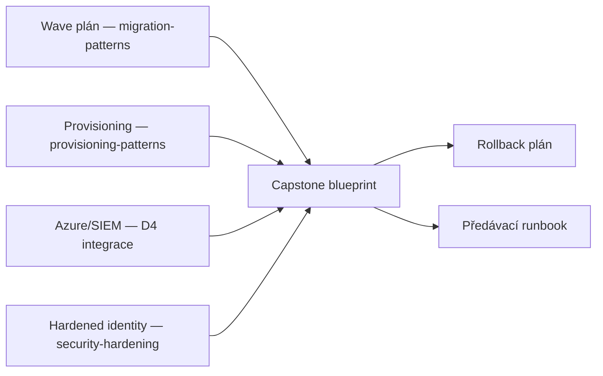

# Výkon, náklady & capstone

> Typ: povinný · Den: 5 · Odhad: 30 min výklad + 60-120 min lab (elastický blok)

## Cíle
- Efektivita API (batching, selektivní projekce).
- Náklady logování, asynchronní fan-out vzory.
- Spočítat náklad hostování plánovaného skriptu ze živého ceníku, ne odhadem.
- Capstone: end-to-end blueprint migrace + provisioning.
- Rizika & rollback; předávka do provozu.
- Další kroky: Advanced Graph, certifikační cesty.

## Výklad

### Efektivita API
`$select` omezuje vrácené vlastnosti jen na ty, které aplikace skutečně potřebuje — snižuje
síťovou zátěž i dobu odezvy. Graph bez `$select` v odpovědi vrací tip
(`@microsoft.graph.tips`) doporučující ho použít. U resources Microsoft Entra (user, group)
je `$select` dokonce **povinný**, pokud chce aplikace vlastnosti mimo výchozí sadu. V
kombinaci s `$expand` lze `$select` aplikovat i na vnořené (expanded) položky — ale u Entra
resources `$expand` vrací max. 20 položek, což je nutné zohlednit ve stránkování. Spolu s
batchingem ([`../../day-3/graph-fundamentals/`](../../day-3/graph-fundamentals/)) je toto hlavní pákový bod pro snížení objemu přenášených dat a počtu
requestů.

### Náklady logování a asynchronní fan-out
Logovací náklady ([`../../day-4/siem-blob-integration/`](../../day-4/siem-blob-integration/)) rostou s objemem a granularitou — batching zápisů a DCR
transformace před uložením (filtrování, ne log-everything-then-filter) drží náklady dolů.
Asynchronní fan-out (jeden trigger → N paralelních dílčích úloh, např. per-web migrace v
rámci jedné vlny z [`../../day-3/migration-patterns/`](../../day-3/migration-patterns/)) škáluje propustnost, ale musí respektovat throttling limity ([`../../day-3/graph-fundamentals/`](../../day-3/graph-fundamentals/))
per cíl, ne jen agregátně.

### Kolik to reálně stojí: floor, grant a jediný rostoucí náklad

Kvalitativní srovnání hostingů je v
[`../../day-4/azure-integration-patterns/comparison-scheduled-runtimes.md`](../../day-4/azure-integration-patterns/comparison-scheduled-runtimes.md).
Kvantitativní protějšek je [`solution/Get-HostingCost.ps1`](solution/Get-HostingCost.ps1) —
tahá sazby živě z **Azure Retail Prices API**, což je *anonymní* endpoint: nepotřebuje
přihlášení, subscription ani token, takže se dá spustit i na stroji bez Azure přístupu.

Výsledek pro **noční skript** (30 běhů po 10 minutách, 10 MB logu na běh):

| Varianta | EUR / měsíc | Proč |
|---|---|---|
| Automation Runbook | **0** | 300 min z 500 min zdarma |
| Functions Flex Consumption | **0** | 36 000 z 100 000 GB-s zdarma |
| Functions Consumption (legacy) | **0** | 36 000 z 400 000 GB-s zdarma |
| Container Apps Job | **0** | 9 000 z 180 000 vCPU-s zdarma |
| Log Analytics (ingest) | **0** | 0,3 GB z 5 GB zdarma |

**Plánovaný administrátorský skript je na hostování zdarma, a to na všech čtyřech
variantách.** To je ten teaching point: debata „Functions nebo Runbook" se u typické
noční dávky nevede o peníze, ale o determinismus runtime a strop doby běhu. Rozhodujte
podle toho, ne podle ceny.

Náklad se objeví ve dvou situacích, a jsou velmi nestejné:

| Scénář | Nejdražší compute | Log Analytics |
|---|---|---|
| Běh každých 5 minut po minutě | 20,92 EUR (Flex) | 0 |
| **Chybně nastavená DCR, 100 GB/měsíc** | 0 | **243,90 EUR** |

Jedna špatná DCR tedy stojí **víc než desetinásobek** nejdražší varianty compute. Přesně
proto je budget alert u [`../../day-4/siem-blob-integration/`](../../day-4/siem-blob-integration/)
označený jako povinný, ne doporučený — riziko nikdy neleželo ve výpočtu.

A jeden nečekaný výsledek u častého běhu: **Container Apps Job vyjde nejlevněji (2,86 EUR)
a Flex Consumption nejdráž (20,92 EUR)** — přičemž legacy Consumption je na 8,75 EUR.
Není to tím, že by Flex měl horší sazbu; má **čtyřikrát menší free grant** (100 000 vs
400 000 GB-s). Flex je správná volba z jiných důvodů (viz D4), ale u vysokofrekvenčního
běhu za to zaplatíte.

> [!IMPORTANT] Proč se sazby derivují z USD
> Azure Retail Prices API zaokrouhluje **sub-centové EUR metery na nulu** — v EUR jsou
> nulové *všechny* výkonové metery Functions i Container Apps. Kdo je vezme, jak jsou,
> dostane nulový hosting a uvěří tomu. Skript proto tyhle sazby tahá v USD a přepočítává
> faktorem odvozeným **živě** z meteru, který má obě valuty nenulové, a každou takovou
> sazbu ve výstupu **označí jako derivovanou**. Číslo bez dohledatelného původu nepatří
> do nabídky zákazníkovi.

### Capstone — konsolidace týdne
Capstone spojuje: wave plán a throttle-aware exekuci ([`../../day-3/migration-patterns/`](../../day-3/migration-patterns/)),
provisioning artefakt ([`../../day-3/provisioning-patterns/`](../../day-3/provisioning-patterns/)),
Azure integrační/SIEM blueprint ([`../../day-4/azure-integration-patterns/`](../../day-4/azure-integration-patterns/) + [`../../day-4/siem-blob-integration/`](../../day-4/siem-blob-integration/))
a hardened app registraci ([`../security-hardening/`](../security-hardening/)) do jednoho
end-to-end blueprintu migrace + provisioningu. Součástí je explicitní rollback plán (co
dělat, když vlna selže v polovině) a předávací runbook do provozu (kdo je vlastník po
kurzu, jak se hlásí incidenty, jaký je patch/update cyklus).

### Další kroky — certifikační cesty

> [!WARNING] Ověřit k datu běhu — stav k 2026-07.
> **AZ-204 (Developing Solutions for Microsoft Azure) a certifikace Azure Developer
> Associate končí 31. 7. 2026** — nahrazuje je nová certifikace **AI-200 (Azure AI Cloud
> Developer Associate)**. K datu psaní tohoto materiálu je to během několika dní od konce
> platnosti AZ-204 jako aktivní cesty — **nedoporučovat studentům AZ-204** jako další krok,
> doporučit AI-200 jako přímého nástupce. **SC-300 (Identity and Access Administrator)**
> zůstává platnou cestou pro prohloubení identity/Conditional Access témat z [`../security-hardening/`](../security-hardening/). Ověřit
> aktuální stav obou certifikací (obsahová náplň AI-200 se teprve ustaluje) před
> doporučením konkrétního studijního plánu.

## Klíčové rozlišení
- **`$select` povinný (Entra resources) vs doporučený (většina ostatních resources)** —
  u Entra bez něj aplikace nevidí vlastnosti mimo výchozí sadu vůbec, ne jen "zbytečně moc dat".
- **Optimalizace výkonu (rychlost) vs optimalizace nákladů (cena)** — někdy protichůdné
  (agresivní batching může zvýšit latenci jednotlivého requestu kvůli čekání na naplnění batch).
- **Floor vs sklon** — u plánovaného skriptu je náklad plochý floor daný free granty,
  ne cena za běh. Sklon se objeví teprve u vysoké frekvence, a i tam je mírný.
- **Compute vs telemetrie** — jediný náklad, který u automatizace reálně roste, je ingest
  logů. Chybná DCR přebije nejdražší compute o řád.
- **Sazba vs free grant** — Flex má lepší vlastnosti a menší grant než legacy Consumption.
  Levnější plán není totéž co lepší plán.
- **Rollback plán připravený předem vs improvizovaná náprava za běhu** — capstone vyžaduje první.

## Lab
Viz [`lab-capstone-blueprint.md`](lab-capstone-blueprint.md).

## Zdroje (Microsoft)
- [Customize Microsoft Graph responses with query parameters](https://learn.microsoft.com/en-us/graph/query-parameters)
- [Best practices for working with Microsoft Graph](https://learn.microsoft.com/en-us/graph/best-practices-concept)
- [Azure Retail Prices API](https://learn.microsoft.com/en-us/rest/api/cost-management/retail-prices/azure-retail-prices) — anonymní endpoint, ze kterého kalkulátor tahá sazby
- [Billing in Azure Container Apps](https://learn.microsoft.com/en-us/azure/container-apps/billing) — free granty vCPU-s a GiB-s (nejsou v API, jen v dokumentaci)
- [Study guide for Exam AZ-204](https://learn.microsoft.com/en-us/credentials/certifications/resources/study-guides/az-204) (k ověření stavu retirementu)

## Stav produktu / delta
- Ověřit k datu běhu — AZ-204 retirement (31. 7. 2026) a přesná náplň AI-200 jako náhrady;
  toto je nejrychleji se měnící fakt v celém kurzu a musí se ověřovat před **každým** během,
  ne jen jednou při psaní materiálu.

> [!WARNING] Čísla v sekci o nákladech necitovat z materiálu — přepočítat
> Konkrétní hodnoty (243,90 EUR za 100 GB ingestu, 2,86 vs 20,92 EUR u častého běhu) jsou
> stav k **2026-09-08** pro region `westeurope`. Sazby, velikosti free grantů i tarifní
> pásma se mění. Před během spustit
> [`solution/Get-HostingCost.ps1`](solution/Get-HostingCost.ps1) a čísla v sekci
> „Kolik to reálně stojí" nahradit aktuálními; skript je právě proto napsaný tak, aby
> sazby netahal z konstant v kódu.
