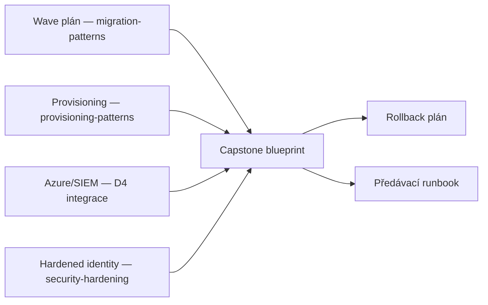

# Výkon, náklady & capstone

> Typ: povinný · Den: 5 · Odhad: <min>

## Cíle
- Efektivita API (batching, selektivní projekce).
- Náklady logování, asynchronní fan-out vzory.
- Capstone: end-to-end blueprint migrace + provisioning.
- Rizika & rollback; předávka do provozu.
- Další kroky: Advanced Graph, certifikační cesty.

## Výklad

### Efektivita API
`$select` omezuje vrácené vlastnosti jen na ty, které aplikace skutečně potřebuje — snižuje
síťovou zátěž i dobu odezvy. Graph bez `$select` v odpovědi vrací tip
(`@microsoft.graph.tips`) doporučující ho použít. U resources Microsoft Entra (user, group)
je `$select` dokonce **povinný**, pokud chce aplikace vlastnosti mimo výchozí sadu. V
kombinaci s `$expand` lze `$select` aplikovat i na vnořené (expanded) položky — ale u Entra
resources `$expand` vrací max. 20 položek, což je nutné zohlednit ve stránkování. Spolu s
batchingem ([`../../day-2/graph-fundamentals/`](../../day-2/graph-fundamentals/)) je toto hlavní pákový bod pro snížení objemu přenášených dat a počtu
requestů.

### Náklady logování a asynchronní fan-out
Logovací náklady ([`../../day-4/siem-blob-integration/`](../../day-4/siem-blob-integration/)) rostou s objemem a granularitou — batching zápisů a DCR
transformace před uložením (filtrování, ne log-everything-then-filter) drží náklady dolů.
Asynchronní fan-out (jeden trigger → N paralelních dílčích úloh, např. per-web migrace v
rámci jedné vlny z [`../../day-3/migration-patterns/`](../../day-3/migration-patterns/)) škáluje propustnost, ale musí respektovat throttling limity ([`../../day-2/graph-fundamentals/`](../../day-2/graph-fundamentals/))
per cíl, ne jen agregátně.

### Capstone — konsolidace týdne
Capstone spojuje: wave plán a throttle-aware exekuci ([`../../day-3/migration-patterns/`](../../day-3/migration-patterns/)),
provisioning artefakt ([`../../day-3/provisioning-patterns/`](../../day-3/provisioning-patterns/)),
Azure integrační/SIEM blueprint ([`../../day-4/azure-integration-patterns/`](../../day-4/azure-integration-patterns/) + [`../../day-4/siem-blob-integration/`](../../day-4/siem-blob-integration/))
a hardened app registraci ([`../security-hardening/`](../security-hardening/)) do jednoho
end-to-end blueprintu migrace + provisioningu. Součástí je explicitní rollback plán (co
dělat, když vlna selže v polovině) a předávací runbook do provozu (kdo je vlastník po
kurzu, jak se hlásí incidenty, jaký je patch/update cyklus).

### Další kroky — certifikační cesty

> [!WARNING] Ověřit k datu běhu — stav k 2026-07.
> **AZ-204 (Developing Solutions for Microsoft Azure) a certifikace Azure Developer
> Associate končí 31. 7. 2026** — nahrazuje je nová certifikace **AI-200 (Azure AI Cloud
> Developer Associate)**. K datu psaní tohoto materiálu je to během několika dní od konce
> platnosti AZ-204 jako aktivní cesty — **nedoporučovat studentům AZ-204** jako další krok,
> doporučit AI-200 jako přímého nástupce. **SC-300 (Identity and Access Administrator)**
> zůstává platnou cestou pro prohloubení identity/Conditional Access témat z [`../security-hardening/`](../security-hardening/). Ověřit
> aktuální stav obou certifikací (obsahová náplň AI-200 se teprve ustaluje) před
> doporučením konkrétního studijního plánu.

## Klíčové rozlišení
- **`$select` povinný (Entra resources) vs doporučený (většina ostatních resources)** —
  u Entra bez něj aplikace nevidí vlastnosti mimo výchozí sadu vůbec, ne jen "zbytečně moc dat".
- **Optimalizace výkonu (rychlost) vs optimalizace nákladů (cena)** — někdy protichůdné
  (agresivní batching může zvýšit latenci jednotlivého requestu kvůli čekání na naplnění batch).
- **Rollback plán připravený předem vs improvizovaná náprava za běhu** — capstone vyžaduje první.

## Lab
Viz [`lab-capstone-blueprint.md`](lab-capstone-blueprint.md).

## Zdroje (Microsoft)
- [Customize Microsoft Graph responses with query parameters](https://learn.microsoft.com/en-us/graph/query-parameters)
- [Best practices for working with Microsoft Graph](https://learn.microsoft.com/en-us/graph/best-practices-concept)
- [Study guide for Exam AZ-204](https://learn.microsoft.com/en-us/credentials/certifications/resources/study-guides/az-204) (k ověření stavu retirementu)

## Stav produktu / delta
- Ověřit k datu běhu — AZ-204 retirement (31. 7. 2026) a přesná náplň AI-200 jako náhrady;
  toto je nejrychleji se měnící fakt v celém kurzu a musí se ověřovat před **každým** během,
  ne jen jednou při psaní materiálu.
