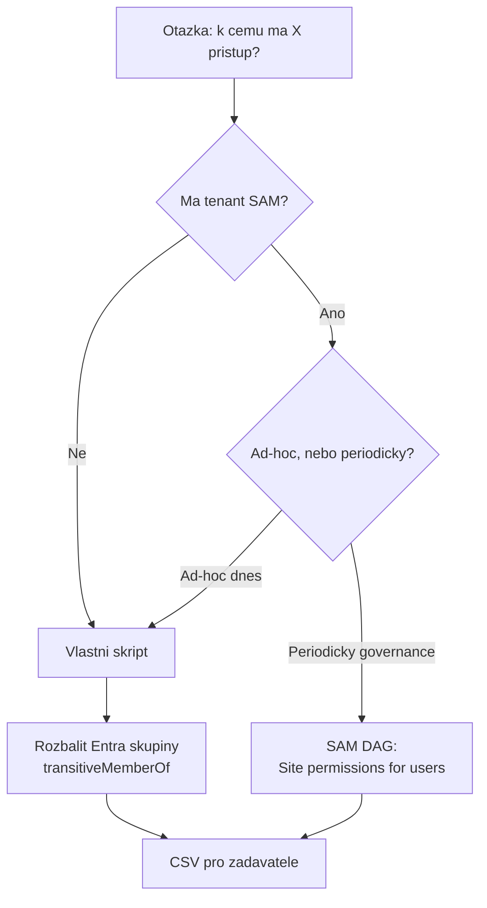

# Kdo má k čemu přístup: reporting oprávnění

> Typ: povinný · Den: 5 · Odhad: 35 min výklad + 40 min lab

Nejčastější dotaz, který dostane SharePoint admin od HR, právníků nebo bezpečáka, zní
**„k čemu má tenhle člověk přístup?"** — typicky když někdo odchází, mění oddělení, nebo
se má rozhodnout o Copilot licenci. Portál na to přímou odpověď nedává: ukáže vám
oprávnění **jednoho webu**, ne všechny weby jednoho člověka.

Tenhle blok je o obrácení dotazu a o tom, proč je to těžší, než vypadá.

## Cíle
- Vyjmenovat **všechny cesty**, kterými se člověk dostane k obsahu — a poznat, které
  z nich naivní skript minul.
- Napsat reverzní report „co vidí uživatel X" a vědět, co je jeho **slepá místa**.
- Rozhodnout mezi vlastním skriptem a **SAM DAG reportem** podle licence, rozsahu a limitů.
- Odlišit **snapshot** od živého dotazu a vědět, čemu odpovídá číslo v reportu.

## Výklad

### Pět cest k obsahu — a čtyři z nich skript snadno minou

Když se ptáte „vidí Novák tenhle web?", odpověď může být ano z kterékoli z těchto příčin:

| Cesta | Jak se zjistí |
|---|---|
| **Site collection admin** | `Get-PnPSiteCollectionAdmin` |
| **Členství v SharePoint skupině** | `Get-PnPGroup` + `Get-PnPGroupMember` |
| **Členství v Entra skupině**, která je členem SharePoint skupiny | `Get-PnPGroupMember` vrátí **skupinu**, ne lidi v ní — nutné rozbalit přes Graph |
| **Přímé oprávnění na položce/knihovně** (porušená dědičnost) | `HasUniqueRoleAssignments` na listu/položce |
| **Sharing link** | samostatná soustava, v členstvích skupin není vidět vůbec |

Naivní report projde weby a hledá `LoginName` uživatele v členech skupin. To pokryje
**první dvě** cesty. Uživatel, který má přístup přes bezpečnostní skupinu Entra
(v reálném tenantu ten nejběžnější případ), v takovém reportu **nefiguruje** — a report
tvrdí „žádný přístup". Falešně negativní odpověď na otázku od právníků je horší než
žádná odpověď.

Řešení pro třetí cestu je Graph a **tranzitivní** členství, ne přímé:

```powershell
# vsechny skupiny, jejichz je uzivatel clenem - vcetne vnorenych
Get-MgUserTransitiveMemberOf -UserId <upn> -All |
  Select-Object -ExpandProperty Id
```

Pak se hledá průnik těchto ID s tím, co je členem SharePoint skupin na webu.
Rozdíl mezi `memberOf` a `transitiveMemberOf` je přesně ten rozdíl mezi reportem, který
platí, a reportem, který uklidní.

### Proč to nejde dělat naivně přes celý tenant

Reverzní dotaz je z principu drahý: neexistuje index „uživatel → weby", takže se musí
projít weby a v každém se ptát. To je **O(počet webů)** na jednoho uživatele, s throttlingem
(viz [`../../day-3/graph-fundamentals/`](../../day-3/graph-fundamentals/)) a s tím, že
web, ke kterému se nelze připojit, nesmí shodit celý běh.

Praktické důsledky pro skript:

- **Scope si vynuťte parametrem**, nikdy „projdi všechno" jako výchozí chování.
- Nepřístupný web **zaznamenat a pokračovat**, ne `throw`.
- Výstup jako **objekty** do `Export-Csv`, ne `Write-Host` — tenhle report někdo dostane
  mailem a bude ho filtrovat v Excelu.
- U CSV pro Excel `-Encoding utf8BOM -UseCulture` (viz
  [`../../day-2/powershell-deep-dive/explainer-formats-encoding.md`](../../day-2/powershell-deep-dive/explainer-formats-encoding.md)).

### SAM: hotová odpověď, pokud na ni máte

**SharePoint Advanced Management (SAM)** má mezi Data access governance reporty
**Site permissions for users** — přesně tenhle dotaz jako produktovou funkci. Vrátí
seznam webů dostupných uživateli včetně toho, **jestli je přístup přímý nebo přes skupinu**
a kolika položek se týká.

Zásadní je znát jeho hranice, protože rozhodují o použitelnosti:

| Vlastnost | Hodnota |
|---|---|
| Licence | **stačí jedna přiřazená licence Microsoft Copilot v tenantu** (uživatel nemusí být admin), nebo SAM Plan 1 add-on |
| Role | SharePoint Administrator, nebo SharePoint Advanced Management Administrator |
| Stáří dat | až **48 hodin** |
| Počet reportů | max **5** |
| Opakovaný běh | jednou za **30 dní** |
| Předpoklad | org-wide report *Site permissions* musí proběhnout aspoň jednou |

Ty poslední dva řádky znamenají, že SAM report **není nástroj na ad-hoc dotaz**. Když
v úterý přijde otázka na tři lidi, skript odpoví za minuty; SAM řekne „za 30 dní zas".

### Rozhodovací osa

| | Vlastní skript | SAM DAG report |
|---|---|---|
| Licence | žádná navíc | Copilot licence nebo SAM Plan 1 |
| Ad-hoc dotaz | ano | **ne** (1× za 30 dní) |
| Item-level a sharing links | musíte dopsat | v reportu jsou |
| Tranzitivní Entra skupiny | musíte dopsat | řeší produkt |
| Auditní stopa | vaše | produktová, s datem snapshotu |
| Kdy sáhnout | rychlá odpověď, tenant bez SAM, opakovatelná automatizace | pravidelný governance cyklus, podklad pro Copilot rollout |

Pravidlo: **SAM na periodický přehled, skript na otázku, která přišla dnes.**



## Klíčové rozlišení
- **Přímé členství vs tranzitivní** — `memberOf` vs `transitiveMemberOf`; rozdíl mezi
  reportem, který platí, a reportem, který jen uklidní.
- **Falešně negativní vs chybějící odpověď** — report, který přehlédne přístup přes
  Entra skupinu, je horší než přiznané „nevím"; zadavatel podle něj jedná.
- **Snapshot vs živý dotaz** — SAM report popisuje stav starý až 48 h; skript se ptá teď.
  U personální otázky („měl přístup, když odcházel?") je to podstatný rozdíl.
- **Oprávnění vs sharing link** — dvě různé soustavy; link se v členstvích skupin neobjeví.
- **Reverzní dotaz (uživatel → weby) vs běžný (web → kdo)** — portál umí jen druhý,
  a proto tenhle blok existuje.

## Lab
Viz [`lab-user-access-report.md`](lab-user-access-report.md).

## Zdroje (Microsoft)
- [SharePoint Advanced Management overview](https://learn.microsoft.com/en-us/sharepoint/advanced-management)
- [Prerequisites for SharePoint Advanced Management](https://learn.microsoft.com/en-us/sharepoint/sharepoint-advanced-management-prerequisites)
- [Data access governance reports — site permissions for users](https://learn.microsoft.com/en-us/sharepoint/data-access-governance-site-permissions-users-report)
- [DAG reports and PowerShell](https://learn.microsoft.com/en-us/sharepoint/powershell-for-data-access-governance)
- [List a user's transitive memberOf (Microsoft Graph)](https://learn.microsoft.com/en-us/graph/api/user-list-transitivememberof)
- [Get-PnPSiteCollectionAdmin](https://pnp.github.io/powershell/cmdlets/Get-PnPSiteCollectionAdmin.html)

## Stav produktu / delta
> [!WARNING] Ověřit k datu běhu — stav k 2026-09.
> **SAM je nejrychleji se měnící část tohoto bloku.** Licenční podmínky (dnes stačí jedna
> Copilot licence v tenantu), seznam DAG reportů i limity (5 reportů, běh 1× za 30 dní,
> data 48 h stará) se mění po měsících. Před KAŽDÝM během projít
> [prerekvizity](https://learn.microsoft.com/en-us/sharepoint/sharepoint-advanced-management-prerequisites)
> a ověřit, zda kurzovní tenant SAM vůbec má — jinak je SAM část jen screenshotové demo.
