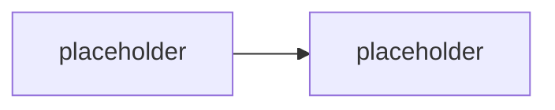

# M5.2 · Security hardening & least privilege

> Typ: povinný · Den: 5 · Odhad: <min>

## Cíle
- <Minimalizace záběru, dopad Conditional Access>
- <Rotace tajemství a přechod na cert-based auth>

## Výklad

<TODO: revize permission scope napříč app registracemi z celého týdne — minimalizace na skutečně použité>

<TODO: dopad Conditional Access na app-only/delegated flows>

<TODO: rotace secretů a migrace na cert-based auth (viz M1.3 auth módy)>

## Klíčové rozlišení
- <secret-based auth vs cert-based auth — životnost, riziko exfiltrace, rotace>
- <Conditional Access dopad na delegated (uživatel) vs app-only (service principal) flows>

## Lab
Viz [`lab-hardening-app-registration.md`](lab-hardening-app-registration.md).

## Zdroje (Microsoft)
- <TODO: Conditional Access dokumentace>
- <TODO: cert-based authentication pro app registrace — dokumentace>

## Stav produktu / delta
- <TODO: ověřit aktuální doporučenou dobu platnosti certifikátů a rotační politiku k datu běhu>
