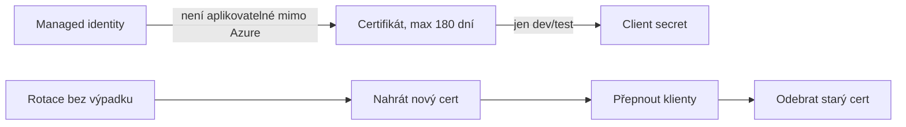

# Security hardening & least privilege

> Typ: povinný · Den: 5 · Odhad: 40 min výklad + 60 min lab

## Cíle
- Minimalizace záběru, dopad Conditional Access.
- Rotace tajemství a přechod na cert-based auth.

## Výklad

### Minimalizace záběru — audit permissions
Projít permissions přiřazené app registraci z [`../../day-2/automation-strategy/`](../../day-2/automation-strategy/) napříč celým týdnem a odebrat vše, co
reálně nebylo použito nebo má přesnější (užší) alternativu — stejný princip jako v [`../../day-2/automation-strategy/`](../../day-2/automation-strategy/),
teď aplikovaný na skutečnou historii použití, ne na odhad předem.

### Conditional Access pro workload identities (service principals)
Conditional Access lze cílit i na service principaly (workload identities), ne jen na
uživatele — ale s důležitými omezeními: politika musí být **přiřazená přímo** konkrétnímu
service principalu, přiřazení přes skupinu, do které service principal patří, se
**nevynucuje**. Multitenant Microsoft/3rd-party SaaS aplikace a **managed identity nejsou
touto politikou pokryté vůbec**. Vyžaduje licenci Workload Identities Premium. Continuous
Access Evaluation (CAE) pro workload identity umí vynutit odvolání tokenu v reálném čase —
kompromitovaný service principal lze takto odříznout bez čekání na expiraci tokenu.

### Rotace tajemství a cert-based auth
Aktuální doporučené pořadí preferencí pro produkční workload identitu: **managed identity**
(Azure sama řeší rotaci a úložiště — nejlepší volba, kde je aplikovatelná) → **certifikát**
(asymetrický klíč, odolnější proti exfiltraci, vhodný mimo Azure nebo tam, kde managed
identity nejde použít) → **client secret** (jen pro vývoj/test, v produkci se má
odstranit). Doporučená maximální životnost certifikátu je **180 dní** — automatizovat
rotaci přes Azure Key Vault. `keyCredentials` na app registraci je multi-hodnotové pole —
lze mít nahraný starý i nový certifikát současně a provést rotaci bez výpadku (nejdřív
nahrát nový, přepnout klienty, pak teprve odebrat starý).

### Ztráta credentialu — co se odvolává (a co ne)
Častá otázka z praxe: „přišel jsem o stroj/klíč s certifikátem — mám aplikaci odebrat
oprávnění?" Ne. **Odvolává se credential, ne permissions:**

- Z app registrace se smaže **certifikát ztraceného credentialu** (podle thumbprintu)
  v *Certificates & secrets*. Oprávnění (`Sites.Read.All`…) říkají, *co aplikace smí*,
  a platí pro ni jako celek — jejich odebráním rozbijete i zbylé funkční klienty.
- Protože je `keyCredentials` multi-hodnotové, dá se totéž použít **preventivně**: druhý,
  záložní certifikát nahraný předem znamená, že ztráta prvního je úkon na 30 sekund.
  Záložní certifikát ale **není kopie** — je to samostatný pár klíčů (privátní klíč se
  nekopíruje, viz [`../../day-2/powershell-deep-dive/explainer-certificates-keys.md`](../../day-2/powershell-deep-dive/explainer-certificates-keys.md)).
- **Už vydaný access token dožívá** (řádově do hodiny) i po smazání certifikátu —
  okamžité odříznutí umí až **CAE** (viz výše). To je praktický důvod, proč CAE u vysoce
  privilegovaných workload identit není luxus.

### Co ještě patří do auditu vedle app registrací
Oprávnění schválená pro **SPFx řešení** (SharePoint admin center → API access) visí na
**jediném sdíleném service principalu** pro celý tenant — a využije je i každé další SPFx
řešení, které do tenantu přijde později. Do auditního skriptu proto vedle app registrací
patří `Get-PnPTenantServicePrincipalPermissionGrants` a přehled tenant-wide extensions;
mechanika je v [`../app-catalog-lifecycle/`](../app-catalog-lifecycle/).

## Klíčové rozlišení
- **Managed identity vs certifikát vs client secret** — v tomto pořadí preference pro
  produkci; secret nikdy není produkční volba.
- **Conditional Access přiřazená přímo service principalu vs přes skupinu** — jen první
  varianta se reálně vynucuje.
- **CAE (real-time token revocation) vs čekání na přirozenou expiraci tokenu** — CAE odřízne
  kompromitovanou identitu okamžitě.

## Lab
Viz [`lab-hardening-app-registration.md`](lab-hardening-app-registration.md).

## Zdroje (Microsoft)
- [Microsoft Entra Conditional Access for workload identities](https://learn.microsoft.com/en-us/entra/identity/conditional-access/workload-identity)
- [Migrate applications away from secret-based authentication](https://learn.microsoft.com/en-us/entra/identity/enterprise-apps/migrate-applications-from-secrets)
- [Security best practices for application properties](https://learn.microsoft.com/en-us/entra/identity-platform/security-best-practices-for-app-registration)

## Stav produktu / delta
- Ověřit k datu běhu — doporučená maximální životnost certifikátu (180 dní) a licenční
  požadavek Workload Identities Premium pro Conditional Access na service principaly se
  mohou zpřesnit; ověřit aktuální hodnoty na [Conditional Access for workload identities](https://learn.microsoft.com/en-us/entra/identity/conditional-access/workload-identity) před přípravou labu.
