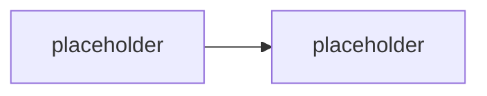

# M5.1 · SPFx základy & App Catalog

> Typ: povinný · Den: 5 · Odhad: <min>

## Cíle
- <Dev setup (Node LTS, Yeoman, gulp) a struktura projektu>
- <Generování HelloWorld webpartu a klíčové soubory>
- <Build/balíček .sppkg>
- <App Catalog (tenant vs site), nahrání, deploy, trust>
- <Přidání webpartu na moderní stránku; verzování a update>

## Výklad

<TODO: dev setup — Node LTS verze kompatibilní se SPFx generátorem, Yeoman, build toolchain (gulp/Heft — viz Stav produktu/delta)>

<TODO: `yo @microsoft/sharepoint` — struktura projektu, klíčové soubory (manifest, `.sppkg` config)>

<TODO: build a balíčkování do `.sppkg`>

<TODO: App Catalog — tenant-wide vs site collection app catalog, nahrání, deploy, trust — viz GLOSSARY.md>

<TODO: přidání webpartu na moderní stránku, verzování a update řešení>

## Klíčové rozlišení
- <tenant-wide app catalog vs site collection app catalog>
- <deploy (dostupné všem webům) vs trust jen na vybraném webu>

## Lab
Viz [`lab-helloworld-appcatalog.md`](lab-helloworld-appcatalog.md).

## Zdroje (Microsoft)
- <TODO: SPFx dokumentace — Get started>
- <TODO: App Catalog dokumentace>

## Stav produktu / delta
- <TODO: ověřit, zda aktuální `@microsoft/generator-sharepoint` používá gulp nebo Heft toolchain — viz GLOSSARY.md>
