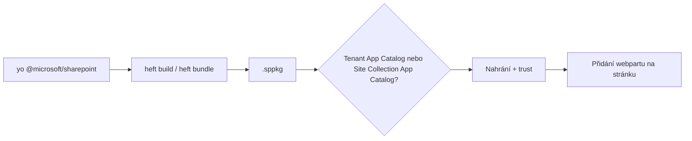

# SPFx základy & App Catalog

> Typ: povinný · Den: 5 · Odhad: <min>

## Cíle
- Dev setup (Node LTS, Yeoman, aktuální build toolchain) a struktura projektu.
- Generování HelloWorld webpartu a klíčové soubory.
- Build/balíček .sppkg.
- App Catalog (tenant vs site), nahrání, deploy, trust.
- Přidání webpartu na moderní stránku; verzování a update.
- Správcovský pohled na hotové řešení — API access (sdílený service principal!),
  tenant-wide extensions, provozní hygiena: [`explainer-spfx-admin.md`](explainer-spfx-admin.md).

## Výklad

### Dev setup
Bezpečná výchozí kombinace je nejnovější generátor (`npm install @microsoft/generator-sharepoint@latest --global`) + Node LTS verze, kterou tato verze generátoru podporuje — SPFx build systém je **přísně verzově provázaný**: nesoulad Node/SPFx verze může znamenat, že projekt se vůbec nezkompiluje. Použít nvm pro správu více Node verzí, pokud se pracuje na projektech s různými SPFx verzemi napříč zákazníky.

### Build toolchain — Heft nahradil Gulp
Od SPFx v1.22 generátor **defaultně scaffolduje Heft-based toolchain** místo staršího
Gulp — Heft je deklarativní, konfigurací (JSON) řízený model tasků s pluginovou
architekturou, ne JavaScript task runner jako Gulp. Nové projekty tedy používají
`heft start`/`heft build`/`heft test`, ne `gulp serve`/`gulp bundle`. Generátor stále
nabízí přepínač `--use-gulp` pro projekty, které potřebují starší toolchain dočasně
zachovat, ale u nových projektů to není výchozí volba.

### Generování a klíčové soubory
`yo @microsoft/sharepoint` → HelloWorld webpart. Klíčové soubory: manifest webpartu
(`*.manifest.json` — GUID, verze, ikona), `package-solution.json` (metadata `.sppkg`
balíčku, vč. `skipFeatureDeployment` pro tenant-wide deployment scénář z [`../../day-4/clarity-configuration/`](../../day-4/clarity-configuration/)),
`config/config.json` (bundle entry). Build vytvoří `.sppkg` v `sharepoint/solution/`.

### App Catalog — tenant vs site collection
Tenant má **přesně jeden** Tenant App Catalog, spravovaný Global/SharePoint
administrátory — distribuce řešení napříč celým tenantem. Site Collection App Catalog
je volitelný, lze ho povolit na vybraných site collections a delegovat správu na
vlastníky/dev týmy dané site collection bez zásahu do tenant-wide katalogu — užitečné
pro izolaci mezi zákaznickými prostory bez cross-tenant úniku.

### Deploy, trust, stránka, verzování
Po nahrání `.sppkg` do App Catalogu SharePoint nabídne "make this solution available to
all sites" (trust) — bez tohoto potvrzení řešení nejde použít mimo katalog samotný.
Přidání webpartu na moderní stránku jde přes standardní "Edit page → Add a web part".
Update řešení = nahrání nové verze `.sppkg` se zvýšeným číslem verze v
`package-solution.json` — SharePoint detekuje novější verzi a nabídne update existujícím
instancím.

## Klíčové rozlišení
- **Tenant App Catalog (jeden na tenant, globální distribuce) vs Site Collection App
  Catalog (volitelný, delegovaná správa, izolace)**.
- **Heft (aktuální default od 1.22, deklarativní/JSON) vs Gulp (starší, JS task runner,
  stále dostupný přes `--use-gulp`)**.
- **Deploy (dostupné všem webům po "trust") vs pouhé nahrání do katalogu bez trustu**
  (řešení existuje, ale nejde použít).

## Lab
Viz [`lab-helloworld-appcatalog.md`](lab-helloworld-appcatalog.md).

## Zdroje (Microsoft)
- [SharePoint Framework Platform & Toolchain Compatibility Reference](https://learn.microsoft.com/en-us/sharepoint/dev/spfx/compatibility)
- [Migrate from the Gulp-based to the Heft-based Toolchain](https://learn.microsoft.com/en-us/sharepoint/dev/spfx/toolchain/migrate-gulptoolchain-hefttoolchain)
- [Use the site collection app catalog](https://learn.microsoft.com/en-us/sharepoint/dev/general-development/site-collection-app-catalog)

## Stav produktu / delta
- Ověřit k datu běhu — bezpečná baseline k 2026-07 je SPFx 1.21.1+ / Node 22 LTS; Microsoft
  posunulo vynucený konec podpory Gulp toolchainu na SPFx 1.24 (přibližně září 2026) — ověřit
  aktuální verzi generátoru a přesný stav Gulp/Heft podpory na
  [Compatibility Reference](https://learn.microsoft.com/en-us/sharepoint/dev/spfx/compatibility) před přípravou slidů a laboratorního prostředí.
